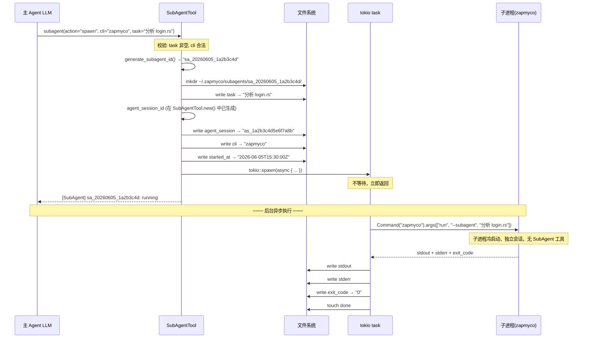
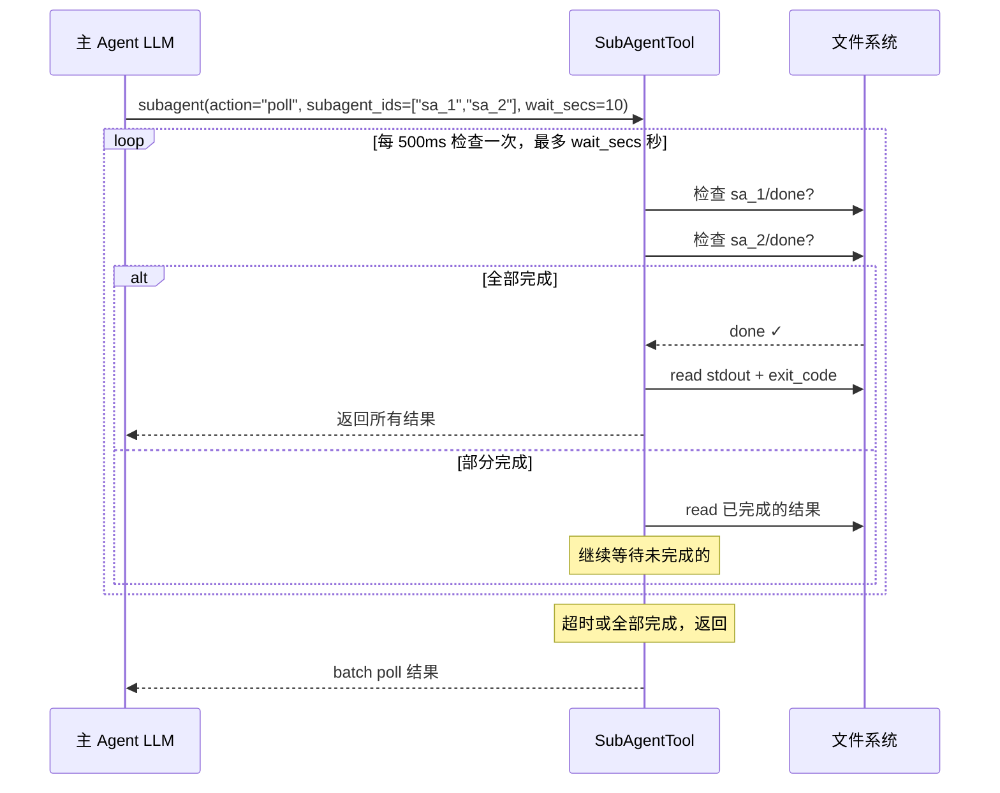
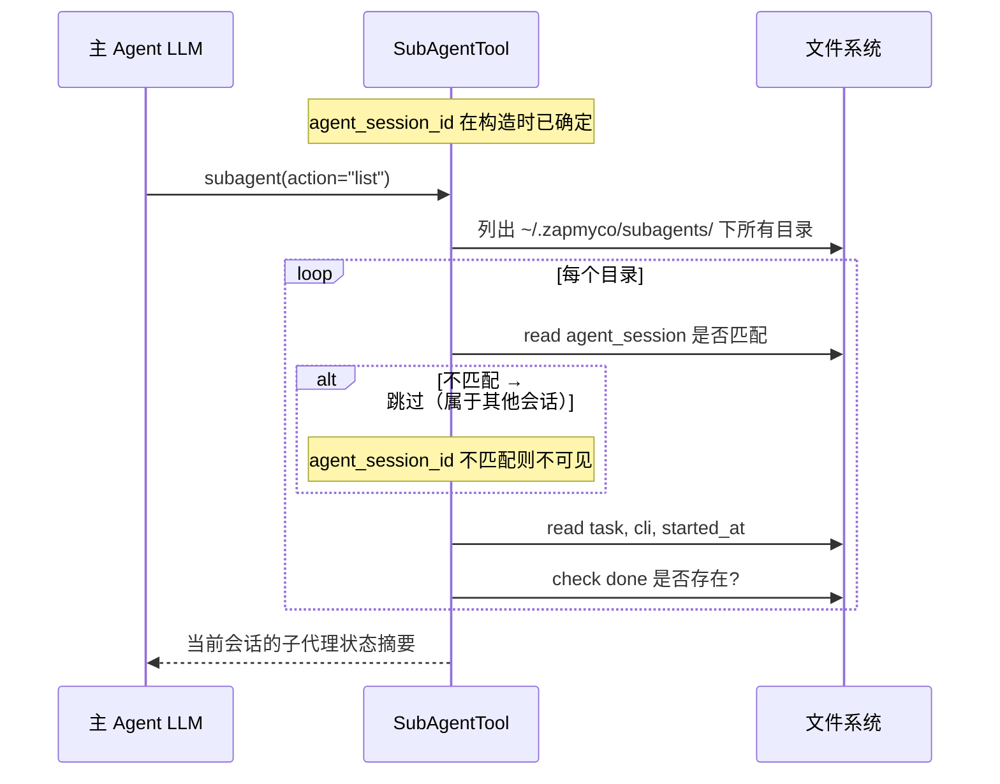
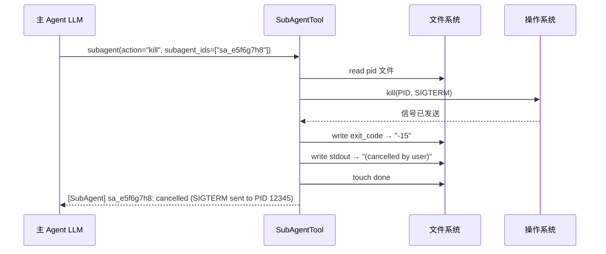
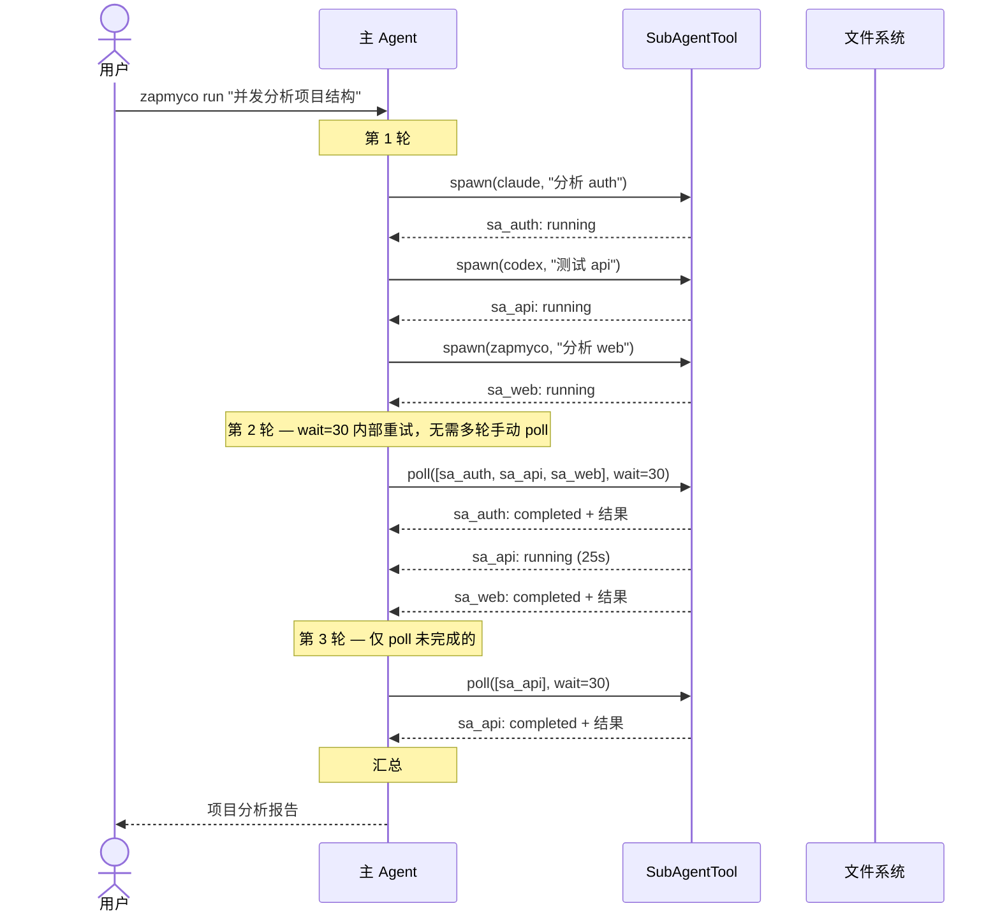
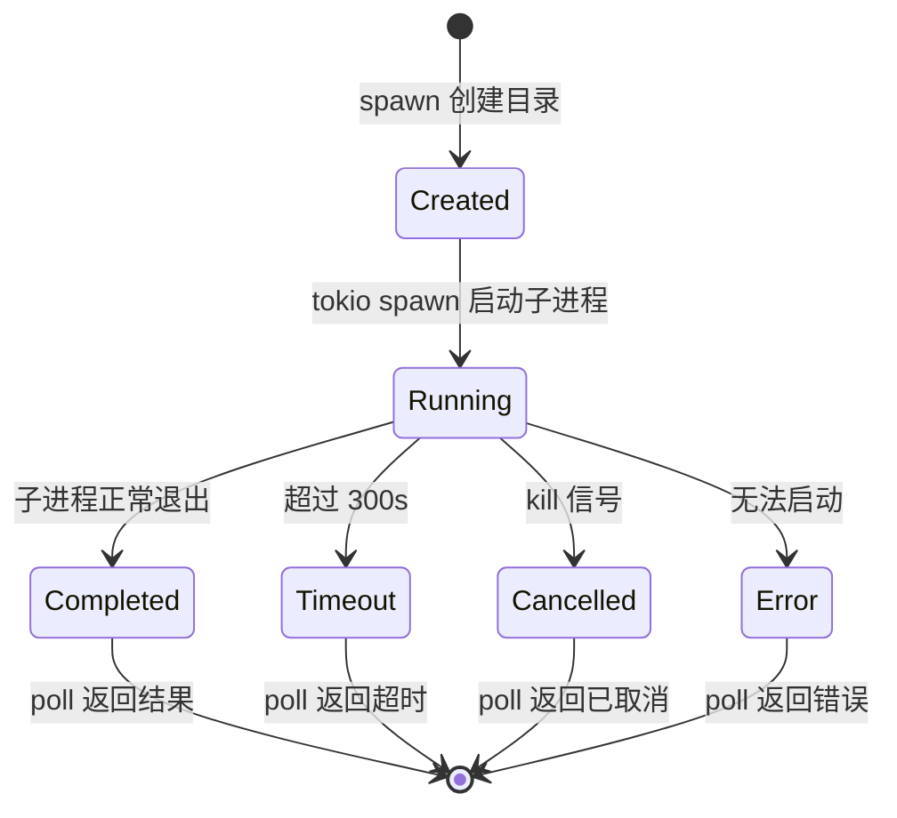
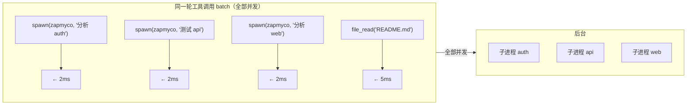

# SubAgent 自调用 — 技术方案

> 版本: v3.0 · 日期: 2026-06-05 · 状态: 设计中

---

## 1. 动机与背景

zapmyco CLI 是一个基于 LLM 的 AI Agent，目前单进程工作。当面对需要多视角分析或可并行执行的子任务时，单 Agent 的串行模式无法充分利用计算资源。

**核心问题**：Agent 能否像人类团队一样，把大任务拆成独立子任务，并发地分配给多个"助手"去执行，然后汇总结果？

**方案**：通过工具调用派生子进程，子进程可以是 zapmyco 自身，也可以是其他支持 headless 模式的 CLI Agent（Claude Code、Codex CLI、Gemini CLI）。每个子 Agent 独立工作，结果通过文件系统回传给主 Agent。

---

## 2. 设计目标

| 目标 | 说明 |
|------|------|
| **自调用** | zapmyco 可通过工具调用派生自己的子进程 |
| **多 CLI 支持** | 接口支持 zapmyco / claude / codex / gemini，MVP 仅实现 zapmyco |
| **纯异步** | 所有 subagent 均为后台执行，spawn 立即返回，通过 poll 收集结果 |
| **全并发安全** | spawn、poll、list、kill 均可与其他工具在同一 batch 中并行 |
| **最低侵入** | 不修改现有 ConversationLogger、不新增 CLI 参数、不改 TaskManager |
| **可扩展** | 增加新的 CLI 支持只需加一行命令模板 |

### 非目标

- **不做 sync 模式**：主 Agent 等待子进程完成和自己做没有区别，纯异步才是价值
- **不继承对话上下文**：子 Agent 冷启动，任务描述即全部输入
- **不支持跨 CLI 上下文恢复**：每个 CLI 的会话系统不互通
- **不做实时双向通信**：单向任务派发 + 结果收集

---

## 3. 工具接口定义

### 3.1 Tool Schema

```json
{
  "name": "subagent",
  "description": "管理子代理(sub-agent)。子代理作为独立子进程运行指定的 CLI Agent。\
    支持四种 action:\n\
    - spawn: 创建子代理，立即返回子代理 ID\n\
    - poll: 查询子代理执行结果，支持批量查询和内部等待重试\n\
    - list: 列出所有活跃的子代理\n\
    - kill: 终止正在运行的子代理",
  "input_schema": {
    "type": "object",
    "properties": {
      "action": {
        "type": "string",
        "enum": ["spawn", "poll", "list", "kill"],
        "description": "操作类型"
      },
      "cli": {
        "type": "string",
        "enum": ["zapmyco"],
        "description": "使用的 CLI agent。目前仅支持 zapmyco。"
      },
      "task": {
        "type": "string",
        "description": "子代理需要执行的具体任务描述（action=spawn 时必填）"
      },
      "subagent_ids": {
        "type": "array",
        "items": { "type": "string" },
        "description": "要查询或终止的子代理 ID 列表（poll 和 kill 时必填）"
      },
      "wait_secs": {
        "type": "number",
        "description": "poll 时可选。工具已内置首次 5 秒内部等待（无论此参数如何），\
          如需额外等待可设置此参数，工具会在首次 5 秒基础上继续等待 N 秒。\
          范围 1-30。默认 0（仅内置 5 秒）。"
      }
    },
    "required": ["action"]
  }
}
```

### 3.2 Rust 结构体

```rust
pub struct SubAgentTool {
    /// 数据根目录: ~/.zapmyco/subagents/
    data_dir: PathBuf,
    /// 子进程超时时间（秒），默认 300
    timeout_secs: u64,
    /// 当前 Agent 会话的唯一标识，写入子 Agent 目录用于 list 隔离
    agent_session_id: String,
    /// 测试用：覆盖 spawn 的子进程二进制路径
    /// 生产环境为 None，使用 current_exe()；测试环境可设为 "echo"/"sleep" 等
    #[cfg(test)]
    pub test_binary: Option<String>,
}

impl SubAgentTool {
    pub fn new() -> Result<Self, String>;
    /// 返回当前 agent_session_id
    pub fn agent_session(&self) -> &str;

    /// 返回 Anthropic Tool 定义
    pub fn tool_definition() -> Tool;

    /// 执行入口，根据 action 字段分发
    pub async fn execute(&self, input: &Value) -> Result<String, String>;

    /// 创建并启动子代理（始终异步，立即返回 subagent_id）
    /// task 为空或全空白时返回错误
    async fn spawn(&self, cli: &str, task: &str) -> Result<String, String>;

    /// 查询子代理执行结果。支持批量（多个 ID）和内部等待重试（wait_secs）
    async fn poll(&self, ids: &[String], wait_secs: u64) -> Result<String, String>;

    /// 列出所有活跃子代理的状态摘要
    async fn list(&self) -> Result<String, String>;

    /// 终止正在运行的子代理
    async fn kill(&self, ids: &[String]) -> Result<String, String>;
}
```

---

## 4. 数据存储

### 4.1 目录结构

```
~/.zapmyco/subagents/
  └── sa_20260605_1a2b3c4d/    ← 以 subagent_id 命名的目录
      ├── agent_session    ← 创建者的 agent_session_id（用于 list 隔离）
      ├── task             ← 任务描述（纯文本）
      ├── cli              ← CLI 类型（纯文本）
      ├── pid              ← 进程 PID（纯文本）
      ├── started_at       ← 开始时间（ISO 8601）
      ├── stdout           ← 子进程标准输出
      ├── stderr           ← 子进程标准错误
      ├── exit_code        ← 退出码（纯文本，完成后写入）
      └── done             ← 完成标记（空文件，完成后创建）
```

### 4.2 subagent_id 生成

```rust
/// 生成 subagent_id: sa_{日期}_{8位十六进制}
/// 示例: sa_20260605_1a2b3c4d
/// 日期前缀确保可排序，随机后缀避免并发冲突
/// 创建前检查目录是否存在，避免碰撞
fn generate_subagent_id(data_dir: &Path) -> String {
    let now = chrono::Local::now().format("%Y%m%d").to_string();
    loop {
        let rand_part: u32 = rand::thread_rng().gen();
        let id = format!("sa_{}_{:08x}", now, rand_part);
        if !data_dir.join(&id).exists() {
            return id;
        }
    }
}
```

### 4.3 agent_session_id 生成

```rust
/// 生成 agent_session_id: as_{16位十六进制}
/// 每个 SubAgentTool 实例生成一次，写入所创建的所有子代理目录
/// list 时只显示匹配当前 agent_session_id 的子代理
fn generate_agent_session_id() -> String {
    format!("as_{:016x}", rand::thread_rng().gen::<u64>())
}
// 示例: as_1a2b3c4d5e6f7a8b
```

`agent_session_id` 在 `SubAgentTool::new()` 中生成一次，之后所有 spawn/poll/list/kill 操作共享。

---

## 5. 完整执行流程

### 5.1 spawn 流程



### 5.2 poll 流程



**wait_secs 机制**：

```rust
/// poll 内部实现
/// - 无论 wait_secs 如何，先内部等 5 秒（给短任务一个完成窗口）
/// - 全部 running 时折叠为单行，已完成展开
/// - stderr 无论 exit_code 如何，只要非空就展示
async fn poll(&self, ids: &[String], wait_secs: u64) -> Result<String, String> {
    if ids.is_empty() {
        return Err("poll 时 subagent_ids 不能为空，使用 list 查看所有子代理".to_string());
    }
    // 基础等待：至少 5 秒，加用户额外指定的 wait_secs
    let extra = wait_secs.min(30);
    let deadline = Instant::now() + Duration::from_secs(5 + extra);
    let mut completed = HashSet::new();

    // 内部等待循环（不消耗 LLM 轮次）
    while Instant::now() < deadline && completed.len() < ids.len() {
        for id in ids {
            if completed.contains(id) { continue; }

            let dir = self.data_dir.join(id);
            if !dir.exists() { continue; }

            // 探测已死亡但未标记 done 的子进程
            if !dir.join("done").exists() {
                if let Ok(pid_str) = read_file(&dir.join("pid")) {
                    if let Ok(pid) = pid_str.trim().parse::<u32>() {
                        if !is_process_alive(pid) {
                            // 进程已死但没写 done → 标记为 lost
                            write_file(&dir.join("exit_code"), "-9");
                            write_file(&dir.join("stdout"), "(process lost: killed externally)");
                            File::create(dir.join("done")).ok();
                        }
                    }
                }
            }

            if dir.join("done").exists() {
                completed.insert(id.clone());
            }
        }
        if completed.len() < ids.len() {
            tokio::time::sleep(Duration::from_millis(500)).await;
        }
    }

    // 收集结果
    let mut completed_outputs = Vec::new();
    let mut running_ids = Vec::new();
    let mut running_tasks = Vec::new();
    let mut errors = Vec::new();

    for id in ids {
        let dir = self.data_dir.join(id);
        if !dir.exists() {
            errors.push(format!("{}: ID 不存在", id));
            continue;
        }
        if dir.join("done").exists() {
            completed_outputs.push(Self::format_completed(&dir, id));
        } else {
            running_ids.push(id.clone());
            if let Ok(task) = read_file(&dir.join("task")) {
                running_tasks.push(task.trim().chars().take(40).collect::<String>());
            }
        }
    }

    let mut result = Vec::new();

    // 已完成的结果（逐一展开）
    for o in &completed_outputs {
        result.push(o.clone());
    }

    // 未完成的：全部 running 则折叠，部分 running 则摘要
    if !running_ids.is_empty() {
        // 取最早 running 子 Agent 的已等待时间
        let since_now = || -> String {
            let now = chrono::Local::now();
            let earliest = running_ids.iter()
                .filter_map(|id| {
                    let content = read_file(&self.data_dir.join(id).join("started_at")).ok()?;
                    let trimmed = content.trim().to_string();
                    Some(trimmed)
                })
                .filter_map(|ts| {
                    chrono::DateTime::parse_from_str(&ts, "%Y-%m-%dT%H:%M:%S%z")
                        .ok()
                        .map(|dt| dt.naive_local())
                        .or_else(|| {
                            chrono::NaiveDateTime::parse_from_str(&ts, "%Y-%m-%dT%H:%M:%S%.f").ok()
                        })
                })
                .min()?;  // 最早的 started_at = 等待最久的
            let elapsed = now.naive_local() - earliest;
            Some(format!("{}s", elapsed.num_seconds()))
        }.unwrap_or_default();

        if completed_outputs.is_empty() && errors.is_empty() {
            // 全部 running → 单行
            let tasks = running_tasks.join(" / ");
            result.push(format!(
                "[SubAgent] {}/{} 仍在运行 (已等待 {})\n  任务: {}",
                running_ids.len(), ids.len(), since_now, tasks
            ));
        } else {
            // 部分完成 → 仅摘要计数
            result.push(format!(
                "[SubAgent] 还有 {} 个仍在运行 (已等待 {})", running_ids.len(), since_now
            ));
        }
    }

    // 错误
    for e in &errors {
        result.push(e.clone());
    }

    Ok(result.join("\n---\n"))
}

/// 探测进程是否存活（POSIX: kill -0 仅检查存在性）
fn is_process_alive(pid: u32) -> bool {
    std::process::Command::new("kill")
        .arg("-0").arg(pid.to_string())
        .status().map(|s| s.success()).unwrap_or(false)
}
```

### 5.3 list 流程



list 返回格式：

```
[SubAgent] 当前共 3 个子代理

sa_20260605_a1b2c3d4: running (已运行 23s)
  CLI: zapmyco
  Task: 分析 auth 模块

sa_20260605_e5f6g7h8: completed (耗时 45s, exit 0)
  CLI: claude
  Task: 测试 api 模块

sa_20260605_x9y8z7w6: timeout (300s)
  CLI: gemini
  Task: 检查依赖版本
```

### 5.4 kill 流程



### 5.5 完整调用时序



### 5.6 进程隔离

子 Agent 是**独立 OS 进程**，与主 Agent 完全隔离：

| 场景 | 子 Agent | 主 Agent |
|------|---------|---------|
| 进程崩溃 | exit_code = signal（如 139 SIGSEGV） | 不受影响，poll 返回错误信息 |
| 内存溢出 (OOM) | 被系统 kill | 不受影响，poll 看到非正常退出 |
| 逻辑执行错误 | exit_code ≠ 0，stderr 有内容 | 不受影响，poll 返回完整输出 |
| 死循环/挂起 | 300s 超时后强制 kill | 不受影响，poll 返回 timeout |
| 文件误操作 | 修改了磁盘文件 | 通过 git diff 感知，自主决策 |

---

## 6. 子 Agent 生命周期

### 6.1 递归阻断

子 Agent 通过 `--subagent` 标记禁止再派生：

```
主 Agent:  zapmyco run "分析项目"              → 有 SubAgent 工具
子 Agent:  zapmyco run --subagent "分析 auth" → 无 SubAgent 工具
子 Agent:  zapmyco run --subagent "分析 api"  → 无 SubAgent 工具
```

```rust
// src/cli.rs
#[derive(clap::Args)]
pub struct RunArgs {
    /// 标记此进程为子 Agent（隐藏，由 SubAgent 工具自动传入）
    #[arg(long, hide = true)]
    pub subagent: bool,
}
```

`build_command` 中自动传入 `--subagent`，`cmd_run()` 检测后跳过 SubAgent 工具注册：

```rust
if !args.subagent {
    let subagent = SubAgentTool::new()?;
    agent.register_tool(ToolHandler::SubAgent(subagent));
}
```

### 6.2 状态模型



### 6.3 状态定义

| 状态 | 判定条件 | poll 返回 |
|------|---------|-----------|
| CREATED | 目录已创建，但 pid 文件不存在 | — |
| RUNNING | pid 文件存在，done 文件不存在 | `running（已运行 Ns）` |
| COMPLETED | done 存在，exit_code = 0 | `completed（耗时 Ns, exit 0）` |
| TIMEOUT | done 存在，exit_code = -1 | `timeout（300s）` |
| CANCELLED | done 存在，exit_code = -15（SIGTERM） | `cancelled` |
| ERROR | done 存在，exit_code ≠ 0 且 ≠ -1、-15 | `error（exit N, stderr）` |

### 6.4 超时处理

```rust
// 先 .spawn() 写入 PID，再 .wait_with_output()
let mut child = cmd.spawn().map_err(|e| format!("启动子进程失败: {}", e))?;
write_file(&data_dir.join("pid"), &child.id().to_string()).ok();

let result = tokio::time::timeout(
    Duration::from_secs(timeout_secs),  // 默认 300s
    child.wait_with_output(),
).await;

match result {
    Ok(output) => {
        write_exit_code(output.status.code().unwrap_or(-1).to_string());
        write_stdout(&String::from_utf8_lossy(&output.stdout));
        write_stderr(&String::from_utf8_lossy(&output.stderr));
    }
    Err(_) => {
        child.kill().await.ok();
        write_exit_code("-1");
        write_stdout("(timeout after 300s)");
    }
}
touch(done);
```

---

## 7. CLI 命令模板

```rust
fn build_command(task: &str, is_subagent: bool) -> Result<(String, Vec<String>), String> {
    let binary = std::env::current_exe()
        .map_err(|e| format!("无法获取当前二进制路径: {}", e))?;
    let mut args = vec!["run".to_string()];
    if is_subagent {
        args.push("--subagent".to_string());
    }
    args.push(task.to_string());
    Ok((binary.to_string_lossy().to_string(), args))
}

/// spawn 内部使用。测试模式（test_binary 有值）时直接执行 task 作为命令，
/// 不经过 build_command，避免启动真实 zapmyco 进程。
#[cfg(test)]
fn build_test_command(test_binary: &str, task: &str) -> (String, Vec<String>) {
    (test_binary.to_string(), vec![task.to_string()])
}
```

**说明**：使用 `current_exe()` 而非 PATH 查找，确保 `cargo run` 开发环境和自定义安装路径均可正确找到二进制。CLI 有效性已在 `spawn()` 中前置校验，此处无需再判断。

**测试模式**：当 `#[cfg(test)]` 且 `self.test_binary` 有值时，spawn 调用 `build_test_command` 直接执行 `test_binary task`，跳过 `build_command`。这样测试可以使用 `echo`/`sleep` 等标准命令，不启动真实 zapmyco 进程。

---

## 8. 并发安全策略

```rust
pub(crate) fn is_concurrency_safe(&self, input: &serde_json::Value) -> bool {
    let ToolHandler::SubAgent(_) = self else { return /* 已有逻辑 */ };
    let action = input.get("action").and_then(|v| v.as_str()).unwrap_or("spawn");
    match action {
        "spawn" => true,  // 仅创建目录 + tokio::spawn
        "poll"  => true,  // 只读文件 + 内部 sleep 不阻塞 batch
        "list"  => true,  // 只读文件
        "kill"  => true,  // 发信号 + 写标记，微秒级
        _       => false,
    }
}
```

**典型并发场景**：



---

## 9. 输出格式定义

### spawn 返回

```
[SubAgent] sa_20260605_a1b2c3d4: running
CLI: zapmyco
Task: 分析 login.rs
Created: 2026-06-05T15:30:00Z
```

### poll 返回（全部 running — 自动折叠为单行）

当所有查询的子 Agent 都未完成时，不逐条展开，只返回单行摘要：

```
[SubAgent] 3/3 仍在运行 (已等待 23s)
  任务: 分析 auth 模块 / 测试 api 模块 / 分析 web 模块
```

### poll 返回（部分完成 — 已完成展开，未完成的折叠）

```
>>> sa_20260605_a1b2c3d4 <<<
[SubAgent] sa_20260605_a1b2c3d4: completed
CLI: zapmyco
Exit code: 0
Duration: 23s

=== stdout ===
<子进程的完整 stdout 内容>

[SubAgent] 还有 2 个仍在运行 (已等待 45s)
```

### poll 返回（已完成，含 stderr 警告）

无论 exit_code 是否为 0，只要 stderr 非空就展示：

```
>>> sa_20260605_a1b2c3d4 <<<
[SubAgent] sa_20260605_a1b2c3d4: completed
CLI: zapmyco
Exit code: 0
Duration: 23s

=== stdout ===
分析完成，无异常。

=== stderr ===
warning: 使用了已废弃的 API login_v1()，建议迁移到 login_v2()
```

### poll 返回（已完成但截断 - 超过 1MB）

```
>>> sa_20260605_a1b2c3d4 <<<
[SubAgent] sa_20260605_a1b2c3d4: completed (OUTPUT TRUNCATED at 1MB)
CLI: zapmyco
Exit code: 0
Duration: 23s

=== 子 Agent 输出（开头 2KB，完整文件: ~/.zapmyco/subagents/sa_xxx/stdout） ===
<stdoiut 开头 2KB>
...
```

### poll 返回（已完成且超过 2KB，自动摘要化）

当 stdout > 2KB 时，自动折叠为头尾摘要，避免大文本灌入 LLM 上下文：

```
>>> sa_20260605_a1b2c3d4 <<<
[SubAgent] sa_20260605_a1b2c3d4: completed (OUTPUT LARGE: 48KB, 1120 lines)
CLI: zapmyco
Exit code: 0
Duration: 23s

=== 开头 2KB ===
<开头部分内容>

=== 末尾 2KB（第 1100-1120 行） ===
<末尾部分内容>

完整输出: ~/.zapmyco/subagents/sa_xxx/stdout
```

折叠阈值 2KB。LLM 如需查看完整内容，可使用 file_read 工具读取磁盘文件。

### poll 返回（运行中）

```
>>> sa_20260605_a1b2c3d4 <<<
[SubAgent] sa_20260605_a1b2c3d4: running
Created: 2026-06-05T15:30:00Z
Elapsed: 23s
```

### poll 返回（错误）

```
>>> sa_20260605_a1b2c3d4 <<<
[SubAgent] sa_20260605_a1b2c3d4: error
CLI: claude
Exit code: 127
Stderr: CLI 'claude' 暂未实现，当前仅支持 zapmyco
```

### poll 返回（超时）

```
>>> sa_20260605_a1b2c3d4 <<<
[SubAgent] sa_20260605_a1b2c3d4: timeout
CLI: zapmyco
Duration: 300s
Stdout: (partial output available on disk)
```

### poll 返回（已取消）

```
>>> sa_20260605_a1b2c3d4 <<<
[SubAgent] sa_20260605_a1b2c3d4: cancelled
CLI: zapmyco
Stderr: (cancelled by user)
```

### list 返回

```
[SubAgent] 当前共 3 个子代理

sa_20260605_a1b2c3d4: running (已运行 23s)
  CLI: zapmyco
  Task: 分析 auth 模块

sa_20260605_e5f6g7h8: completed (耗时 45s, exit 0)
  CLI: claude
  Task: 测试 api 模块

sa_20260605_x9y8z7w6: timeout (300s)
  CLI: gemini
  Task: 检查依赖版本
```

### kill 返回

```
[SubAgent] 已终止 2 个子代理:
  sa_20260605_a1b2c3d4: cancelled (SIGTERM → PID 12345)
  sa_20260605_e5f6g7h8: cannot cancel (already completed)
```

---

## 10. 错误处理

| 场景 | 处理方式 | LLM 视角 |
|------|---------|---------|
| `action` 参数缺失 | 返回错误 "缺失 action 参数" | LLM 知道要传 action |
| `task` 参数缺失或为空（spawn） | 返回错误 "spawn 时 task 不能为空" | LLM 知道要传有效 task |
| `subagent_ids` 缺失或为空（poll/kill） | 返回错误 "subagent_ids 不能为空，使用 list 查看所有子代理" | LLM 传 ID 或改用 list |
| subagent_id 不存在（poll） | 该 ID 返回 "ID 不存在"，其他正常返回 | LLM 检查拼写或用 list |
| CLI 不支持（非 zapmyco） | spawn 时同步返回错误 | LLM 立即知道，不创建子代理 |
| 子进程超时（300s） | kill 子进程，exit_code=-1 | poll 看到 timeout |
| 子进程非零退出 | 正常保存全部输出 | poll 看到 error + exit_code |
| 输出 > 1MB | 截断，poll 首行标注 `OUTPUT TRUNCATED` | LLM 第一眼知道数据不完整 |
| poll wait 超时 | 返回部分结果（已完成的和仍 running 的） | LLM 决定继续等还是放弃 |
| kill 已完成/不存在的子进程 | 返回 "cannot cancel (already completed/not found)" | LLM 知道无需操作 |
| 磁盘空间不足（spawn 创建目录） | spawn 阶段返回创建目录失败 | LLM 知道无法创建 |
| 磁盘空间不足（后台写 stdout） | 错误写入 stderr 文件，done 仍创建 | poll 看到 error + 错误原因 |
| 后台任务内部错误 | 错误写入 stderr 文件，done 仍创建 | poll 看到 error + 错误原因 |

---

## 11. 系统提示词

在 `BEHAVIORAL_GUIDANCE` 中添加：

```
## SubAgent 使用策略

SubAgent 允许你将独立子任务分配给子进程去执行，实现真正的并行处理。

### 可用操作

- subagent(action="spawn", cli="zapmyco", task="...")
  → 创建子代理，立即返回 subagent_id
  → cli 参数目前仅支持 zapmyco

- subagent(action="poll", subagent_ids=["id1", "id2"])
  → 查询多个子代理结果
  → 工具已内置首次 5 秒等待（短任务自动返回，无需手动 poll）
  → 如需更久等待，可传 wait_secs=N（在 5 秒基础上再等 N 秒）

- subagent(action="list")
  → 列出所有活跃子代理及其状态

- subagent(action="kill", subagent_ids=["id1"])
  → 终止正在运行的子代理

### 使用流程

1. spawn 多个子代理 → 全部并发执行
2. poll（带 wait）收集结果 → 工具内部重试，省去多轮手动轮询
3. 如 poll 后仍有未完成的，再次 poll（可降低 wait 或设为 0 快速检查）
4. list 查看所有子代理摘要（适用于忘记 ID 或全局视角）
5. 对方向错误的子代理使用 kill 及时终止

### 注意事项

- 每个 subagent 是冷启动，任务描述中提供足够上下文
- poll 已内置首次 5 秒等待，短任务自动完成无需再次 poll
- 如需延长等待时间可传 wait_secs 参数
- 截断的结果（标注 OUTPUT TRUNCATED）说明输出不完整
- 超时或无效的子代理直接放弃或 kill，不要阻塞主流程
- 如忘记 subagent_id，使用 list 查询
```

---

## 12. 与现有系统的关系

| 系统 | 关系 |
|------|------|
| **ConversationLogger** | 不修改。子 Agent 通过 `--subagent` 标记自动创建独立的会话日志 |
| **TaskManager** | 不修改。SubAgent 工具独立管理自己的数据 |
| **PermissionMode** | 不继承。子进程读取自己的 settings.toml |
| **现有 ToolHandler** | 新增 SubAgent 变体，不修改现有变体 |
| **shell_exec 安全** | 子进程在非 TTY 环境，shell_exec 自动跳过确认 |
| **executor.rs** | 新增 subagent 的图标和参数格式化 |

---

## 13. 文件变更

### 13.1 变更清单

| 文件 | 操作 | 行数 | 说明 |
|------|------|------|------|
| `src/tools/subagent.rs` | **新建** | ~200 | SubAgentTool: spawn / poll / list / kill |
| `src/tools/mod.rs` | 修改 | +1 | `pub mod subagent;` |
| `src/agent/chat.rs` | 修改 | +15 | ToolHandler 变体 + 3 处 match |
| `src/agent/executor.rs` | 修改 | +5 | `tool_icon` + `format_tool_param` |
| `src/cli.rs` | 修改 | +15 | Run 新增 `--subagent` 隐藏参数 + cmd_run 条件注册 |
| `src/agent/system_prompt.rs` | 修改 | +30 | BEHAVIORAL_GUIDANCE 添加 SubAgent 策略 |
| **合计** | | **~270** | |

### 13.2 代码锚点

**`src/agent/chat.rs` — ToolHandler 枚举**（~第 59 行）：

```rust
TaskUpdate(std::sync::Arc<crate::tools::task_manager::TaskManager>),
/// SubAgent 子代理工具 — 通过子进程执行独立任务
SubAgent(crate::tools::subagent::SubAgentTool),
```

3 处 match：

1. `tool_definition()` → `ToolHandler::SubAgent(_) => SubAgentTool::tool_definition()`
2. `execute()` → `ToolHandler::SubAgent(ref s) => s.execute(input).await`
3. `is_concurrency_safe()` → `ToolHandler::SubAgent(ref s) => s.is_concurrency_safe(input)`

**`src/cli.rs` — cmd_run**（注册 Task 工具之后）：

```rust
if !args.subagent {
    let subagent = SubAgentTool::new()?;
    agent.register_tool(ToolHandler::SubAgent(subagent));
}
```

**`src/cli.rs` — cmd_run 退出前**（主循环结束后，return 之前）：

```rust
// 退出前检查是否有当前会话未完成的子代理
let running = count_running_subagents(&subagent_dir, &agent_session_id);
if running > 0 {
    eprintln!("\n[SubAgent] 仍有 {} 个子代理在后台运行:", running);
    if let Ok(entries) = std::fs::read_dir(&subagent_dir) {
        for entry in entries.flatten() {
            let dir = entry.path();
            if !dir.join("done").exists()
                && dir.join("pid").exists()
                && std::fs::read_to_string(dir.join("agent_session"))
                    .map(|s| s.trim() == agent_session_id)
                    .unwrap_or(false)
            {
                let id = dir.file_name().map(|s| s.to_string_lossy()).unwrap_or_default();
                let task = std::fs::read_to_string(dir.join("task")).unwrap_or_default();
                eprintln!("  ├ {} — {}", id, task.lines().next().unwrap_or(""));
            }
        }
    }
    eprintln!("  └ 结果保留在: {}", subagent_dir.display());
}
```

**`src/agent/executor.rs` — tool_icon**（~第 29 行）：

```rust
"subagent" => "\u{1f916}",  // 🤖
```

**`src/agent/executor.rs` — format_tool_param**（~第 168 行）：

```rust
"subagent" => input.get("task").and_then(|v| v.as_str())
    .map(|s| truncate_str(s, 60).to_string()).unwrap_or_default(),
```

---

## 14. 实施计划

### 阶段一：实现 core（~200 行）

`src/tools/subagent.rs`：

```
1. SubAgentTool 结构体
   └── data_dir, timeout_secs, agent_session_id
   └── output_summary_threshold: 2048 (bytes)
   └── output_hard_limit: 1_000_000 (bytes)
   └── new() → 初始化 data_dir + 生成 agent_session_id

2. tool_definition() → Tool JSON Schema（含 4 个 action）

3. execute(input)
   └── action="spawn" → self.spawn(cli, task)
   └── action="poll"   → self.poll(ids, wait_secs)
   └── action="list"   → self.list()
   └── action="kill"   → self.kill(ids)

4. spawn(cli, task)
   └── 校验: task.trim().is_empty() → Err("task 不能为空")
   └── 校验: cli != "zapmyco" → Err("不支持的 CLI")
   └── generate_subagent_id()
   └── init_subagent_dir()
   └── write_file(agent_session), write_file(task), write_file(cli), write_file(started_at)
   └── tokio::spawn(async move {
         let result = async {
             // 测试模式：test_binary 有值时直接执行，不启动真实 zapmyco
             #[cfg(test)]
             let (binary, args) = if let Some(ref tb) = self.test_binary.as_ref() {
                 build_test_command(tb, task)
             } else {
                 build_command(task, true)?
             };
             #[cfg(not(test))]
             let (binary, args) = build_command(task, true)?;
             // spawn 获取 child 句柄，不等退出（需要 PID 用于 kill 和死进程检测）
             let mut child = Command::new(&binary).args(&args)
                 .stdout(Stdio::piped()).stderr(Stdio::piped())
                 .spawn().map_err(|e| e.to_string())?;
             // 写入 PID 后子进程才进入 RUNNING 状态
             write_file(&dir.join("pid"), &child.id().to_string())?;
             let output = child.wait_with_output().await
                 .map_err(|e| e.to_string())?;
             write_file(&dir.join("stdout"), &String::from_utf8_lossy(&output.stdout))?;
             write_file(&dir.join("stderr"), &String::from_utf8_lossy(&output.stderr))?;
             write_file(&dir.join("exit_code"),
                 &output.status.code().unwrap_or(-1).to_string())?;
             Ok::<_, String>(())
         }.await;
         if let Err(e) = &result {
             let _ = std::fs::write(dir.join("stderr"), &e);
         }
         let _ = std::fs::File::create(dir.join("done"));
       })
   └── return "[SubAgent] sa_xxx: running"

5. poll(ids, wait_secs)
   └── 基础等待：固定 5 秒 + 额外 wait_secs（最多再 +30）
   └── 内部循环：每 500ms 检查 done
   └── 死进程探测 kill(PID,0)
   └── 收集结果策略：
       ├── 全部 running → 折叠为单行: "[SubAgent] N/N 仍在运行 (已等待 Xs)"
       ├── 部分完成 → 已完成展开 + "[SubAgent] 还有 N 个仍在运行"
       └── 已完成 → 展开，含 stdout +（如有）stderr

6. list()
   └── 遍历 ~/.zapmyco/subagents/ 所有子目录
   └── 读取 agent_session，跳过不匹配当前 this.agent_session_id 的
   └── 读取 task, cli, done, exit_code, started_at
   └── 返回格式化摘要（仅当前会话的子代理）

7. kill(ids)
   └── 读取 pid 文件 → kill(PID, SIGTERM)
   └── 写入 exit_code = -15, stdout = "(cancelled)", done
   └── 返回操作结果

8. format_completed(dir, id)
   └── read stdout → 判断长度
   └── ≤2KB: 全文返回
   └── >2KB 但 ≤1MB: 返回头 2KB + 尾 2KB + 标注 "OUTPUT LARGE: NKB"
   └── >1MB: 截断到 1MB，返回头 2KB + 标注 "OUTPUT TRUNCATED at 1MB"

9. build_command(task, is_subagent)
   └── std::env::current_exe() 获取当前二进制路径
   └── is_subagent=true → args 中加入 --subagent

10. 辅助函数
    └── generate_subagent_id(data_dir) — 碰撞检查 loop
    └── init_subagent_dir()
    └── write_file(path, content) -> Result — 显式错误返回，后台任务统一处理
    └── is_process_alive(pid) — kill -0
    └── count_running_subagents(data_dir, agent_session_id) — 退出检查，仅统计当前会话
```

### 阶段二：集成（+25 行）

1. `src/tools/mod.rs` — `pub mod subagent;`
2. `src/agent/chat.rs` — ToolHandler 枚举 + 3 处 match
3. `src/cli.rs` — cmd_run 条件注册
4. `src/agent/executor.rs` — icon + format
5. `src/agent/system_prompt.rs` — BEHAVIORAL_GUIDANCE

### 阶段三：验证

```bash
cargo build
cargo test -- --test-threads=1
cargo clippy -- -D warnings
cargo fmt --check
```

手动测试场景：

```
1. spawn → list → poll → 拿到结果
2. 3 个并发 spawn → poll all → list 确认全部 completed
3. spawn → kill → list（看到 cancelled）
4. spawn(cli="unknown") → 同步返回错误，不创建子代理
```

---

## 15. 开放问题

| 问题 | 决策 | 原因 |
|------|------|------|
| 自动清理 | 不自动清理 | poll 可重复读取，LLM 可能在多轮中引用同一条结果 |
| 孤儿进程 | 不处理 | 子进程独立进程组，主 Agent 退出不影响 |
| 最大并发 | 不限制 | 由 LLM 自行判断，实际受系统资源限制 |
| 结果保留 | 永久保留（用户手动清理） | 简单可靠，无数据丢失风险 |
| 权限继承 | 不继承 | 子进程读取自己的 settings.toml |

---

## 16. 附录：各 CLI Agent 头戴式模式参考

| CLI | 执行命令 | 自动确认 | 输出格式 |
|-----|---------|---------|---------|
| zapmyco | `zapmyco run <task>` | 非 TTY 自动跳过 | stdout 文本 |
| Claude Code | `claude -p <task>` | `--allowedTools` | `--output-format json` |
| Codex CLI | `codex exec <task>` | `--full-auto` | `--json` |
| Gemini CLI | `gemini -p <task>` | `--yolo` | `--output-format json` |
