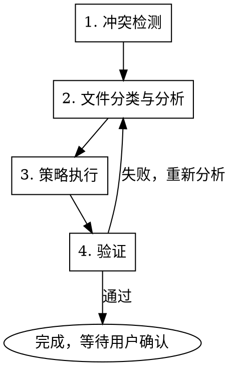

# Resolve Git Conflicts

## Overview

结构化解决 Git 冲突的工作流。按文件类型自动分类、按策略优先级处理，安全的自动合并与交互式确认结合，确保冲突解决后项目状态正确。

## When to Use

- `git status` 显示 unmerged paths
- 代码中出现 `<<<<<<<` / `=======` / `>>>>>>>` 冲突标记
- merge / rebase / cherry-pick 操作后出现冲突
- `git ls-files --unmerged` 返回非空结果

## Core Workflow



### Step 1: 冲突检测

运行以下命令获取冲突概况：

```bash
# 检测冲突文件列表
git --no-pager diff --name-only --diff-filter=U
# 获取详细 unmerged 信息
git --no-pager ls-files --unmerged
# 查看冲突文件数量
git --no-pager diff --name-only --diff-filter=U | wc -l
```

向用户展示：冲突文件数量、每个文件的冲突块数量。

### Step 2: 文件分类与分析

将冲突文件按以下类型分类：

| 类型 | 文件示例 | 优先级 |
|------|----------|--------|
| 锁文件 | `pnpm-lock.yaml`, `package-lock.json`, `yarn.lock` | 最高 |
| 文档文件 | `*.md`, `*.txt`, `*.rst` | 高 |
| 配置文件 | `*.json`, `*.yaml`, `*.toml`, `*.env` | 高 |
| 代码文件 | `*.ts`, `*.js`, `*.py`, `*.java` 等 | 中 |
| 二进制文件 | `*.png`, `*.jpg`, `*.woff` 等 | 中 |
| 敏感文件 | `.env*`, `*secret*`, `*credential*` | 特殊 |

对每个文件，用 `grep -c "^<<<<<<<"` 统计冲突块数量，并读取冲突内容进行分析。

### Step 3: 策略执行

按文件类型选择解决策略：

**锁文件** — 删除后重新生成：
```bash
rm pnpm-lock.yaml
pnpm install
git add pnpm-lock.yaml
```

**文档文件** — 合并双方内容，保留两边的改动。

**配置文件** — 智能合并：不同字段各保留，相同字段优先 incoming（通常是更新的版本）。

**代码文件** — 逐块分析：

| 冲突块特征 | 策略 |
|-----------|------|
| 一方为空，一方有改动 | 保留有改动的一方 |
| 双方改动相同 | 保留任一方 |
| 改动在不同区域 | 合并双方改动 |
| 改动在同一区域，< 20 行 | 分析语义，自动合并 |
| 改动在同一区域，>= 20 行 | **必须交互确认** |

自动解决的冲突块直接处理，需要确认的冲突块展示给用户并提供选项：
1. 保留 ours
2. 保留 incoming
3. 手动编辑
4. 查看详细 diff 后决定

**二进制文件** — 询问用户选择 ours 或 incoming。

**敏感文件** — 默认保留 ours，除非用户明确指定。

每个文件解决后立即 `git add <file>`。

### Step 4: 验证

冲突全部标记为 resolved 后，运行验证：

```bash
# 确认没有遗漏的冲突
git --no-pager diff --name-only --diff-filter=U
# 类型检查
pnpm run typecheck
# 运行测试
pnpm run test
# Lint 检查
pnpm run lint
```

如果验证失败，定位失败原因，判断是否与冲突解决有关，必要时回到 Step 2 重新分析。

### Step 5: 异常处理

| 场景 | 处理方式 |
|------|---------|
| 冲突文件超过 30 个 | 建议用户考虑 `git merge --abort` 重新规划合并策略 |
| 单个文件冲突块超过 15 个 | 建议逐块交互确认，不要批量自动解决 |
| 验证持续失败 | 提示用户是否 `git merge --abort` 回退 |
| rebase 冲突 | 每个 commit 的冲突单独处理，提供 `git rebase --abort` 选项 |
| 部分文件无法自动解决 | 先解决可以自动解决的文件，剩余的逐个与用户交互 |

## Safety Rules

- **不自动 commit** — 解决完所有冲突后展示最终 diff，等用户确认后再 commit
- **超过 20 行的冲突块** — 不自动解决，必须展示给用户确认
- **敏感文件** — `.env`、含 `secret`/`credential`/`key` 的文件，默认保留 ours
- **破坏性操作需确认** — `git checkout --theirs`、`git rebase --abort` 等操作前必须确认
- **保留备份** — 处理前展示将要修改的文件列表

## Quick Reference

```bash
# 查看冲突概况
git --no-pager diff --name-only --diff-filter=U

# 查看某文件的冲突内容
git --no-pager diff <file>

# 标记单个文件为已解决
git add <file>

# 查看合并状态
git --no-pager status

# 放弃合并
git merge --abort
git rebase --abort

# 使用特定版本
git checkout --ours <file>
git checkout --theirs <file>
```

## Common Mistakes

| 错误 | 正确做法 |
|------|---------|
| 直接 `git checkout --theirs .` 批量解决 | 逐文件分析，批量仅适用于锁文件 |
| 忽略验证步骤直接 commit | 必须运行 typecheck + test + lint |
| 解决冲突后忘记 `git add` | 每个文件解决后立即 add |
| 不看冲突内容直接选一边 | 必须读取并理解冲突语义 |
| 在 rebase 中用 `git commit` | rebase 中应使用 `git rebase --continue` |
