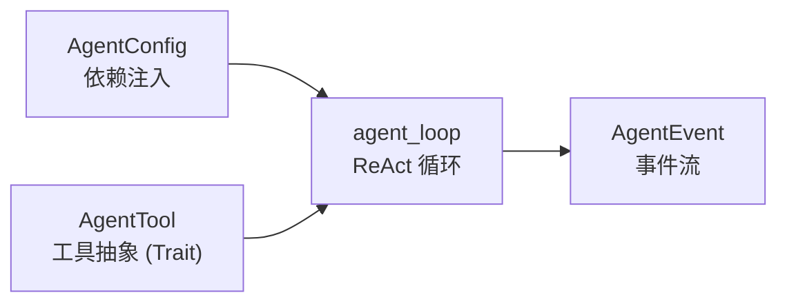

# zapmyco-core 使用指南

`zapmyco-core` 是 [zapmyco](https://github.com/shenjingnan/zapmyco) 的核心抽象层，已作为独立 crate 发布到 [crates.io](https://crates.io/crates/zapmyco-core) 和 [docs.rs](https://docs.rs/zapmyco-core)。它提供与环境无关的 AI Agent 运行时——ReAct 循环、工具抽象、事件系统——可以嵌入到任意 Rust 项目中。

## 适用场景

- 为你的应用构建一个基于 **Anthropic API 兼容接口** 的 AI Agent
- 需要 **ReAct 循环**（推理 → 工具调用 → 继续/结束）能力，而不想自己实现
- 把 AI 能力嵌入 **CLI / Web 后端 / 后台任务** 等不同环境

## 环境要求

| 项目 | 要求 |
| ---- | ---- |
| Rust | **1.95+**（crate 声明了 `rust-version = "1.95"`） |
| 异步运行时 | `tokio`（`agent_loop` 是异步函数，事件通道基于 `tokio::sync::mpsc`） |

## 引入依赖

```toml
[dependencies]
zapmyco-core = "0.1"
tokio = { version = "1", features = ["rt-multi-thread", "macros", "sync"] }
serde_json = "1"
async-trait = "0.1"
```

## 快速开始

一个完整的最小可运行示例：

```rust
use std::sync::Arc;

use serde_json::{json, Value};
use tokio::sync::mpsc;
use zapmyco_core::{agent_loop, AgentConfig, AgentEvent, AgentTool};

// 1. 定义自定义工具：任何实现 `AgentTool` 的类型都可注册
struct GreetTool;

#[async_trait::async_trait]
impl AgentTool for GreetTool {
    fn name(&self) -> &str {
        "greet"
    }
    fn description(&self) -> &str {
        "向用户打招呼"
    }
    fn input_schema(&self) -> Value {
        json!({ "type": "object", "properties": {} })
    }
    async fn execute(&self, _input: Value) -> Result<String, String> {
        Ok("Hello from zapmyco-core!".to_string())
    }
}

#[tokio::main]
async fn main() -> Result<(), Box<dyn std::error::Error>> {
    // 2. 通过 AgentConfig 注入外部依赖
    let config = AgentConfig::new(
        "claude-sonnet-5",
        std::env::var("ANTHROPIC_API_KEY").unwrap_or_default(),
        "https://api.anthropic.com",
    )
    .with_system_prompt("You are a helpful assistant")
    .with_tools(vec![Box::new(GreetTool)]);

    // 3. 运行 ReAct 循环，通过事件通道消费输出
    let (event_tx, mut event_rx) = mpsc::channel(64);
    let mut messages = Vec::new();
    agent_loop(Arc::new(config), &mut messages, "你好", event_tx).await?;

    while let Some(event) = event_rx.recv().await {
        match event {
            AgentEvent::TextChunk { delta } => print!("{delta}"),
            AgentEvent::Finished { reason } => println!("\n完成: {reason}"),
            _ => {}
        }
    }
    Ok(())
}
```

## 核心概念

整个 crate 围绕四个核心抽象展开：



### AgentConfig —— 依赖注入

所有外部依赖（模型、API Key、端点、工具、提示词等）通过 `AgentConfig` 传入，Core 层**不读取文件、不读环境变量**，由调用方决定数据来源：

```rust
let config = AgentConfig::new(model, api_key, base_url) // 必需参数
    .with_api_version("2024-01-01")   // 可选，默认 "2023-06-01"
    .with_max_tokens(8192)            // 可选，默认 4096
    .with_system_prompt("...")        // 可选，默认空
    .with_tools(vec![Box::new(MyTool)]) // 可选，默认空
    .with_max_tool_rounds(10)         // 可选，默认 50
    .with_thinking(false);            // 可选，默认 true
```

> ⚠️ **注意**：`AgentConfig` 实现了 `Clone`，但克隆后的实例 **tools 会被清空**（工具对象无法克隆）。需要继续使用工具时，请重新通过 `with_tools` 注册，或在 `agent_loop` 前手动重建。

### AgentTool —— 工具即 Trait

实现 `AgentTool` trait 即可为 Agent 添加自定义工具。trait 带有 `Send + Sync` 约束，可以跨 crate 边界使用：

```rust
#[async_trait]
impl AgentTool for MyTool {
    /// 工具名称（LLM 使用的标识符）
    fn name(&self) -> &str { "my_tool" }

    /// 工具描述（LLM 决定是否调用时的参考）
    fn description(&self) -> &str { "描述这个工具做什么" }

    /// 工具参数的 JSON Schema
    fn input_schema(&self) -> Value {
        json!({ "type": "object", "properties": {} })
    }

    /// 执行工具
    async fn execute(&self, input: Value) -> Result<String, String> {
        Ok("执行结果".to_string())
    }
}
```

### agent_loop —— ReAct 循环

核心入口，驱动「推理 → 工具调用 → 继续/结束」的循环：

```rust
pub async fn agent_loop(
    config: Arc<AgentConfig>,
    messages: &mut Vec<ConversationMessage>,
    user_input: impl Into<String>,
    event_tx: mpsc::Sender<AgentEvent>,
) -> Result<(), AgentError>
```

- `messages` 是对话历史，**传入传出**：调用后会追加用户输入和 Agent 回复
- 返回 `Err(AgentError)` 表示循环中止，`Ok(())` 表示正常完成（含达到最大工具轮次）

### AgentEvent —— 事件流

Core 层通过 `mpsc::Sender<AgentEvent>` 向外输出所有状态变化，由调用方决定如何渲染（终端 / SSE / 日志等）：

| 事件 | 含义 |
| ---- | ---- |
| `TextChunk { delta }` | LLM 输出的文本片段（流式） |
| `ThinkingChunk { delta }` | Extended Thinking 思考过程 |
| `ToolInvocationStarted { id, name, input }` | 开始调用工具 |
| `ToolInvocationFinished { id, result }` | 工具调用结束（含执行结果） |
| `TurnFinished { tool_calls_count }` | 一轮请求完成 |
| `TokenUsage { input_tokens, output_tokens, ... }` | Token 用量统计 |
| `Finished { reason }` | Agent 执行结束 |

### ConversationMessage —— 对话历史

```rust
let mut messages = Vec::new();
messages.push(ConversationMessage::user("你好"));
messages.push(ConversationMessage::assistant("你好，有什么可以帮你？"));
messages.push(ConversationMessage::tool_result("查询结果"));
```

### AgentError —— 错误处理

| 变体 | 含义 |
| ---- | ---- |
| `Api(String)` | API 调用失败 |
| `ToolExecution { name, error }` | 工具执行失败 |
| `MaxRoundsReached` | 达到最大工具调用轮次 |
| `ChannelClosed` | 事件通道关闭 |
| `Conversion(String)` | 消息转换失败 |

## 完整示例：带工具的 Agent

以下示例演示如何接入一个带文件读取工具的 Agent，并处理流式输出与 Token 用量：

```rust
use std::sync::Arc;

use serde_json::{json, Value};
use tokio::sync::mpsc;
use zapmyco_core::{agent_loop, AgentConfig, AgentError, AgentEvent, AgentTool};

struct ReadTool;

#[async_trait::async_trait]
impl AgentTool for ReadTool {
    fn name(&self) -> &str { "read" }
    fn description(&self) -> &str { "读取指定路径的文本文件" }
    fn input_schema(&self) -> Value {
        json!({
            "type": "object",
            "properties": { "path": { "type": "string" } },
            "required": ["path"]
        })
    }
    async fn execute(&self, input: Value) -> Result<String, String> {
        let path = input.get("path").and_then(Value::as_str).ok_or("缺少 path 参数")?;
        std::fs::read_to_string(path).map_err(|e| e.to_string())
    }
}

async fn run_agent() -> Result<(), AgentError> {
    let config = Arc::new(
        AgentConfig::new(
            "claude-sonnet-5",
            std::env::var("ANTHROPIC_API_KEY").map_err(|_| AgentError::Api("缺少 ANTHROPIC_API_KEY".into()))?,
            "https://api.anthropic.com",
        )
        .with_system_prompt("You are a helpful file assistant")
        .with_tools(vec![Box::new(ReadTool) as Box<dyn AgentTool>])
        .with_max_tool_rounds(5),
    );

    let (event_tx, mut event_rx) = mpsc::channel(64);
    let mut messages = Vec::new();

    // 事件消费者：在独立 task 中消费事件流，避免阻塞 agent_loop
    let consumer = tokio::spawn(async move {
        while let Some(event) = event_rx.recv().await {
            match event {
                AgentEvent::TextChunk { delta } => print!("{delta}"),
                AgentEvent::ThinkingChunk { delta } => eprint!("[思考] {delta}"),
                AgentEvent::ToolInvocationStarted { name, .. } => println!("\n[调用工具] {name}"),
                AgentEvent::TokenUsage { input_tokens, output_tokens, .. } => {
                    println!("\n[用量] in={input_tokens} out={output_tokens}")
                }
                AgentEvent::Finished { reason } => println!("\n[完成] {reason}"),
                _ => {}
            }
        }
    });

    // 运行 ReAct 循环（channel 关闭后，事件消费者 task 会自然结束）
    agent_loop(config, &mut messages, "读取 README.md 的前几行", event_tx).await?;

    consumer.await.expect("event consumer task panicked");
    Ok(())
}
```

## 设计原则

- **零环境依赖**：不读文件、不写终端、不碰环境变量
- **依赖注入**：所有外部依赖通过 `AgentConfig` 传入
- **事件驱动**：所有输出通过 `AgentEvent` 流发送
- **工具即 Trait**：通过 `AgentTool` trait 注册，不通过枚举硬编码

## 与 zapmyco CLI 的关系

- `zapmyco-core` 是 zapmyco 命令行的核心引擎，CLI 通过"适配器"模式接入（CLI 适配器负责配置读取与终端渲染）
- 如果你只是想使用 zapmyco 这个 CLI 工具本身，请阅读[快速开始](/guide/installation)；本文档面向**把 core 作为库嵌入自己项目**的 Rust 开发者

## 相关链接

- [crates.io / zapmyco-core](https://crates.io/crates/zapmyco-core)
- [docs.rs / zapmyco-core](https://docs.rs/zapmyco-core)
- [GitHub 源码](https://github.com/shenjingnan/zapmyco/tree/main/crates/zapmyco-core)
