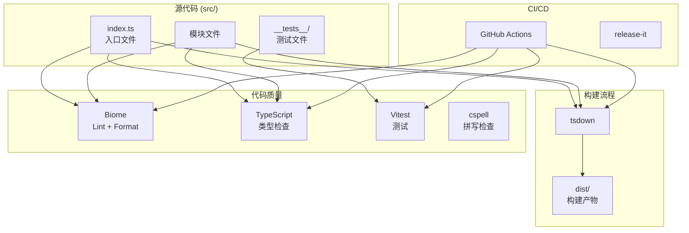
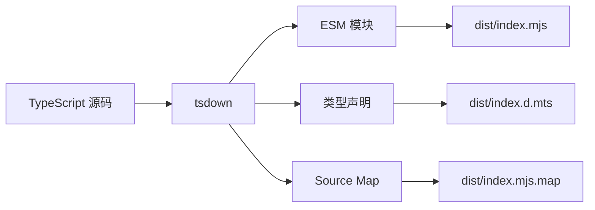
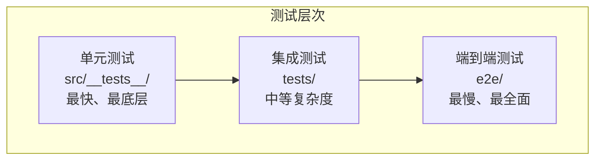
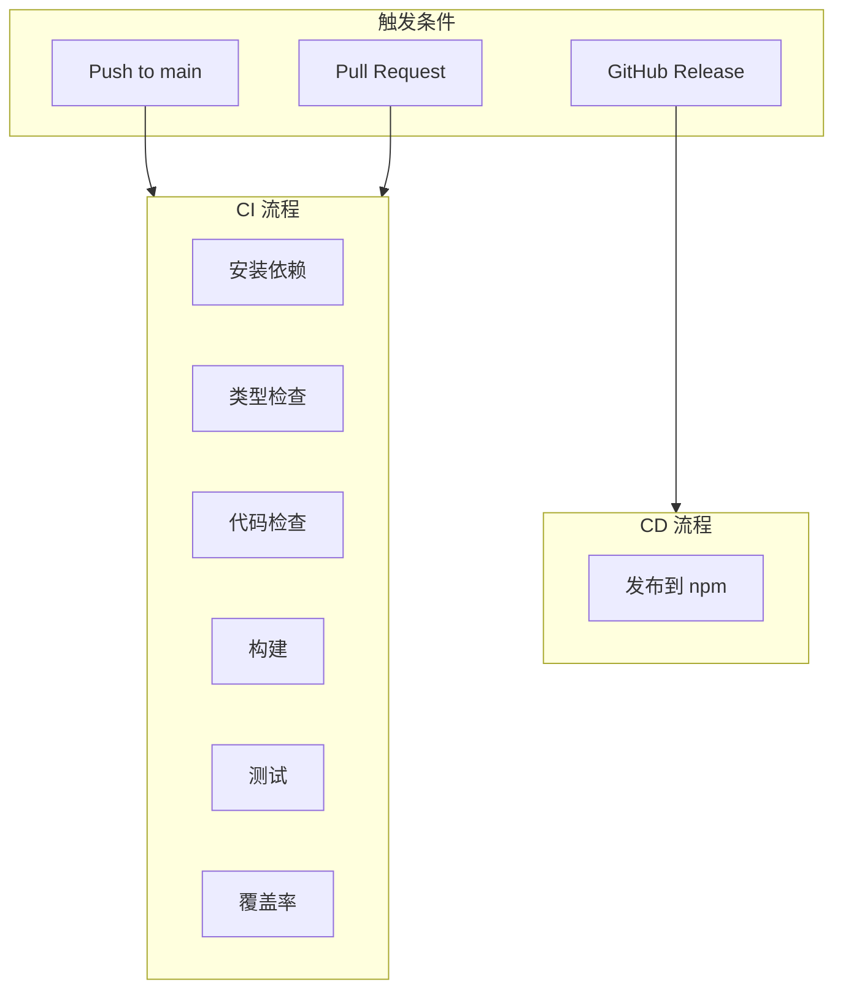
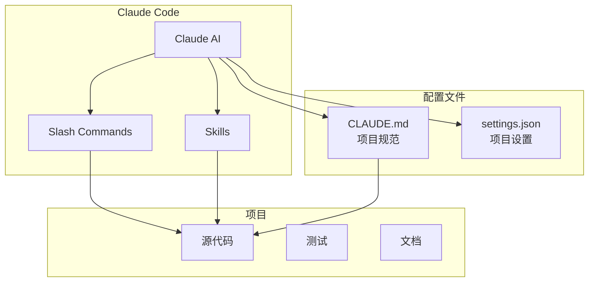

# 架构文档

本文档描述 ai-typescript-starter 项目的架构设计。

## 架构概览



## 目录结构

```
ai-typescript-starter/
├── .claude/              # Claude Code 配置
│   ├── commands/         # Slash 命令定义
│   ├── skills/           # 技能定义
│   ├── settings.json     # 项目设置
│   └── settings.local.json.example
├── .github/              # GitHub 配置
│   ├── workflows/        # CI/CD 工作流
│   │   ├── ci.yml        # 持续集成
│   │   └── release.yml   # 发布流程
│   ├── ISSUE_TEMPLATE/   # Issue 模板
│   ├── copilot-instructions.md
│   └── dependabot.yml
├── docs/                 # 项目文档
│   ├── architecture.md   # 架构文档
│   ├── api.md            # API 文档
│   └── contributing.md   # 贡献指南
├── examples/             # 使用示例
├── src/                  # 源代码
│   ├── index.ts          # 入口文件
│   └── __tests__/        # 测试文件
├── dist/                 # 构建产物 (git ignored)
├── coverage/             # 测试覆盖率报告 (git ignored)
└── [配置文件]
```

## 技术决策

### 为什么选择 tsdown？

- **零配置**: 开箱即用，无需复杂配置
- **快速**: 基于 rolldown，构建速度极快
- **ESM 优先**: 原生支持 ESM 格式
- **类型声明**: 自动生成 .d.ts 文件

### 为什么选择 Vitest？

- **Vite 原生**: 与 Vite 生态无缝集成
- **快速**: 基于 Vite，测试启动快
- **兼容性**: API 与 Jest 兼容
- **功能丰富**: 内置覆盖率、快照、UI 等

### 为什么选择 Biome？

- **统一工具**: Lint + Format 合一
- **快速**: Rust 实现，性能极佳
- **Prettier 兼容**: 格式化风格可配置为 Prettier
- **详细错误信息**: 提供清晰的错误提示

### 为什么选择 pnpm？

- **节省磁盘空间**: 内容寻址存储
- **快速安装**: 符号链接，避免重复安装
- **严格依赖**: 避免幽灵依赖
- **Monorepo 支持**: 内置 workspace 支持

## 构建流程



## 测试策略

### 测试金字塔



### 覆盖率要求

| 指标 | 阈值 |
|------|------|
| 行覆盖率 | 80% |
| 函数覆盖率 | 80% |
| 分支覆盖率 | 80% |
| 语句覆盖率 | 80% |

## CI/CD 流程



## AI 集成架构



## 扩展建议

### 添加新模块

1. 在 `src/` 下创建新文件
2. 在 `src/index.ts` 中导出
3. 在 `src/__tests__/` 添加测试
4. 更新文档

### 添加新命令

1. 在 `.claude/commands/` 创建 `.md` 文件
2. 定义命令描述和步骤
3. 在 `CLAUDE.md` 中添加命令说明

### 添加新技能

1. 在 `.claude/skills/` 创建目录
2. 创建 `SKILL.md` 文件定义技能
3. 在项目上下文中引用