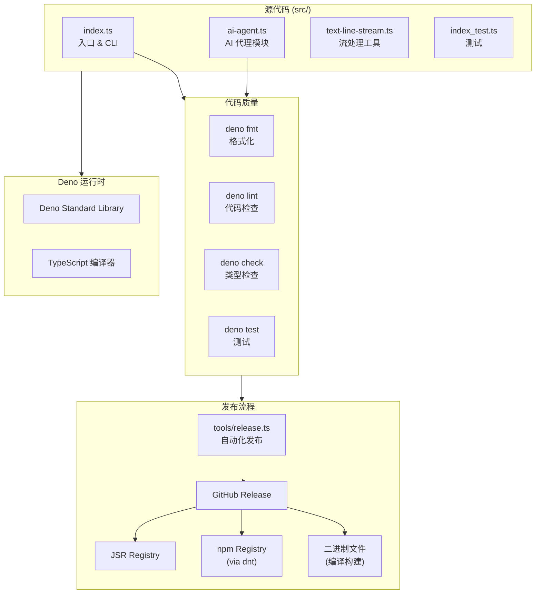

## 架构概览



## 目录结构

```
zapmyco/
├── .claude/              # Claude Code 配置
│   ├── skills/           # 项目技能定义
│   └── CLAUDE.md         # 项目上下文
├── .github/              # GitHub 配置
│   └── workflows/        # CI/CD 工作流
├── docs/                 # 文档站点
├── examples/             # 示例代码
├── src/                  # 源代码
│   ├── index.ts          # 主入口 & CLI 解析
│   ├── ai-agent.ts       # AI Agent 对话模块
│   └── text-line-stream.ts # 文本行流工具
├── tools/                # 构建/发布脚本
│   ├── build-npm.ts      # dnt npm 构建
│   └── release.ts        # 自动化发布
├── deno.json             # Deno 项目配置
├── AGENTS.md             # AI Agent 配置说明
└── CHANGELOG.md          # 变更日志
```

## 技术决策

### 为什么选择 Deno？

- **零配置** — 无需 `package.json`、`node_modules`，开箱即用
- **内置工具链** — 格式化、Lint、测试、类型检查全部内置
- **安全优先** — 默认沙箱，权限按需授予
- **TypeScript 原生** — 无需额外编译步骤

### 为什么选择 JSR + npm 双发布？

- **JSR** — Deno 生态原生 registry，提供类型声明和文档
- **npm** — 最广泛的 JavaScript 包生态，兼容 Node.js 和 Bun
- **dnt** — Deno 到 npm 的转换工具，自动处理兼容性

## 核心模块

### CLI 入口（`src/index.ts`）

解析命令行参数并分发到对应处理函数：

- `greet <name>` — 问候功能
- `config` — 配置展示
- `ai` — AI 对话模式
- `--version` / `--help` — 版本和帮助信息

### AI Agent（`src/ai-agent.ts`）

交互式 AI 对话模块，通过标准输入输出与用户交互。

### 流处理工具（`src/text-line-stream.ts`）

提供文本行的流式处理能力，用于 AI Agent 的输入输出处理。

## 构建与发布

详见[发布流程](/advanced/release-flow)。
