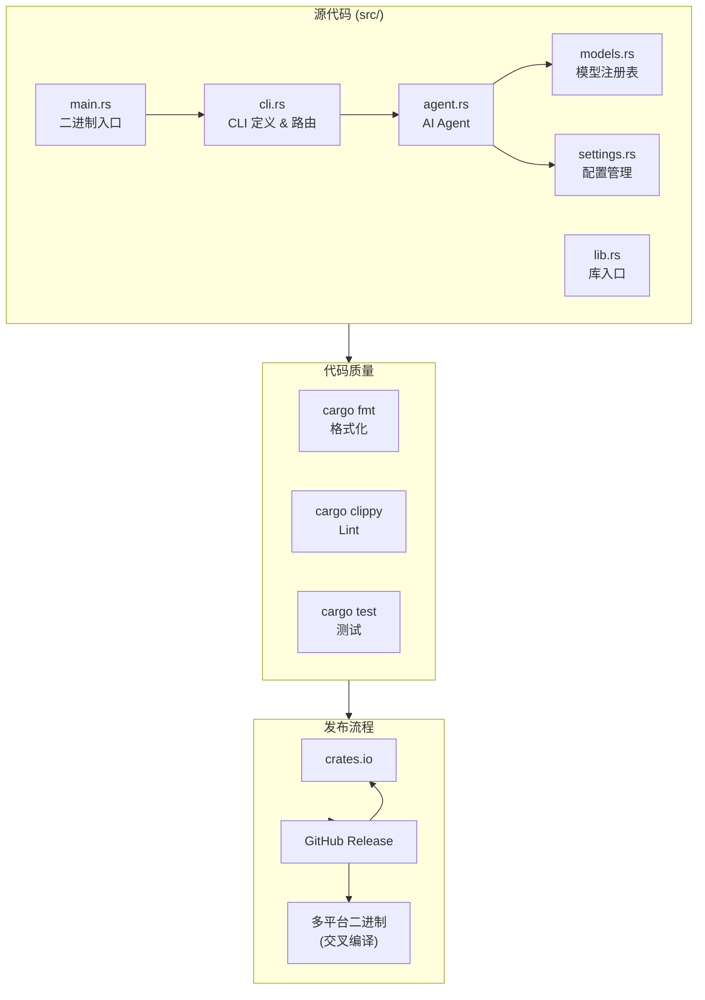

## 架构概览



## 目录结构

```
zapmyco/
├── Cargo.toml              # Rust 项目配置和依赖管理
├── .github/workflows/
│   ├── ci.yml              # Rust CI (fmt + clippy + test + build)
│   └── release.yml         # 发布流水线
├── src/
│   ├── main.rs             # 二进制入口
│   ├── lib.rs              # 库入口
│   ├── cli.rs              # clap CLI 定义
│   ├── agent.rs            # AiAgent（Anthropic API 封装）
│   ├── models.rs           # 7 个内置模型注册表
│   └── settings.rs         # ~/.zapmyco/settings.toml 管理
├── tests/
│   └── integration_test.rs # 集成测试 (wiremock)
└── AGENTS.md               # AI 辅助开发上下文
```

## 技术决策

### 为什么选择 Rust？

- **零成本抽象** — 无运行时开销，单二进制文件约 5-10MB
- **内存安全** — 编译器保证内存安全，无需 GC
- **跨平台编译** — 原生支持 5 平台交叉编译
- **丰富生态** — clap（CLI）、tokio（异步）、serde（序列化）等成熟库

### 为什么使用 anthropic-ai-sdk？

- **兼容 Anthropic API** — DeepSeek 和 GLM 都提供 Anthropic 兼容接口
- **流式支持** — 原生支持 SSE 流式解析
- **自定义 endpoint** — `with_api_base_url()` 可对接任意兼容服务

## 核心模块

### CLI 入口（`src/main.rs`）

基于 clap 的命令行参数解析，路由到对应子命令处理函数。

### AiAgent（`src/agent.rs`）

AI 对话核心模块，封装 `anthropic-ai-sdk`：

- `chat()` — 非流式对话
- `chat_stream()` — 流式对话（SSE 事件解析）

配置解析链：`options` > `settings.toml` > 环境变量

### 配置管理（`src/settings.rs`）

管理 `~/.zapmyco/settings.toml`：

- 旧版格式（扁平 apiKey/baseURL/model）→ 新版格式（providers/models）自动迁移
- `${env.VAR}` 环境变量引用解析
- API Key 脱敏显示

### 模型注册表（`src/models.rs`）

内置 7 个模型，含供应商、baseURL、上下文窗口、max tokens 信息。

## 构建与发布

详见[发布流程](/advanced/release-flow)。
