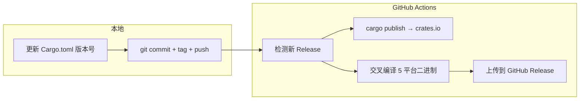

ZapMyCo 使用 GitHub Actions 驱动的自动化发布流程，一次发布同时推送到 crates.io 和多平台二进制文件。

## 发布架构



## 版本规范

遵循语义化版本规范：

| 版本变化 | 说明 |
|----------|------|
| major（1.0.0 → 2.0.0）| 不兼容的 API 变更 |
| minor（1.0.0 → 1.1.0）| 向后兼容的新功能 |
| patch（1.0.0 → 1.0.1）| 向后兼容的 Bug 修复 |

## 发布步骤

### 1. 更新版本号

在 `Cargo.toml` 中手动更新 `version` 字段：

```toml
[package]
name = "zapmyco"
version = "0.2.0"  # 更新此字段
```

### 2. 提交并打标签

```bash
git add Cargo.toml
git commit -m "chore(release): v0.2.0"
git tag -a v0.2.0 -m "v0.2.0"
git push origin HEAD --tags
```

### 3. 创建 GitHub Release

```bash
gh release create v0.2.0 --title "v0.2.0" --generate-notes
```

### 4. 自动化流程

GitHub Actions 检测到新 Release 后自动执行：

- `cargo publish` — 发布到 crates.io
- 交叉编译 5 平台二进制文件：
  - Linux x86_64 / ARM64
  - macOS ARM64 / x86_64
  - Windows x86_64
- 上传二进制文件和 SHA256SUMS 到 Release

## 安装特定版本

```bash
# 通过 cargo（需要 Rust 工具链）
cargo install zapmyco --version 0.2.0

# 通过 install 脚本
ZAPMYCO_VERSION=v0.2.0 curl -fsSL https://raw.githubusercontent.com/shenjingnan/zapmyco/main/install.sh | sh
```
