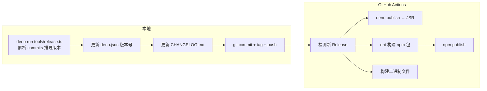

# 发布流程

ZapMyCo 使用 Conventional Commits 驱动的自动化发布流程，一次发布同时推送到 JSR 和 npm。

## 发布架构



## 版本推导规则

自动化版本推导基于 Conventional Commits：

| Commit 类型 | 版本变化 |
|-------------|----------|
| `BREAKING CHANGE` | major 版本（不兼容变更） |
| `feat` | minor 版本（新功能） |
| `fix` | patch 版本（Bug 修复） |
| 其他 | 不触发版本变化 |

## 发布步骤

### 1. 预检

```bash
deno task release:dry
```

预检模式会模拟完整的发布流程但不实际发布，可用于验证版本推导和 CHANGELOG 生成。

### 2. 正式发布

```bash
deno task release
```

### 3. 自动化流程

发布脚本自动执行：

1. 解析 Conventional Commits，推导版本号
2. 更新 `deno.json` 中的版本号
3. 生成/更新 `CHANGELOG.md`
4. 创建 Git commit 和 tag
5. 推送到远程仓库
6. 创建 GitHub Release

GitHub Actions 检测到新 Release 后自动执行：

- `deno publish` — 发布到 JSR
- dnt 构建 + `npm publish` — 发布到 npm
- 编译打包各平台二进制文件

## 安装特定版本

你可以通过 GitHub Releases 页面查看所有已发布版本，并安装特定版本：

```bash
# 安装指定版本
ZAPMYCO_VERSION=v0.20.0 curl -fsSL https://raw.githubusercontent.com/shenjingnan/zapmyco/main/install.sh | sh
```
