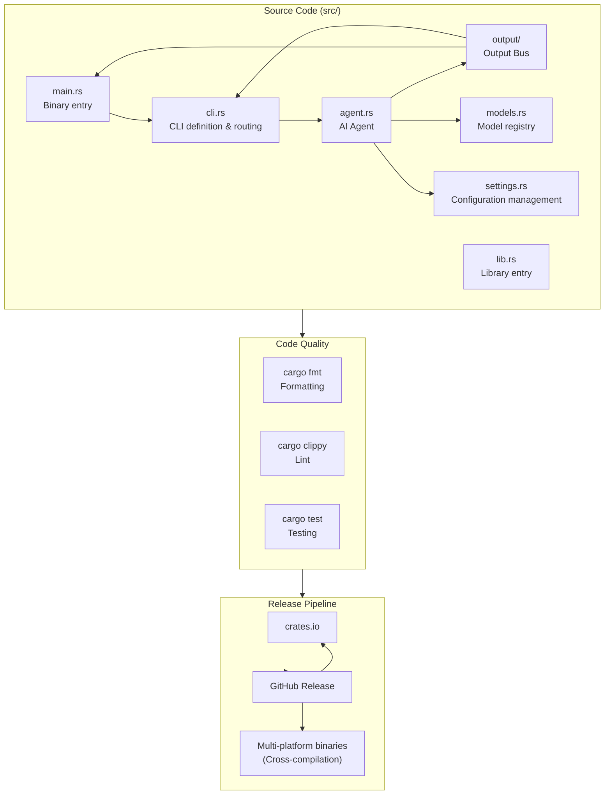

## Architecture Overview



## Directory Structure

```
zapmyco/
├── Cargo.toml              # Rust project configuration and dependency management
├── .github/workflows/
│   ├── ci.yml              # Rust CI (fmt + clippy + test + build)
│   └── release.yml         # Release pipeline
├── src/
│   ├── main.rs             # Binary entry point
│   ├── lib.rs              # Library entry point
│   ├── cli.rs              # clap CLI definition
│   ├── agent.rs            # AiAgent (Anthropic API wrapper)
│   ├── output/             # Unified Output Bus (Message, Router, Target)
│   │   ├── mod.rs          # Core types + Router + global singleton
│   │   ├── terminal.rs     # TerminalTarget (terminal rendering)
│   │   └── log.rs          # LogTarget (log persistence + ANSI stripping)
│   ├── models.rs           # 10 built-in model registry
│   └── settings.rs         # ~/.zapmyco/settings.toml management
├── tests/
│   └── integration_test.rs # Integration tests (wiremock)
└── AGENTS.md               # AI-assisted development context
```

## Technical Decisions

### Why Rust?

- **Zero-cost abstractions** — No runtime overhead, single binary ~5-10MB
- **Memory safety** — Compiler-guaranteed memory safety, no GC required
- **Cross-platform compilation** — Native support for cross-compilation across 5 platforms
- **Rich ecosystem** — Mature libraries like clap (CLI), tokio (async), serde (serialization)

### Why anthropic-ai-sdk?

- **Anthropic API compatible** — DeepSeek and GLM both provide Anthropic-compatible interfaces
- **Streaming support** — Native SSE streaming parsing
- **Custom endpoint** — `with_api_base_url()` can connect to any compatible service

## Core Modules

### CLI Entry (`src/main.rs`)

clap-based command line argument parsing, routing to corresponding subcommand handler functions.

### AiAgent (`src/agent.rs`)

AI conversation core module, wrapping `anthropic-ai-sdk`:

- `chat()` — Non-streaming conversation
- `chat_stream()` — Streaming conversation (SSE event parsing)

Configuration resolution chain: `options` > `settings.toml` > environment variables

### Configuration Management (`src/settings.rs`)

Manages `~/.zapmyco/settings.toml`:

- Legacy format (flat apiKey/baseURL/model) → new format (providers/models) auto-migration
- `${env.VAR}` environment variable reference resolution
- API Key redacted display

### Model Registry (`src/models.rs`)

10 built-in models with provider, baseURL, context window, and max tokens information.

### Output System / Output Bus (`src/output/`)

A unified output infrastructure based on the **publish-subscribe pattern**, managing all terminal rendering and log persistence. See [Output System Details](/advanced/output-system).

## Build & Release

See [Release Flow](/advanced/release-flow).
