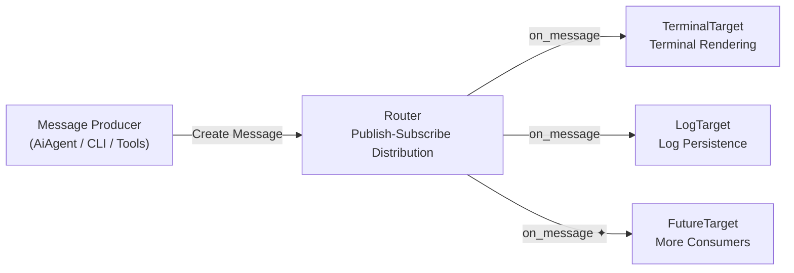
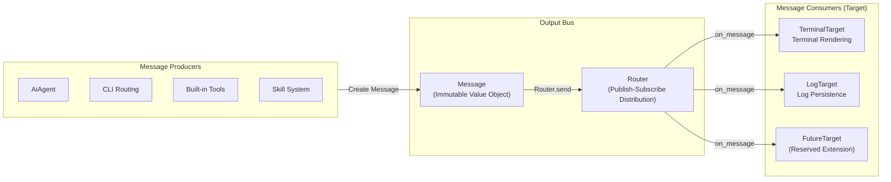

## Overview

The Output Bus is ZapMyCo's **unified output channel**, adopting a **publish-subscribe pattern** architecture to manage all terminal rendering and log persistence. When you see AI response streaming output, status information, or tool call results in the terminal, these are all presented through the Output Bus.

The core idea of the system is **separation of "message production" from "message consumption"**:



- **Message Producers** (such as AiAgent, CLI routing, built-in tools) only need to create a `Message` without caring about where the message eventually goes
- **Message Consumers** (`Target`) are responsible for processing messages — rendering to the terminal, writing to log files, or other purposes
- **Router** acts as the intermediary, distributing `Message` to all registered `Target`s

If you need to modify the output format, adjust logging behavior, or add new output channels, you only need to operate on the corresponding `Target` implementation without modifying any business code.

The entire distribution chain is synchronous: `Router` calls each `Target`'s `on_message` in registration order. Exceptions in individual Targets are isolated via `catch_unwind`, ensuring they do not affect other Targets or poison the internal `Mutex`.

## Design Decisions

### Why publish-subscribe instead of direct output?

The publish-subscribe pattern decouples "message production" from "message consumption":

- **Single Responsibility** — Business code only needs to create a `Message`, without caring about the output method or destination
- **Extensible** — Adding new Targets (such as file logging, WebSocket push) does not require modifying business code
- **Testable** — MockTarget can replace the terminal and log in tests to verify message content

### Why separate formatting from transport?

`Message` factory methods pre-format the text (including ANSI), and Targets are only responsible for transport:

- **Avoid redundant formatting** — All Targets share the same formatted result
- **Simplify Target implementation** — TerminalTarget can output directly without additional processing
- **Centralize logic** — Formatting logic is maintained centrally in factory methods, not scattered everywhere

## Architecture Design



### Core Flow

1. Application code creates a `Message` value object (containing kind, text, optional data)
2. Distributes via `Router::send()` or the global convenience function `send()`
3. `Router` iterates through all registered `Target`s, calling `on_message()` on each
4. Each Target call is wrapped in `catch_unwind` to ensure a panic in one target does not affect others

## Core Types

### MessageKind

`MessageKind` is an enum with 19 variants that categorizes messages:

| Category | Variants | Description |
|----------|----------|-------------|
| **LLM Interaction** | `LlmThinking`, `LlmChunk`, `LlmUsage` | Thinking indicator, streaming text fragments, Token count |
| **Tool Execution** | `ToolCall`, `ToolResult`, `ToolError`, `ToolOutput` | Tool call formatting, success/failure, raw output |
| **Task System** | `TaskPending`, `TaskDone` | Track pending and completed async tasks |
| **Output Channel** | `ResultLine`, `ResultBlock` | Final output, single line or multi-line block (Stdout) |
| **System Status** | `Info`, `Warning`, `Error` | Status messages (Stderr) |
| **Upgrade** | `UpgradePhase`, `UpgradeDone` | Self-update progress |
| **Other** | `NoteInfo`, `SubAgentInfo`, `SkillLoaded` | Domain-specific notifications |

### Message

```rust
pub struct Message {
    pub kind: MessageKind,
    pub text: String,
    pub data: Option<serde_json::Value>,
}
```

Messages are immutable value objects (`Clone`), constructed via factory methods:

- **Structured messages** (with `data`): `tool_call()`, `tool_result()`, `tool_error()`, `llm_usage()`, `warning()`, `error()`, `upgrade_done()`, `upgrade_phase()`
- **Streaming messages**: `llm_chunk()` — streaming text segments
- **Simple terminal messages**: `info()`, `result()`, `result_block()`, `tool_output()`

### Channel

The `Channel` enum maps messages to terminal output streams:

- **`Stdout`** — Uses `println!` (for final output like `ResultLine`, `ResultBlock`)
- **`Stderr`** — Uses `eprintln!` (for status messages like `Info`, `Warning`, `Error`, `ToolCall`)
- **`Stream`** — Uses `eprint!` + `flush()` (for `LlmChunk` streaming output, no newline)

### Target trait

```rust
pub trait Target: Send + Sync {
    fn on_message(&self, msg: &Message);
    fn name(&self) -> &'static str;
}
```

The basic interface for all message consumers. Requires `Send + Sync`, allowing safe sharing across threads.

### Router

```rust
pub struct Router {
    targets: Mutex<Vec<Box<dyn Target>>>,
}
```

Core dispatcher, providing three operations:

- `add_target(target)` — Register a Target
- `remove_target(name)` — Unregister a Target by name
- `send(msg)` — Distribute a message to all registered Targets (each call wrapped in `catch_unwind`)

Global convenience access:

```rust
static ROUTER: LazyLock<Router> = LazyLock::new(Router::new);
pub fn send(msg: &Message) { ROUTER.send(msg); }
```

## Built-in Targets

### TerminalTarget (Terminal Rendering)

A unit struct responsible for rendering messages to the terminal.

Core logic — `channel_for(kind)` maps `MessageKind` to `Channel`:

| Channel | MessageKind |
|---------|-------------|
| `Stdout` | `ResultLine`, `ResultBlock`, `TaskDone`, `UpgradePhase`, `UpgradeDone`, `NoteInfo` |
| `Stderr` | All others (`Info`, `Warning`, `Error`, `ToolCall`, `ToolResult`, `LlmThinking`, etc.) |
| `Stream` | `LlmChunk` (streaming output without newline) |

`on_message` selects `println!`, `eprintln!`, or `eprint! + flush()` based on the channel, directly outputting `msg.text` (the text is pre-formatted as an ANSI-containing string).

### LogTarget (Log Persistence)

Writes messages to `terminal.log`, containing three key components:

- **`BufWriter<File>`** — Buffered file writer
- **`line_buffer: String`** — Line buffer for assembling streaming messages
- **`AnsiStripper`** — Finite state machine for stripping ANSI escape sequences

The ANSI stripper is a four-state FSM (`Normal`, `Escape`, `Csi`, `Osc`), supporting:

- CSI sequences: `\x1b[<params><final>` (e.g., `\x1b[31m`)
- OSC sequences: `\x1b]<content>(\x07 | \x1b\\)` (e.g., setting terminal title)
- Simple escapes: `\x1b<final>`
- Partial sequences across call boundaries

Log format:

```
[2025-06-09T20:45:07] [STDERR] Message content
[2025-06-09T20:45:08] [STDOUT] Output content
```

Each line contains an ISO timestamp and channel tag (`[STDOUT]` / `[STDERR]`). Multi-line text is automatically split into multiple log entries.

The `Drop` implementation flushes all buffers before the file is closed, ensuring no data loss.
