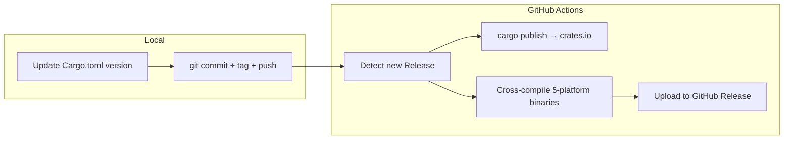

ZapMyCo uses a GitHub Actions-driven automated release flow. A single release simultaneously pushes to crates.io and multi-platform binaries.

## Release Architecture



## Versioning

Follows Semantic Versioning:

| Version Change | Description |
|----------------|-------------|
| major (1.0.0 → 2.0.0) | Incompatible API changes |
| minor (1.0.0 → 1.1.0) | Backward-compatible new features |
| patch (1.0.0 → 1.0.1) | Backward-compatible bug fixes |

## Release Steps

### 1. Update Version

Manually update the `version` field in `Cargo.toml`:

```toml
[package]
name = "zapmyco"
version = "0.2.0"  # Update this field
```

### 2. Commit and Tag

```bash
git add Cargo.toml
git commit -m "chore(release): v0.2.0"
git tag -a v0.2.0 -m "v0.2.0"
git push origin HEAD --tags
```

### 3. Create GitHub Release

```bash
gh release create v0.2.0 --title "v0.2.0" --generate-notes
```

### 4. Automated Pipeline

GitHub Actions detects the new Release and automatically executes:

- `cargo publish` — Publishes to crates.io
- Cross-compiles 5-platform binaries:
  - Linux x86_64 / ARM64
  - macOS ARM64 / x86_64
  - Windows x86_64
- Uploads binaries and SHA256SUMS to the Release

## Install a Specific Version

```bash
# Via cargo (requires Rust toolchain)
cargo install zapmyco --version 0.2.0

# Via install script
ZAPMYCO_VERSION=v0.2.0 curl -fsSL https://raw.githubusercontent.com/shenjingnan/zapmyco/main/install.sh | sh
```
