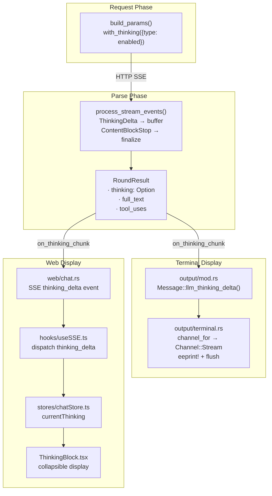
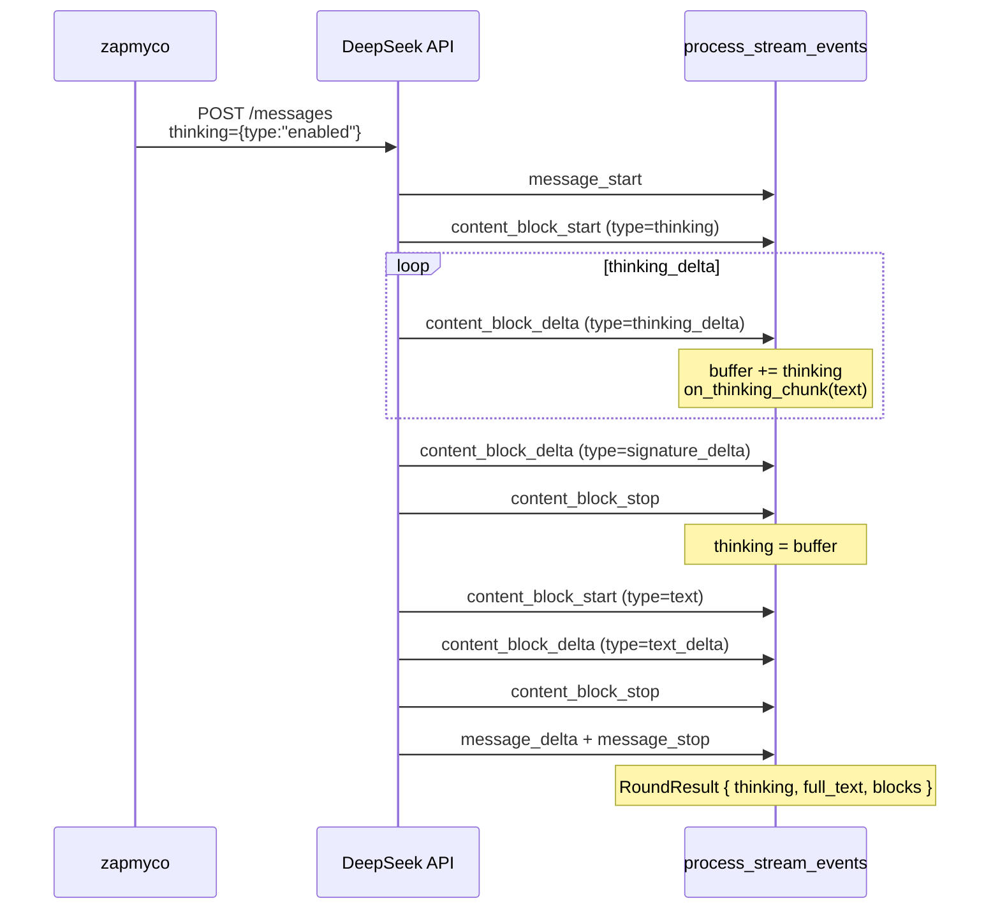

## Overview

Models like DeepSeek return `type="thinking"` ContentBlocks in their Anthropic-compatible SSE streams, containing the model's internal reasoning process before generating the final response. This feature enables Zapmyco to receive, parse, and visually display this thinking content.

### Design Principles

| Principle | Description |
|-----------|-------------|
| **Minimal Changes** | No SDK modifications, no new dependencies |
| **Enabled by Default** | `thinking` parameter is on without user configuration |
| **Backward Compatible** | Behavior is unchanged when the model doesn't return thinking |
| **Zero Configuration** | Users see thinking content without any setup |

## Architecture

Thinking parsing occurs in the streaming event processing layer. `ThinkingDelta` events from the SSE stream are captured in real-time and pushed to terminal and Web frontends through a callback chain:

## Key Design Decisions

### 1. `on_thinking_chunk` Callback Propagation

The `on_thinking_chunk` callback penetrates from the top-level request handler down to the innermost stream parser, passing through 3 layers. Each `ThinkingDelta` event triggers the callback immediately, ensuring real-time display of thinking content in the frontend.

### 2. Thinking Block Position in `blocks`

When rebuilding the message `blocks` list, the thinking block is placed before the text block. This preserves the semantic order and allows the frontend to naturally display thinking before the response.

### 3. Terminal Rendering with Dim Effect

Terminal output uses ANSI `\x1b[2m` (dim effect) for thinking content, prefixed with `⎔` to indicate "model is thinking". Output is rendered in real-time via `eprint!` + flush.

### 4. Collapsible Web Display

The Web frontend uses a collapsible ThinkingBlock component, collapsed by default. Users can click to expand and view the full thinking content. A pulsing animation indicator is shown during streaming.

## Edge Cases

| Scenario | Behavior |
|----------|----------|
| Model doesn't return thinking | `RoundResult.thinking` is None, behavior unchanged |
| Empty thinking content | No thinking block displayed |
| Full thinking in ContentBlockStart | Callback triggered immediately, frontend receives normally |
| Multi-turn conversations | `ContentBlock::Thinking` preserved in blocks, API handles normally |
| Model doesn't support thinking parameter | Can be disabled via `AiAgentOptions.thinking_enabled` |
