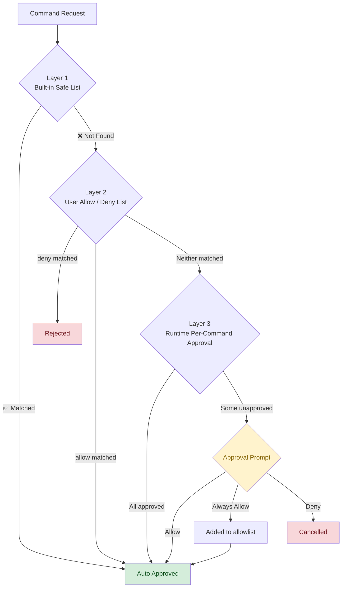
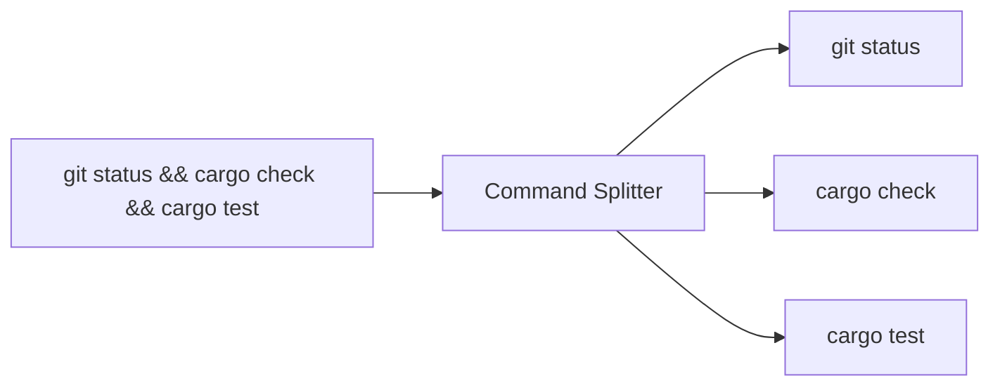
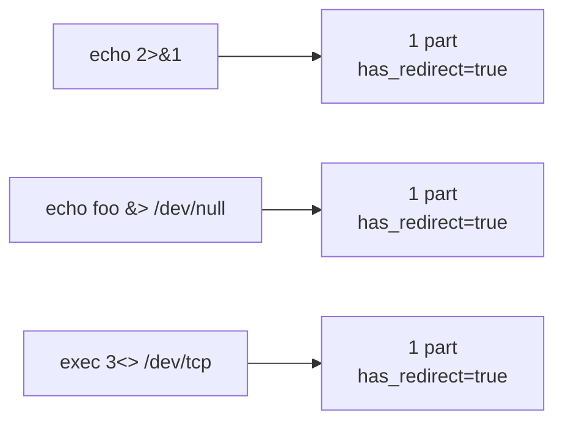
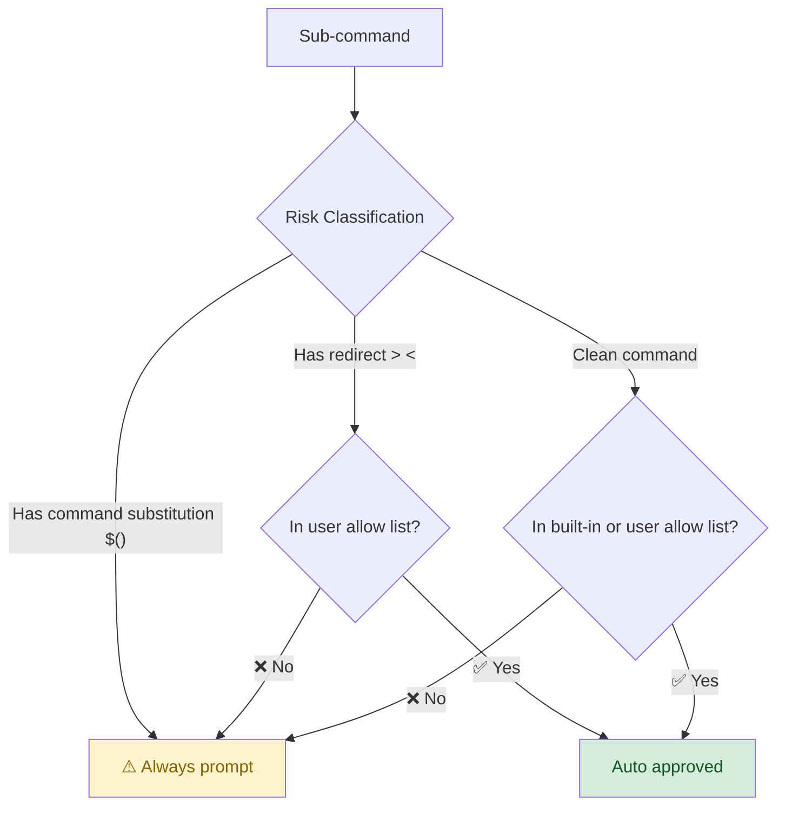
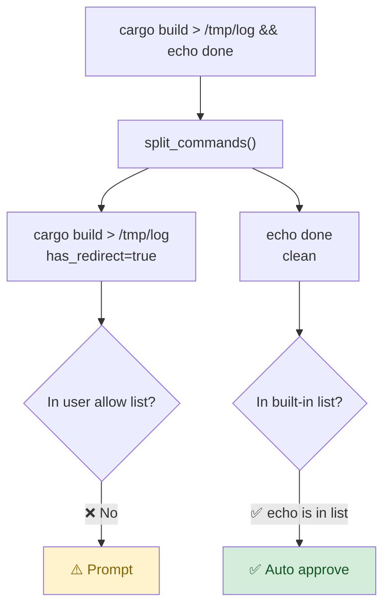
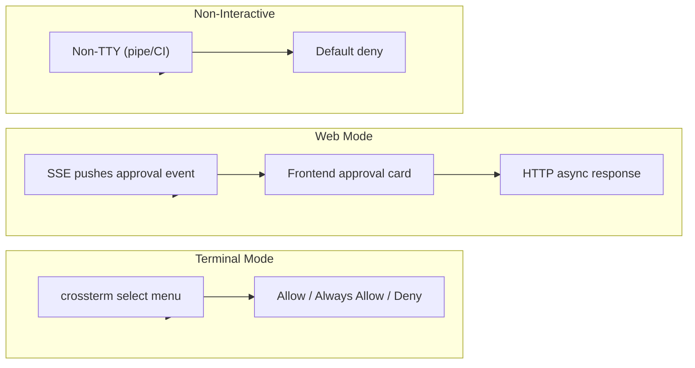
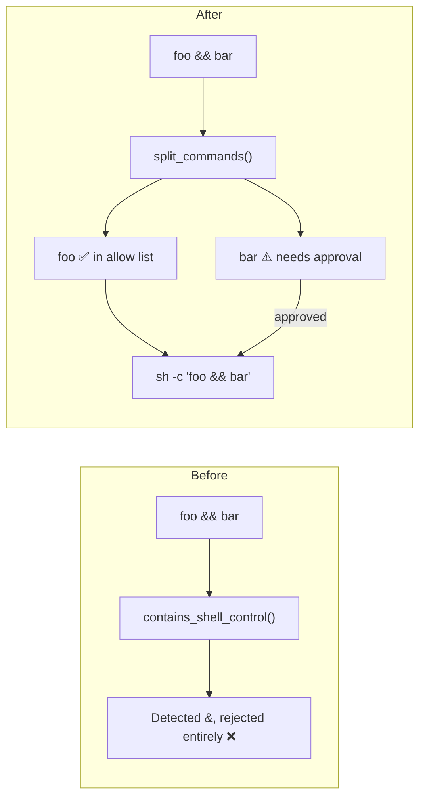

AI Agents have the ability to execute arbitrary shell commands—a double-edged sword where capability and security responsibility go hand in hand.
zapmyco's **three-layer security model** balances safety with interactive smoothness.

## Three-Layer Security Model



Each layer is **checked cumulatively**: if the upper layer matches, the command is allowed or rejected immediately; otherwise, it flows to the next layer.

---

## Layer 1: Built-in Safe List

A compile-time list of unconditionally safe commands containing only **read-only system information** commands.

| Category | Command | Description |
|----------|---------|-------------|
| | `pwd` | Print working directory |
| | `whoami` | Print current username |
| General | `true` | No-op, returns 0 |
| | `false` | No-op, returns 1 |
| | `echo` | Output text (requires arguments; bare `echo` is not allowed) |
| | `printf` | Formatted output (requires arguments) |
| | `cd` | Change working directory |
| | `uname` | System information |
| | `hostname` | Host name |
| | `uptime` | System uptime |
| | `arch` | Hardware architecture |
| System Info | `which` | Locate a command path (requires arguments) |
| | `id` | User identity |
| | `logname` | Login user name |
| | `tty` | Terminal device name |
| | `cal` | Display calendar |
| | `seq` | Generate number sequence (requires arguments) |
| System Config | `getconf` | System configuration variables (requires arguments) |
| | `pathchk` | Path name check (requires arguments) |
| | `basename` | Extract file name from path (requires arguments) |
| Path Ops | `dirname` | Extract directory name from path (requires arguments) |
| | `realpath` | Resolve to absolute path (requires arguments) |
| Directory | `ls` | List directory contents |
| Date/Time | `date` | Display date/time |

**Windows additional commands:**

| Command | Description |
|---------|-------------|
| `ver` | Display Windows version |
| `systeminfo` | Display system information |
| `dir` | List directory |
| `date /t` | Display date (`/t` means view only, not set) |
| `time /t` | Display time (`/t` means view only, not set) |
| `vol` | Display volume label |

**Matching rule:** A command is matched if it starts with one of the listed entries (prefix matching).
For example, `ls` matches both `ls` and `ls -la`, but does NOT match `lsblk`.

> The built-in list follows the principle "better to fall through (back to approval) than to over-allow."
> To extend the list, configure user allow/deny lists in Layer 2.

---

## Layer 2: User Allow / Deny List

Configured in `~/.zapmyco/settings.toml`:

```toml
[permissions.commands]
# Allow list: matching commands skip all approval
allow = [
    "git status",
    "cargo check",
    "cargo clippy",
]

# Deny list: matching commands are always rejected (takes priority over allow)
deny = [
    "rm -rf",
    "sudo",
]
```

- Commands matching `allow` bypass all approval prompts
- Commands matching `deny` are immediately rejected, even if also in `allow`
- Matching rules are the same as the built-in list (prefix matching)

---

## Layer 3: Runtime Approval (Core)

This is the most important layer—it solves the core pain point of traditional approval systems.

### Compound Command Splitting

AI agents often produce chained commands like `git status && cargo check && cargo test`.
Traditional systems either reject the entire chain or prompt for the whole thing at once.

zapmyco's **command splitter** (`split_commands`) uses a state machine to scan character by character,
splitting the command into independent sub-commands at top-level control operators:



The splitter correctly skips operators inside the following syntax constructs:

| Syntax | Example | Splits? |
|--------|---------|:-------:|
| Single quotes `'...'` | `echo 'a && b'` | ❌ No |
| Double quotes `"..."` | `echo "a && b"` | ❌ No |
| Command substitution `$(...)` | `echo $(foo && bar)` | ❌ No |
| Parameter expansion `${...}` | `echo ${VAR:-foo}` | ❌ No |
| Escaped characters `\` | `echo a \& b` | ❌ No |

### Redirect Operator Recognition

Compound redirect operators like `>` `<` `>>` `>&` `&>` `<<` `<<<` `<>` are correctly identified as a single unit and never incorrectly split:



### Approval Decision Flow

Each sub-command independently runs through the approval decision logic:



Why this classification:

| Feature | Example | Risk | Built-in List | User Allow List |
|---------|---------|:----:|:-------------:|:---------------:|
| Clean | `cargo check` | Low | Not allowed | Can allow |
| Redirect `>` `<` | `echo hello > file` | Medium | **Not allowed** | Can allow |
| Command substitution `$()` `` ` `` | `echo $(whoami)` | High | **Not allowed** | **Not allowed** |

- **Redirects** only modify I/O flow; the command's inherent risk doesn't change.
  If you trust `cargo build`, `cargo build > /tmp/log` should also be trustworthy.
- **Command substitution** executes embedded code. `echo $(rm -rf /)` is fundamentally different from `echo hello`,
  so it always requires approval even if the command is in the allow list.

### Mixed Approval

This is the final user experience:



When some sub-commands are already approved, **only the unapproved ones are prompted**:

```
⚠️ Preparing to execute:
  Full command: cargo build > /tmp/log && echo done

Commands requiring authorization:
  ▢ cargo build > /tmp/log  (contains file redirect)

Already in allow list (will auto-execute):
  ✓ echo done

[Allow] [Always Allow] [Deny]
```

When all sub-commands are unapproved, the full command is displayed:

```
⚠️ Preparing to execute:
  Full command: git status && cargo check
[Allow] [Always Allow] [Deny]
```

When all sub-commands are approved, no prompt is shown—silent execution.

---

## Three Interaction Modes



### Terminal Mode (TTY)

An interactive select menu with three options:

- **Allow** — Execute once
- **Always Allow** — Add to allow list and execute (dangerous commands are blocked from adding)
- **Deny** — Cancel execution

### Web Mode

Sends a `tool_approval_required` event via SSE (Server-Sent Events) to the frontend,
displays an approval card, and receives the result asynchronously through `POST /api/tool/approve`.

### Non-Interactive Environment

Pipes, CI, redirects, etc. (non-TTY): **all commands requiring approval are denied by default**. This is a security design.

---

## Execution Path

Security approval **only affects whether a command executes, not how it executes**.
The original command is passed through to the system shell unchanged:



```
Unix:     sh -c "<original_command>; _ZMD_RC=$?; pwd -P > ...; exit $_ZMD_RC"
Windows:  cmd.exe /d /c "<written to temporary bat file>"
```

> This is why we say **"only the approval path changes, not the execution path."**

---

## Security Best Practices

1. **Start with minimal permissions**
   By default, only the built-in safe list is auto-approved; everything else requires approval.
   Use it this way for a while to observe the AI's behavior patterns.

2. **The built-in list covers most read-only commands**
   `pwd` `ls` `echo` `date` etc. are already in the list—no need to configure them again.

3. **Only allow commands you trust**
   Read-only check commands like `git status` and `cargo check` are good candidates.
   Dangerous commands like `rm` and `sudo` are blocked from being added to the allow list.

4. **Be cautious with redirect commands**
   Although the user allow list can approve redirect commands (e.g., `echo > file`),
   it is recommended to only configure this when you explicitly trust the command.

5. **Review your allow list regularly**
   ```bash
   cat ~/.zapmyco/settings.toml | grep -A 20 "\[permissions"
   ```

---

## Technical Details (Optional)

For those interested in implementation specifics:

- The command splitter `split_commands()` uses a state machine with O(n) complexity
- 6 scan states: Normal / SingleQuote / DoubleQuote / CommandSubst / ParamSubst / Backtick / Escape
- Parenthesis and brace counters handle `$()` and `${}` nesting
- The splitter never panics on any input (unclosed quotes, unclosed `$(` or `${`, empty strings, etc.)
- **Worst case when the splitter has a bug**: sub-command not split correctly → allow list doesn't match → approval prompt triggered → fails safe to "requires user confirmation"
  → **fail-safe**: security checks are never bypassed
