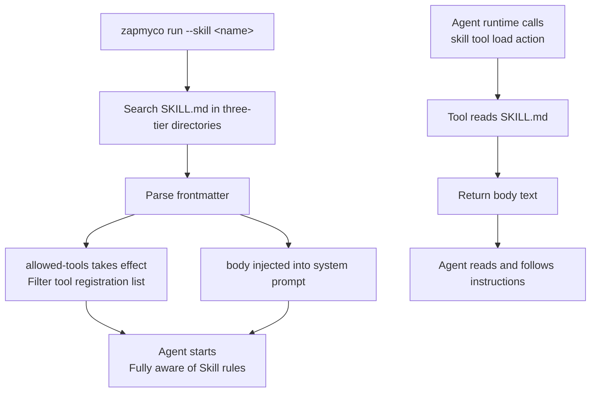

Skill content enters the Agent's prompt context through two pathways. Understanding this mechanism helps in writing effective SKILL.md files.

## `--skill` Startup Loading

When `zapmyco run --skill <name>` is used:

1. **SKILL.md Parsing**: Find the corresponding SKILL.md via the three-tier discovery mechanism, parse the frontmatter and body
2. **Body injected into system prompt**: The Markdown content after the frontmatter in SKILL.md is appended to the end of the Agent's system prompt, serving as part of the Agent's behavioral guidelines
3. **allowed-tools takes effect**: If the frontmatter defines `allowed-tools`, tools not in the whitelist are removed at Agent startup, and the Agent cannot use these tools throughout the session
4. **Content auto-fill**: If no content is provided, the default startup instruction is automatically filled in

The Agent is fully aware of the Skill rules from the start of the conversation, without needing to call additional tools.

## `skill` Tool Runtime Loading

When the Agent calls the `load` action of the `skill` tool during a conversation:

1. **Tool returns body**: The `skill` tool reads SKILL.md and returns text in the format `## Skill: {name}\n\n{body}`
2. **Agent reads and follows**: The Agent reads the returned content as a tool result and executes according to the rules

Unlike `--skill`, this method does not trigger `allowed-tools` filtering, and the already registered tool set is unaffected.

## Available Skill List Injection

Regardless of whether `--skill` is used, the names and descriptions of all available Skills are injected into the context reminder as an `## Available Skills` list. After seeing the list, the Agent can decide on its own whether to load a Skill via the `skill` tool.
