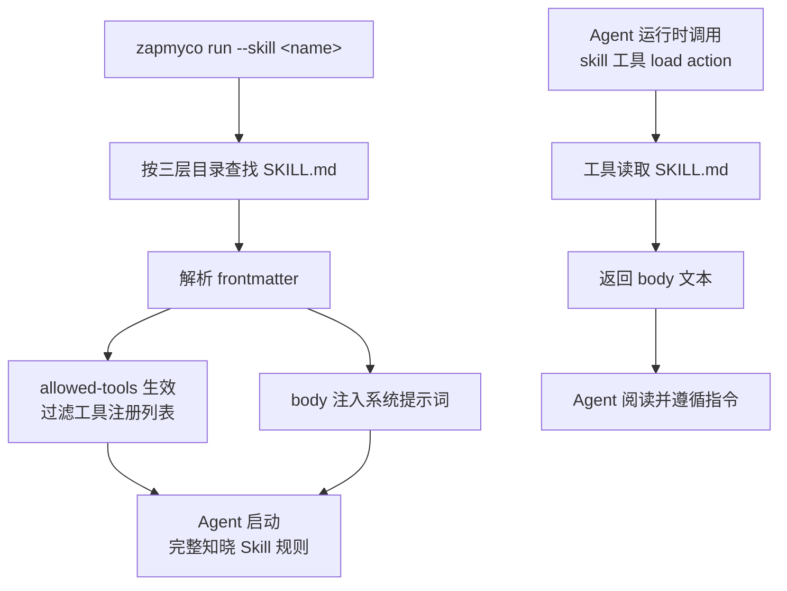

Skill 的内容通过两种途径进入 Agent 的提示词上下文，理解其机制有助于编写有效的 SKILL.md。

## `--skill` 启动加载

当使用 `zapmyco run --skill <name>` 时：

1. **SKILL.md 解析**：按三层发现机制找到对应的 SKILL.md，解析 frontmatter 和 body
2. **body 注入系统提示词**：SKILL.md 中 frontmatter 之后的 Markdown 正文被追加到 Agent 的系统提示词末尾，作为 Agent 行为准则的一部分
3. **allowed-tools 生效**：如果 frontmatter 定义了 `allowed-tools`，不在白名单中的工具在 Agent 启动时即被移除，Agent 全程无法使用这些工具
4. **content 自动填充**：如果未提供 content，自动填充默认启动指令

Agent 在对话开始时就已经完整知晓 Skill 的规则，无需额外调用工具。

## `skill` 工具运行时加载

当 Agent 在对话中调用 `skill` 工具的 `load` action 时：

1. **工具返回 body**：`skill` 工具读取 SKILL.md，返回格式为 `## Skill: {name}\n\n{body}` 的文本
2. **Agent 读取并遵循**：Agent 将返回内容作为工具结果阅读，并按照其中的规则执行

与 `--skill` 不同，此方式不会触发 `allowed-tools` 过滤，已注册的工具集不受影响。

## 可用 Skill 列表注入

无论是否使用 `--skill`，所有可用 Skill 的名称和描述都会以 `## 可用 Skill` 列表的形式注入到上下文提示（context_reminder）中。Agent 看到列表后，可以自行决定是否通过 `skill` 工具加载某个 Skill。
