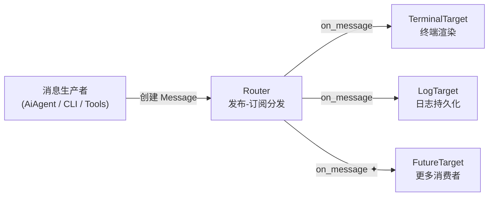
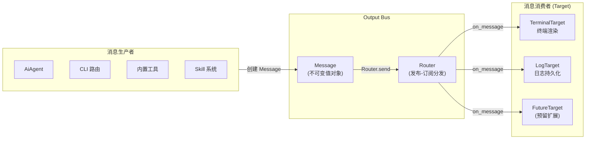

## 概述

输出系统（Output Bus）是 Zapmyco 的**统一输出通道**，采用 **发布-订阅模式** 架构，管理所有终端渲染和日志持久化。当你在终端中看到 AI 回复流式输出、状态信息或工具调用结果时，这些内容都是通过 Output Bus 呈现的。

系统的核心思路是 **「产生消息」与「消费消息」相分离**：



- **消息生产者**（如 AiAgent、CLI 路由、内置工具）只需创建 `Message`，不需要关心消息最终去了哪里
- **消息消费者**（`Target`）负责处理消息——渲染到终端、写入日志文件，或预留的其他用途
- **Router** 作为中间人，将 `Message` 分发给所有已注册的 `Target`

如果你要修改输出格式、调整日志行为或添加新的输出通道，只需操作对应的 `Target` 实现即可，不需要修改任何业务代码。

整个分发链路是同步的：`Router` 按注册顺序依次调用每个 `Target` 的 `on_message`。单个 Target 的异常通过 `catch_unwind` 隔离，不会影响其他 Target，也不会毒化内部的 `Mutex`。

## 设计决策

### 为什么选择发布-订阅而不是直接输出？

发布-订阅模式将"产生消息"与"消费消息"解耦：

- **单一职责** — 业务代码只需创建 `Message`，不关心输出方式和目的地
- **可扩展** — 添加新的 Target（如文件日志、WebSocket 推送）无需修改业务代码
- **可测试** — 测试中可以用 MockTarget 替代终端和日志，验证消息内容

### 为什么格式化与传输分离？

`Message` 工厂方法预先格式化好文本（含 ANSI），Target 只负责传输：

- **避免重复格式化** — 所有 Target 共用同一份格式化结果
- **简化 Target 实现** — TerminalTarget 直接输出无需额外处理
- **逻辑集中** — 格式化逻辑在工厂方法中集中维护，不会散落在各处

## 架构设计



### 核心流程

1. 应用代码创建 `Message` 值对象（含 kind、text、可选 data）
2. 通过 `Router::send()` 或全局快捷函数 `send()` 分发
3. `Router` 遍历所有已注册的 `Target`，逐个调用其 `on_message()`
4. 每个 Target 调用由 `catch_unwind` 包裹，确保单个 target 的 panic 不影响其他 target

## 核心类型

### MessageKind

`MessageKind` 是一个包含 19 种变体的枚举，对消息进行分类：

| 类别 | 变体 | 描述 |
|----------|-------|-------------|
| **LLM 交互** | `LlmThinking`, `LlmChunk`, `LlmUsage` | 思考指示器、流式文本片段、Token 计数 |
| **工具执行** | `ToolCall`, `ToolResult`, `ToolError`, `ToolOutput` | 工具调用格式化、成功/失败、原始输出 |
| **任务系统** | `TaskPending`, `TaskDone` | 跟踪待办和已完成的异步任务 |
| **输出通道** | `ResultLine`, `ResultBlock` | 最终输出，单行或多行块（Stdout） |
| **系统状态** | `Info`, `Warning`, `Error` | 状态消息（Stderr） |
| **升级** | `UpgradePhase`, `UpgradeDone` | 自更新进度 |
| **其他** | `NoteInfo`, `SubAgentInfo`, `SkillLoaded` | 特定领域的通知 |

### Message

```rust
pub struct Message {
    pub kind: MessageKind,
    pub text: String,
    pub data: Option<serde_json::Value>,
}
```

消息是不可变值对象（`Clone`），通过工厂方法构造：

- **结构化消息**（含 `data`）：`tool_call()`、`tool_result()`、`tool_error()`、`llm_usage()`、`warning()`、`error()`、`upgrade_done()`、`upgrade_phase()`
- **流式消息**：`llm_chunk()` — 流式文本分段
- **简单终端消息**：`info()`、`result()`、`result_block()`、`tool_output()`

### Channel

`Channel` 枚举将消息映射到终端输出流：

- **`Stdout`** — 使用 `println!`（适用于 `ResultLine`、`ResultBlock` 等最终输出）
- **`Stderr`** — 使用 `eprintln!`（适用于 `Info`、`Warning`、`Error`、`ToolCall` 等状态消息）
- **`Stream`** — 使用 `eprint!` + `flush()`（适用于 `LlmChunk` 流式输出，无换行）

### Target trait

```rust
pub trait Target: Send + Sync {
    fn on_message(&self, msg: &Message);
    fn name(&self) -> &'static str;
}
```

所有消息消费者的基本接口。要求 `Send + Sync`，因此可以安全地跨线程共享。

### Router

```rust
pub struct Router {
    targets: Mutex<Vec<Box<dyn Target>>>,
}
```

核心分发器，提供三个操作：

- `add_target(target)` — 注册一个 Target
- `remove_target(name)` — 按名称注销 Target
- `send(msg)` — 向所有已注册的 Target 分发消息（每个调用包裹在 `catch_unwind` 中）

全局快捷访问：

```rust
static ROUTER: LazyLock<Router> = LazyLock::new(Router::new);
pub fn send(msg: &Message) { ROUTER.send(msg); }
```

## 内置 Target

### TerminalTarget（终端渲染）

单元结构体，负责将消息渲染到终端。

核心逻辑 —— `channel_for(kind)` 将 `MessageKind` 映射到 `Channel`：

| Channel | MessageKind |
|---------|-------------|
| `Stdout` | `ResultLine`、`ResultBlock`、`TaskDone`、`UpgradePhase`、`UpgradeDone`、`NoteInfo` |
| `Stderr` | 其余所有（`Info`、`Warning`、`Error`、`ToolCall`、`ToolResult`、`LlmThinking` 等） |
| `Stream` | `LlmChunk`（流式无换行输出） |

`on_message` 根据 channel 选择 `println!`、`eprintln!` 或 `eprint! + flush()`，直接输出 `msg.text`（文本已预格式化为含 ANSI 的字符串）。

### LogTarget（日志持久化）

将消息写入 `terminal.log`，包含三个关键组件：

- **`BufWriter<File>`** — 带缓冲的文件写入器
- **`line_buffer: String`** — 行缓冲区，用于组装流式消息
- **`AnsiStripper`** — 有限状态机，剥离 ANSI 转义序列

ANSI 剥离器是一个四状态 FSM（`Normal`、`Escape`、`Csi`、`Osc`），支持：

- CSI 序列：`\x1b[<params><final>`（如 `\x1b[31m`）
- OSC 序列：`\x1b]<content>(\x07 | \x1b\\)`（如设置终端标题）
- 简单转义：`\x1b<final>`
- 跨调用边界的部分序列

日志格式：

```
[2025-06-09T20:45:07] [STDERR] 消息内容
[2025-06-09T20:45:08] [STDOUT] 输出内容
```

每行包含 ISO 时间戳和通道标签（`[STDOUT]` / `[STDERR]`），多行文本自动拆分为多行日志条目。

`Drop` 实现在文件关闭前刷新所有缓冲区，确保不丢失数据。
