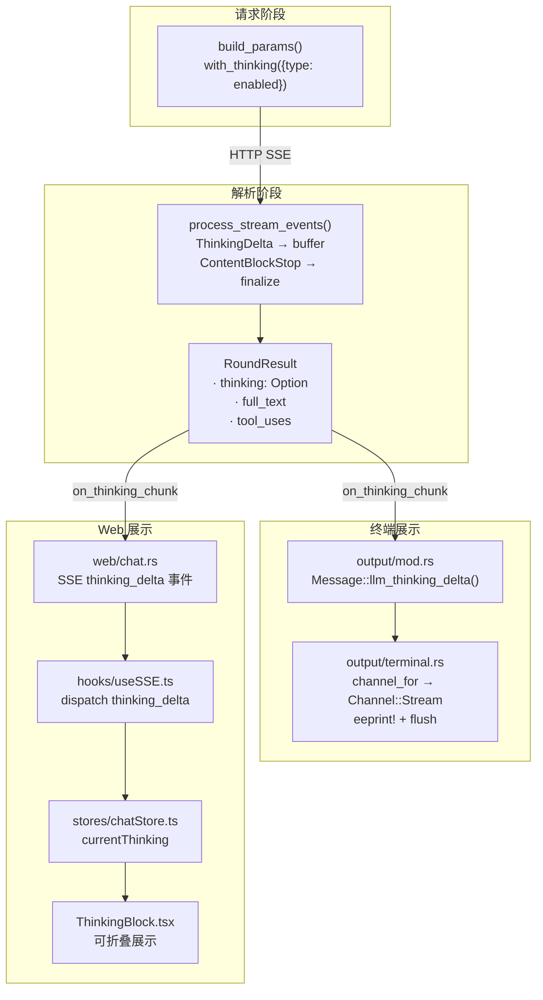
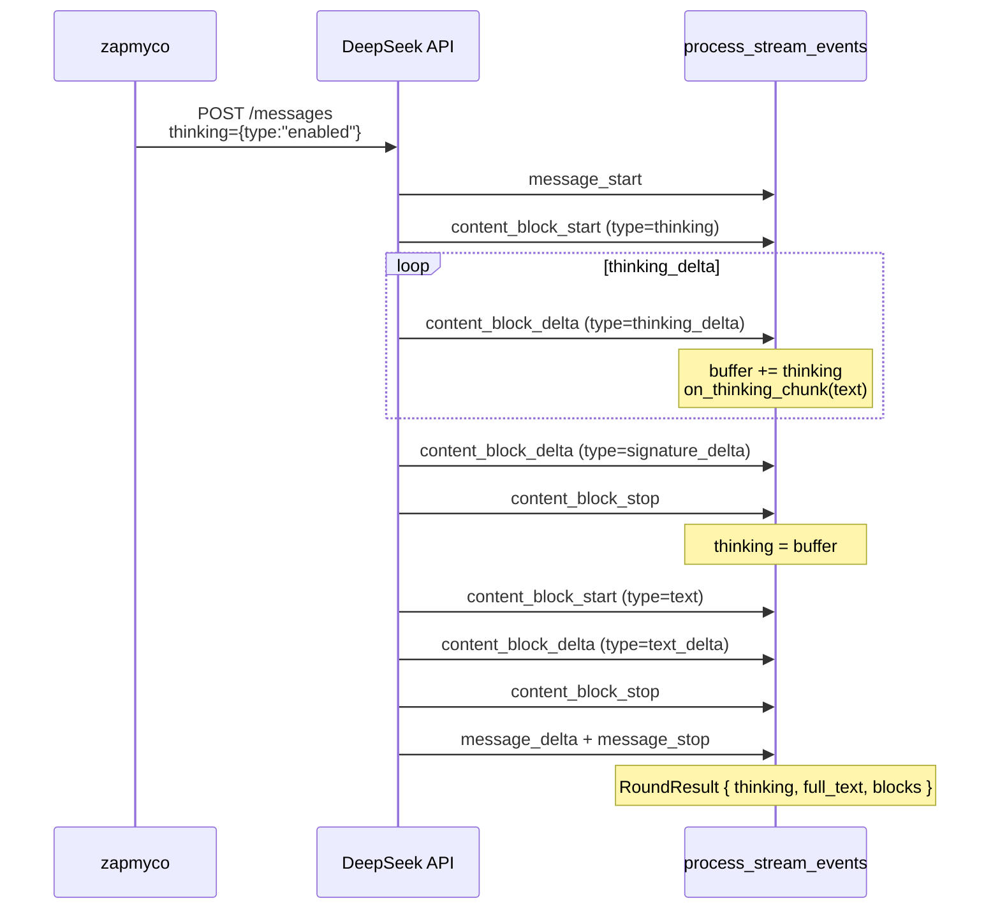

## 概述

DeepSeek 等模型的 Anthropic 兼容 API 会在 SSE 流中返回 `type="thinking"` 的 ContentBlock，包含模型在生成回答前的内部思考过程。本功能让 Zapmyco 能够接收、解析并可视化展示这些思考内容。

### 设计原则

| 原则 | 说明 |
|------|------|
| **最小改动** | 不修改 SDK、不新增依赖 |
| **默认启用** | `thinking` 参数默认开启，无需用户配置 |
| **向后兼容** | 模型不返回 thinking 时行为完全不变 |
| **零用户配置** | 用户无需任何操作就能看到 thinking 内容 |

## 架构

Thinking 的解析发生在流式事件处理层。SSE 流中的 `ThinkingDelta` 事件被实时捕获，通过回调链推送到终端和 Web 前端：

## 关键设计决策

### 1. `on_thinking_chunk` 回调穿透

`on_thinking_chunk` 回调从最外层的请求处理函数穿透到最内层的流解析函数，经过 3 层传递。每个 `ThinkingDelta` 事件到达时立即回调，确保前端能够实时展示思考内容。

### 2. thinking 内容在 blocks 中的位置

在重建消息的 `blocks` 列表时，thinking block 被放置在 text block 之前。这样既保留了思考内容的语义顺序，又让前端在处理时自然地将 thinking 显示在回答之前。

### 3. 终端渲染使用灰色暗淡效果

终端中使用 ANSI `\x1b[2m`（暗淡效果）渲染 thinking 内容，并添加 `⎔` 前缀作为行首标记，表示"模型正在思考"。内容通过 `eprint!` + flush 实时输出。

### 4. Web 前端可折叠展示

Web 端使用可折叠的 ThinkingBlock 组件，默认收起，用户可点击展开查看完整思考内容。流式过程中显示脉冲动画指示器。

## 边界情况

| 场景 | 表现 |
|------|------|
| 模型不返回 thinking | `RoundResult.thinking` 为 None，行为不变 |
| thinking 内容为空 | 不显示 thinking 块 |
| ContentBlockStart 中直接带完整 thinking | 主动触发回调，前端正常收到 |
| 多轮对话 | blocks 中保留了 `ContentBlock::Thinking`，API 正常处理 |
| 模型不支持 thinking 参数 | 可通过 `AiAgentOptions.thinking_enabled` 关闭 |
