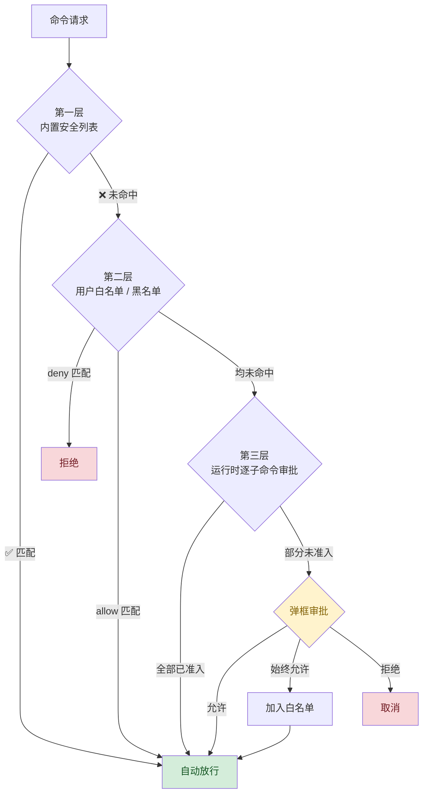
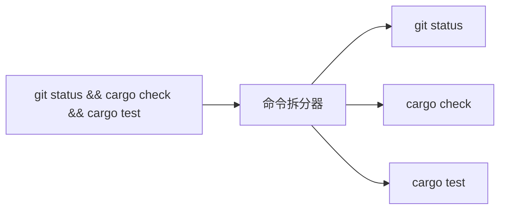
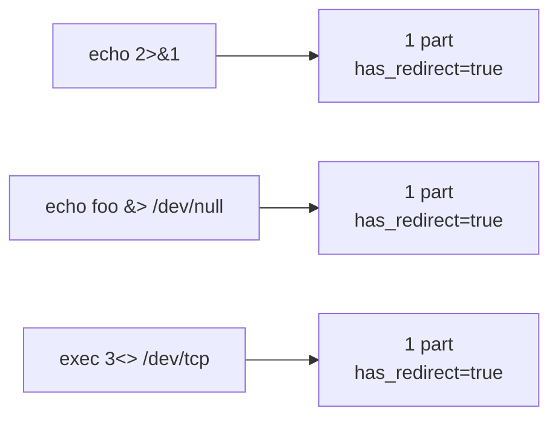
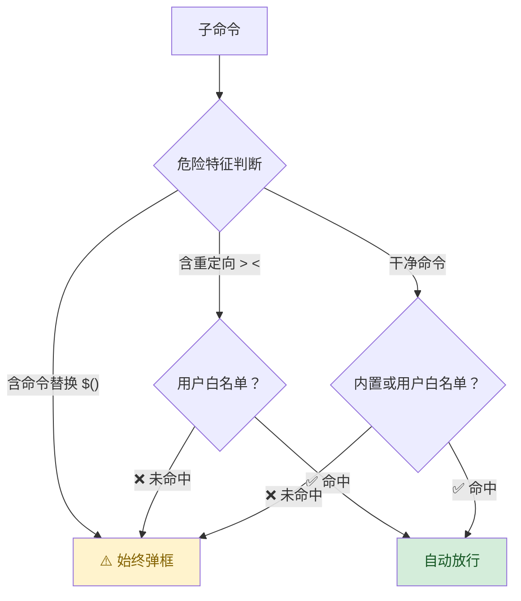
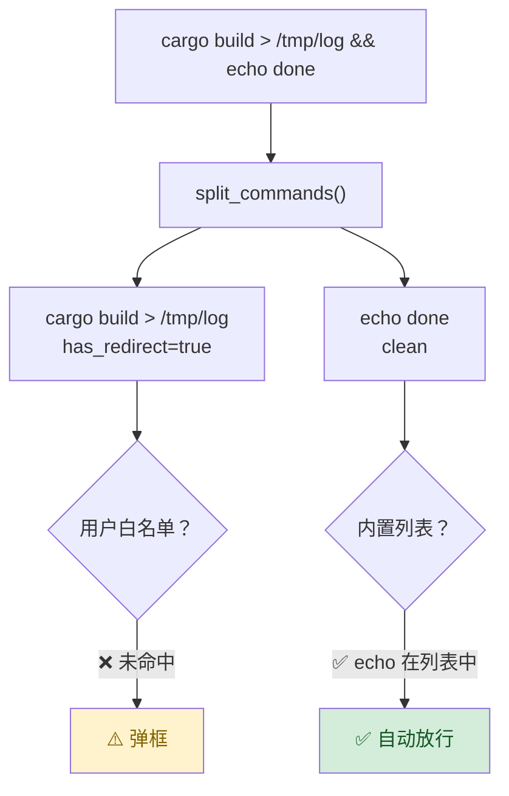
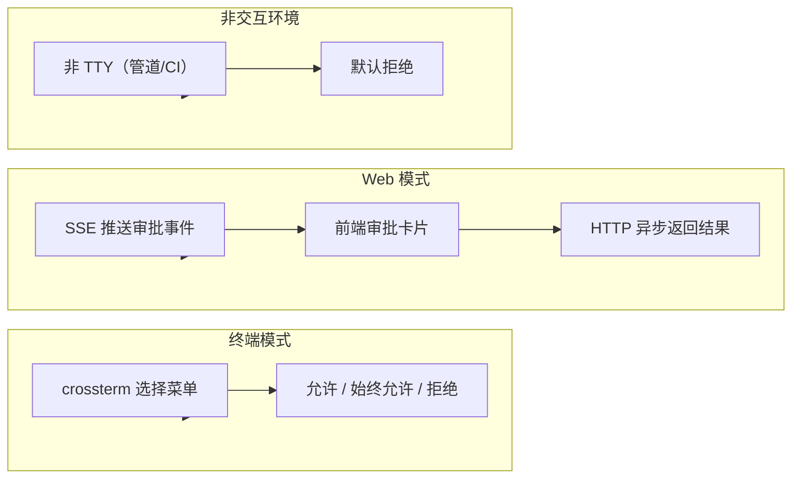
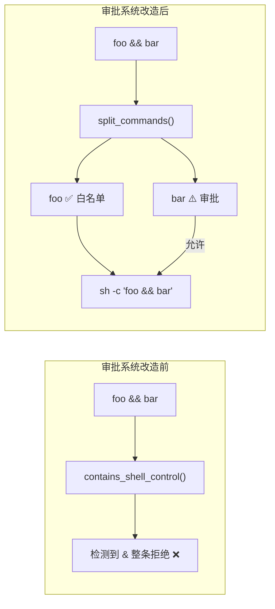

AI Agent 可以执行任意 shell 命令，这是一把双刃剑——能力越强，安全责任越大。
zapmyco 设计了**三层安全模型**，在安全性和交互流畅度之间找到平衡。

## 三层安全模型



每一层都是**累加检查**的：命中了上层就直接放行或拒绝，不命中才流到下一层。

---

## 第一层：内置安全列表

编译期定义的绝对安全命令列表，只包含**纯读取系统状态**的命令。

| 类别 | 命令 | 说明 |
|------|------|------|
| | `pwd` | 打印工作目录 |
| | `whoami` | 打印当前用户名 |
| 通用 | `true` | 无操作，返回 0 |
| | `false` | 无操作，返回 1 |
| | `echo` | 输出文本（需带参数，裸 `echo` 不放行） |
| | `printf` | 格式化输出（需带参数） |
| | `cd` | 改变工作目录 |
| | `uname` | 系统信息 |
| | `hostname` | 主机名 |
| | `uptime` | 系统运行时间 |
| | `arch` | 硬件架构 |
| 系统信息 | `which` | 定位命令路径（需带参数） |
| | `id` | 用户身份信息 |
| | `logname` | 登录用户名 |
| | `tty` | 终端设备名 |
| | `cal` | 显示日历 |
| | `seq` | 生成数字序列（需带参数） |
| 系统配置 | `getconf` | 系统配置变量（需带参数） |
| | `pathchk` | 路径名检查（需带参数） |
| | `basename` | 从路径中提取文件名（需带参数） |
| 路径操作 | `dirname` | 从路径中提取目录名（需带参数） |
| | `realpath` | 解析为绝对路径（需带参数） |
| 目录列表 | `ls` | 列出目录内容 |
| 日期时间 | `date` | 查看当前日期时间 |

**Windows 额外支持的命令：**

| 命令 | 说明 |
|------|------|
| `ver` | 显示 Windows 版本 |
| `systeminfo` | 显示系统信息 |
| `dir` | 列出目录 |
| `date /t` | 显示日期（`/t` 表示只查看不设置） |
| `time /t` | 显示时间（`/t` 表示只查看不设置） |
| `vol` | 显示卷标 |

**匹配规则：** 命令以列表中某个条目的前缀匹配。例如 `ls` 放行 `ls` 和 `ls -la`，但不放行 `lsblk`。

> 内置列表的设计原则是"宁可漏放（回到确认流程）也不错放"。
> 如需扩展，请在第二层配置用户白名单。

---

## 第二层：用户白名单 / 黑名单

在 `~/.zapmyco/settings.toml` 中配置：

```toml
[permissions.commands]
# 白名单：匹配的命令自动放行
allow = [
    "git status",
    "cargo check",
    "cargo clippy",
]

# 黑名单：匹配的命令自动拒绝（优先于白名单）
deny = [
    "rm -rf",
    "sudo",
]
```

- `allow` 中的命令匹配后跳过所有审批
- `deny` 中的命令匹配后直接拒绝，即使也在 `allow` 中
- 匹配规则与内置列表相同（前缀匹配）

---

## 第三层：运行时审批（核心）

这是最值得关注的一层——它解决了传统审批系统的核心痛点。

### 复合命令拆分

AI 经常生成链式命令，例如 `git status && cargo check && cargo test`。
传统系统要么整条拒绝，要么整条弹框。

zapmyco 的**命令拆分器**（`split_commands`）使用状态机逐字符扫描，
在顶层控制运算符处将命令拆分为独立子命令：



拆分器正确跳过以下语法内的运算符：

| 语法 | 示例 | 是否拆分 |
|------|------|:--------:|
| 单引号 `'...'` | `echo 'a && b'` | ❌ 不拆分 |
| 双引号 `"..."` | `echo "a && b"` | ❌ 不拆分 |
| 命令替换 `$(...)` | `echo $(foo && bar)` | ❌ 不拆分 |
| 参数展开 `${...}` | `echo ${VAR:-foo}` | ❌ 不拆分 |
| 转义字符 `\` | `echo a \& b` | ❌ 不拆分 |

### 重定向运算符的识别

`>` `<` `>>` `>&` `&>` `<<` `<<<` `<>` 等复合重定向符号被正确识别为一个整体，
不会错误拆分：



### 审批决策流程

拆分后的每个子命令独立走审批决策，决策逻辑如下：



为什么这么分级：

| 特征 | 示例 | 风险 | 内置列表 | 用户白名单 |
|------|------|:----:|:---------:|:----------:|
| 干净 | `cargo check` | 低 | 不放行 | 可放行 |
| 重定向 `>` `<` | `echo hello > file` | 中 | **不放行** | 可放行 |
| 命令替换 `$()` `` ` `` | `echo $(whoami)` | 高 | **不放行** | **不放行** |

- **重定向**只是修改 I/O 流向，命令本身的危险性不变。
  如果你信任 `cargo build`，`cargo build > /tmp/log` 也应该值得信任。
- **命令替换**会执行嵌入代码。`echo $(rm -rf /)` 和 `echo hello` 完全不同，
  所以即使命令在白名单中也必须弹框。

### 混合审批

这是最终的用户体验效果：



部分命令已准入时，**只弹未准入的部分**：

```
⚠️ 准备执行命令:
  完整命令: cargo build > /tmp/log && echo done

以下命令需要授权:
  ▢ cargo build > /tmp/log  (包含文件重定向)

以下命令已在白名单中（自动放行）:
  ✓ echo done

[允许] [始终允许] [拒绝]
```

全部未准入时，显示完整命令：

```
⚠️ 准备执行命令:
  完整命令: git status && cargo check
[允许] [始终允许] [拒绝]
```

全部已准入时，不弹任何框，静默执行。

---

## 三种交互模式



### 终端模式（TTY）

交互式终端中弹出三个选项的选择菜单：

- **允许** — 单次执行
- **始终允许** — 加入白名单后执行（危险命令被阻止加入）
- **拒绝** — 取消执行

### Web 模式

通过 SSE（Server-Sent Events）向后端发送 `tool_approval_required` 事件，
前端展示审批卡片，结果通过 `POST /api/tool/approve` 异步返回。

### 非交互环境

管道、CI、重定向等非 TTY 环境：**默认拒绝所有需要审批的命令**。这是安全设计。

---

## 执行路径

安全审批**只影响是否执行，不影响如何执行**。
命令原样透传给系统 shell：



```
Unix:     sh -c "<原命令>; _ZMD_RC=$?; pwd -P > ...; exit $_ZMD_RC"
Windows:  cmd.exe /d /c "<写入临时 bat 文件>"
```

> 这就是为什么我们说**"只改审批路径，不改执行路径"**。

---

## 安全最佳实践

1. **从小权限开始**
   默认只有内置安全列表放行，其他全审批。先这样用一段时间，观察 AI 的行为模式。

2. **常用只读命令用内置列表就够了**
   `pwd` `ls` `echo` `date` 等已在列表中，无需重复配置。

3. **白名单只放行你信任的命令**
   `git status` `cargo check` 这类只读检查命令是好的候选。
   `rm` `sudo` 等危险命令被系统阻止加入白名单。

4. **有重定向的命令谨慎放行**
   虽然用户白名单可以放行重定向命令（如 `echo > file`），
   但建议只在明确信任该命令时配置。

5. **定期审查白名单**
   ```bash
   cat ~/.zapmyco/settings.toml | grep -A 20 "\[permissions"
   ```

---

## 技术原理（可选）

如果关心实现细节：

- 命令拆分器 `split_commands()` 使用状态机逐字符扫描，O(n) 复杂度
- 6 种扫描状态：Normal / SingleQuote / DoubleQuote / CommandSubst / ParamSubst / Backtick / Escape
- 括号计数器和花括号计数器处理 `$()` 和 `${}` 嵌套
- 拆分器在任何异常输入下都不 panic（未闭合引号、未闭合 `$(`、空字符串等）
- **拆分器出错的最坏情况**：子命令未正确拆分 → 白名单不匹配 → 触发审批 → 安全降级为"需要用户确认"
  → **fail-safe**：永远不会绕过安全检查
