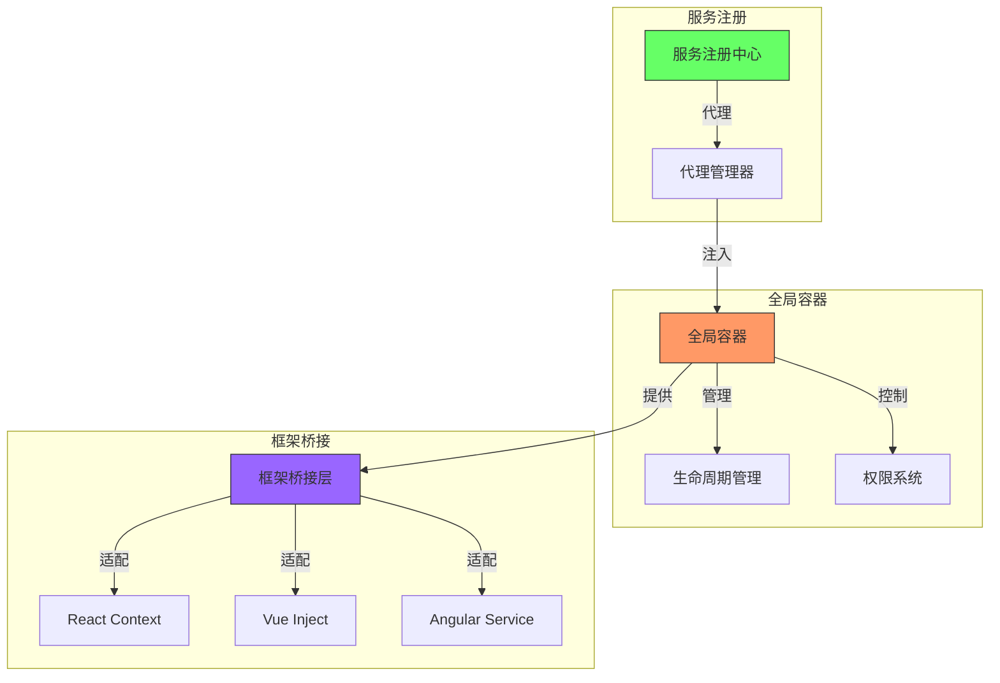

# 全局依赖注入系统



## 全局容器实现

```ts
// 服务生命周期
enum ServiceLifetime {
  SINGLETON = 'singleton',
  SCOPED = 'scoped',
  TRANSIENT = 'transient',
}

// 服务描述符
interface ServiceDescriptor<T = any> {
  token: symbol | string;
  lifetime: ServiceLifetime;
  factory: () => T;
  instance?: T;
  metadata?: Record<string, any>;
}

// 服务配置
interface ServiceConfig {
  lifetime?: ServiceLifetime;
  lazy?: boolean;
  permissions?: string[];
  metadata?: Record<string, any>;
}

// 全局容器
class GlobalContainer {
  private static instance: GlobalContainer;
  private services: Map<symbol | string, ServiceDescriptor> = new Map();
  private scopes: Map<string, Map<symbol | string, any>> = new Map();

  private constructor() {
    // 私有构造函数确保单例
  }

  static getInstance(): GlobalContainer {
    if (!GlobalContainer.instance) {
      GlobalContainer.instance = new GlobalContainer();
    }
    return GlobalContainer.instance;
  }

  // 注册服务
  register<T>(token: symbol | string, factory: () => T, config: ServiceConfig = {}): void {
    const descriptor: ServiceDescriptor<T> = {
      token,
      factory,
      lifetime: config.lifetime || ServiceLifetime.SINGLETON,
      metadata: config.metadata,
    };

    if (!config.lazy && descriptor.lifetime === ServiceLifetime.SINGLETON) {
      descriptor.instance = factory();
    }

    this.services.set(token, descriptor);
  }

  // 获取服务
  get<T>(token: symbol | string, scopeId?: string): T {
    const descriptor = this.services.get(token);
    if (!descriptor) {
      throw new Error(`Service not found: ${String(token)}`);
    }

    switch (descriptor.lifetime) {
      case ServiceLifetime.SINGLETON:
        if (!descriptor.instance) {
          descriptor.instance = descriptor.factory();
        }
        return descriptor.instance as T;

      case ServiceLifetime.SCOPED:
        if (!scopeId) {
          throw new Error('Scope ID required for scoped service');
        }
        return this.getScopedInstance<T>(descriptor, scopeId);

      case ServiceLifetime.TRANSIENT:
        return descriptor.factory() as T;

      default:
        throw new Error(`Unknown lifetime: ${descriptor.lifetime}`);
    }
  }

  // 创建作用域
  createScope(scopeId: string): void {
    if (this.scopes.has(scopeId)) {
      throw new Error(`Scope already exists: ${scopeId}`);
    }
    this.scopes.set(scopeId, new Map());
  }

  // 销毁作用域
  destroyScope(scopeId: string): void {
    const scope = this.scopes.get(scopeId);
    if (scope) {
      // 清理作用域内的资源
      for (const [_, instance] of scope) {
        if (instance && typeof instance.destroy === 'function') {
          instance.destroy();
        }
      }
      this.scopes.delete(scopeId);
    }
  }

  private getScopedInstance<T>(descriptor: ServiceDescriptor<T>, scopeId: string): T {
    let scope = this.scopes.get(scopeId);
    if (!scope) {
      scope = new Map();
      this.scopes.set(scopeId, scope);
    }

    let instance = scope.get(descriptor.token);
    if (!instance) {
      instance = descriptor.factory();
      scope.set(descriptor.token, instance);
    }

    return instance as T;
  }
}
```

## 框架特定的适配器

```ts
// React 适配器
import React, { createContext, useContext, ReactNode } from 'react';

const GlobalContext = createContext<GlobalContainer | null>(null);

export const GlobalProvider: React.FC<{ children: ReactNode }> = ({ children }) => {
  const container = GlobalContainer.getInstance();
  return (
    <GlobalContext.Provider value={container}>
      {children}
    </GlobalContext.Provider>
  );
};

export function useGlobal<T>(token: symbol | string): T {
  const container = useContext(GlobalContext);
  if (!container) {
    throw new Error('useGlobal must be used within a GlobalProvider');
  }
  return container.get<T>(token);
}

// Vue 适配器
import { inject, provide } from 'vue';

export const GLOBAL_CONTAINER = Symbol('GLOBAL_CONTAINER');

export function installGlobal(app: any) {
  const container = GlobalContainer.getInstance();
  app.provide(GLOBAL_CONTAINER, container);
}

export function useGlobalVue<T>(token: symbol | string): T {
  const container = inject<GlobalContainer>(GLOBAL_CONTAINER);
  if (!container) {
    throw new Error('Global container not provided');
  }
  return container.get<T>(token);
}

// Angular 适配器
import { Injectable, Inject } from '@angular/core';

export const GLOBAL_CONTAINER = new InjectionToken('GLOBAL_CONTAINER');

@Injectable({ providedIn: 'root' })
export class GlobalService {
  private container: GlobalContainer;

  constructor() {
    this.container = GlobalContainer.getInstance();
  }

  get<T>(token: symbol | string): T {
    return this.container.get<T>(token);
  }
}
```
