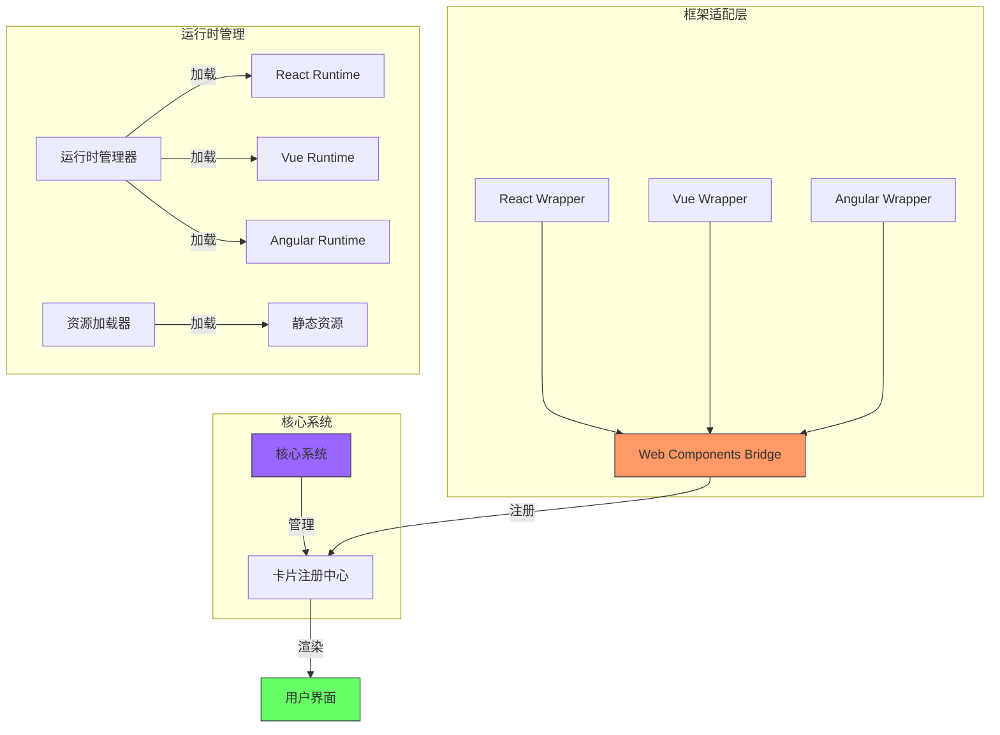

# 卡片扩展系统设计

> 我们采用 Web Components 作为桥接层，让不同框架的组件都能够在系统中运行。

## Multi-Framework Card System



## 框架识别和配置

```ts
// 支持的框架类型
type FrameworkType = 'react' | 'vue' | 'angular' | 'web-component';

interface FrameworkConfig {
  type: FrameworkType;
  version: string;
  runtime?: {
    url: string; // CDN URL
    integrity?: string; // 完整性校验
    dependencies?: string[]; // 相关依赖
  };
}

interface CardManifest {
  name: string;
  version: string;
  framework: FrameworkConfig;
  entry: {
    component: string;
    styles?: string[];
    assets?: string[];
  };
  // 声明外部依赖
  externals?: {
    [key: string]: string; // 包名: 版本范围
  };
}

// 运行时管理器配置
interface RuntimeManagerConfig {
  react?: {
    version: string;
    url: string;
  };
  vue?: {
    version: string;
    url: string;
  };
  angular?: {
    version: string;
    url: string;
  };
}
```

## Web Components 桥接层

```ts
// 基础卡片元素
class BaseCardElement extends HTMLElement {
  private shadow: ShadowRoot;
  private mountPoint: HTMLElement;
  protected framework: FrameworkType;

  constructor() {
    super();
    this.shadow = this.attachShadow({ mode: 'open' });
    this.mountPoint = document.createElement('div');
    this.shadow.appendChild(this.mountPoint);
  }

  // 通用属性
  static get observedAttributes() {
    return ['entity-id', 'state', 'config'];
  }

  // 属性变化处理
  attributeChangedCallback(name: string, oldValue: string, newValue: string) {
    this.updateComponent();
  }

  // 组件生命周期
  connectedCallback() {
    this.mount();
  }

  disconnectedCallback() {
    this.unmount();
  }

  protected abstract mount(): void;
  protected abstract unmount(): void;
  protected abstract updateComponent(): void;
}

// React 适配器
class ReactCardElement extends BaseCardElement {
  private root: Root | null = null;
  private Component: React.ComponentType<any>;

  constructor(Component: React.ComponentType<any>) {
    super();
    this.framework = 'react';
    this.Component = Component;
  }

  protected mount() {
    const { React, ReactDOM } = window as any;
    this.root = ReactDOM.createRoot(this.mountPoint);
    this.updateComponent();
  }

  protected unmount() {
    this.root?.unmount();
  }

  protected updateComponent() {
    const props = {
      entityId: this.getAttribute('entity-id'),
      state: JSON.parse(this.getAttribute('state') || '{}'),
      config: JSON.parse(this.getAttribute('config') || '{}'),
    };

    this.root?.render(React.createElement(this.Component, props));
  }
}

// Vue 适配器
class VueCardElement extends BaseCardElement {
  private app: any = null;
  private component: any;

  constructor(component: any) {
    super();
    this.framework = 'vue';
    this.component = component;
  }

  protected mount() {
    const { createApp } = (window as any).Vue;
    this.app = createApp(this.component, this.getProps());
    this.app.mount(this.mountPoint);
  }

  protected unmount() {
    this.app?.unmount();
  }

  protected updateComponent() {
    // Vue 会自动处理 props 更新
    Object.assign(this.app?._props || {}, this.getProps());
  }

  private getProps() {
    return {
      entityId: this.getAttribute('entity-id'),
      state: JSON.parse(this.getAttribute('state') || '{}'),
      config: JSON.parse(this.getAttribute('config') || '{}'),
    };
  }
}

// Angular 适配器
class AngularCardElement extends BaseCardElement {
  private componentRef: any = null;
  private component: any;

  constructor(component: any) {
    super();
    this.framework = 'angular';
    this.component = component;
  }

  protected async mount() {
    const { platformBrowserDynamic } = (window as any).Angular;
    const NgModule = await this.createDynamicModule();

    platformBrowserDynamic()
      .bootstrapModule(NgModule)
      .then((moduleRef) => {
        const factory = moduleRef.componentFactoryResolver.resolveComponentFactory(this.component);
        this.componentRef = factory.create(moduleRef.injector, [], this.mountPoint);
        this.updateComponent();
      });
  }

  protected unmount() {
    this.componentRef?.destroy();
  }

  protected updateComponent() {
    if (this.componentRef) {
      Object.assign(this.componentRef.instance, this.getProps());
      this.componentRef.changeDetectorRef.detectChanges();
    }
  }

  private getProps() {
    return {
      entityId: this.getAttribute('entity-id'),
      state: JSON.parse(this.getAttribute('state') || '{}'),
      config: JSON.parse(this.getAttribute('config') || '{}'),
    };
  }
}
```

## 运行时管理器

```ts
class RuntimeManager {
  private loadedRuntimes: Map<string, boolean> = new Map();
  private config: RuntimeManagerConfig;

  constructor(config: RuntimeManagerConfig) {
    this.config = config;
  }

  async ensureRuntime(framework: FrameworkConfig): Promise<void> {
    const key = `${framework.type}@${framework.version}`;

    if (this.loadedRuntimes.get(key)) {
      return;
    }

    // 加载框架运行时
    await this.loadRuntime(framework);

    // 加载依赖
    if (framework.runtime?.dependencies) {
      await Promise.all(framework.runtime.dependencies.map((dep) => this.loadScript(dep)));
    }

    this.loadedRuntimes.set(key, true);
  }

  private async loadRuntime(framework: FrameworkConfig): Promise<void> {
    const config = this.getRuntimeConfig(framework);

    if (!config) {
      throw new Error(`Unsupported framework: ${framework.type}@${framework.version}`);
    }

    await this.loadScript(config.url);
  }

  private getRuntimeConfig(framework: FrameworkConfig) {
    switch (framework.type) {
      case 'react':
        return this.config.react;
      case 'vue':
        return this.config.vue;
      case 'angular':
        return this.config.angular;
      default:
        return null;
    }
  }

  private async loadScript(url: string): Promise<void> {
    return new Promise((resolve, reject) => {
      const script = document.createElement('script');
      script.src = url;
      script.onload = () => resolve();
      script.onerror = reject;
      document.head.appendChild(script);
    });
  }
}
```

## 卡片加载器

```ts
class CardLoader {
  private runtimeManager: RuntimeManager;
  private registry: Map<string, any> = new Map();

  constructor(runtimeManager: RuntimeManager) {
    this.runtimeManager = runtimeManager;
  }

  async loadCard(manifest: CardManifest, url: string): Promise<void> {
    // 1. 确保运行时已加载
    await this.runtimeManager.ensureRuntime(manifest.framework);

    // 2. 加载组件代码
    const component = await this.loadComponent(manifest, url);

    // 3. 创建对应的 Web Component
    const ElementClass = this.createWebComponent(manifest.framework.type, component);

    // 4. 注册 Web Component
    const tagName = `card-${manifest.name.toLowerCase()}`;
    customElements.define(tagName, ElementClass);

    // 5. 存储注册信息
    this.registry.set(manifest.name, {
      tagName,
      manifest,
      component,
    });
  }

  private createWebComponent(type: FrameworkType, component: any) {
    switch (type) {
      case 'react':
        return class extends ReactCardElement {
          constructor() {
            super(component);
          }
        };
      case 'vue':
        return class extends VueCardElement {
          constructor() {
            super(component);
          }
        };
      case 'angular':
        return class extends AngularCardElement {
          constructor() {
            super(component);
          }
        };
      default:
        throw new Error(`Unsupported framework type: ${type}`);
    }
  }

  private async loadComponent(manifest: CardManifest, baseUrl: string): Promise<any> {
    const componentUrl = new URL(manifest.entry.component, baseUrl).toString();
    const module = await import(componentUrl);
    return module.default;
  }
}
```
