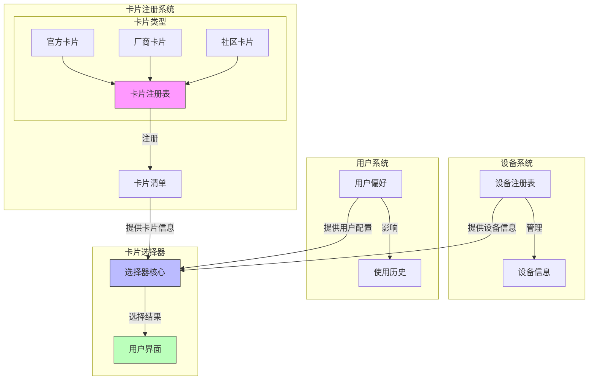
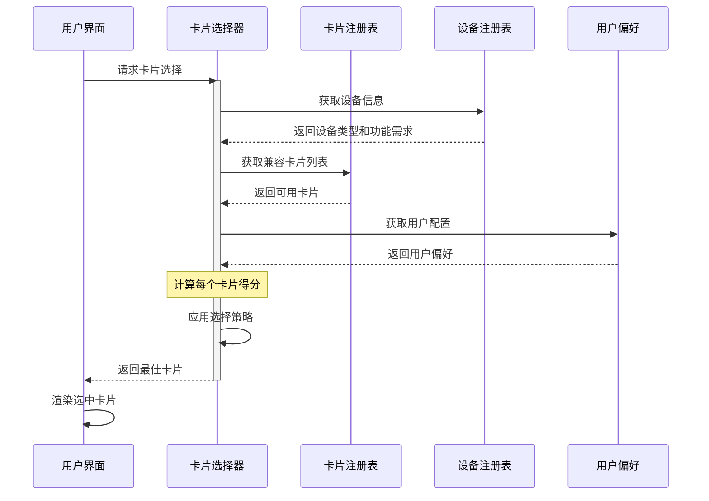
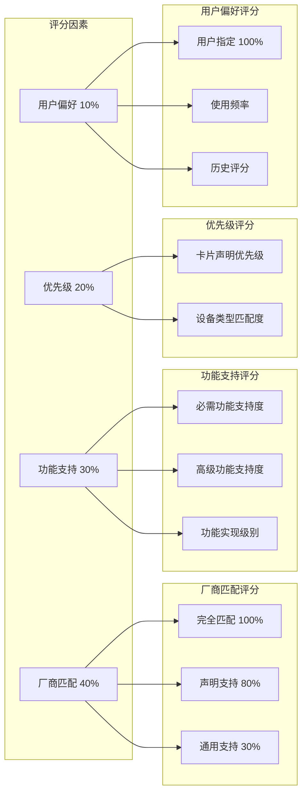
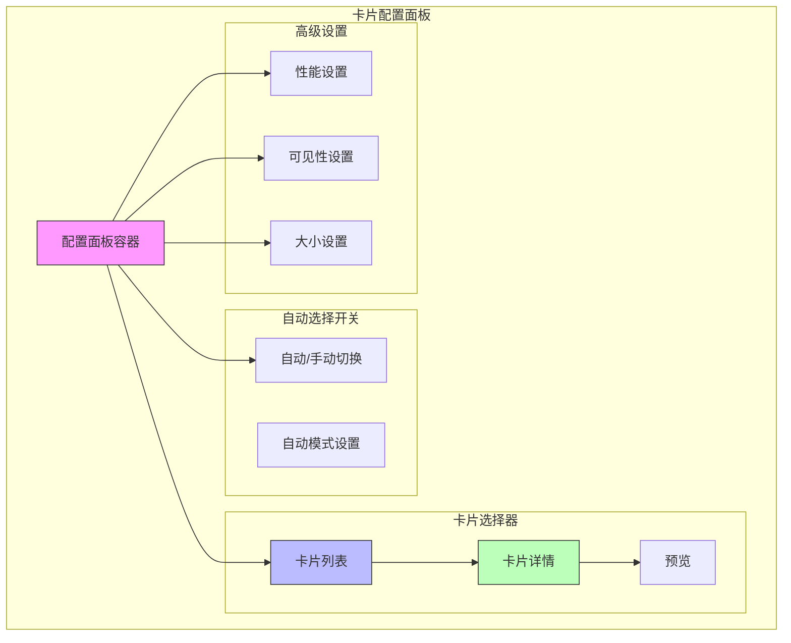
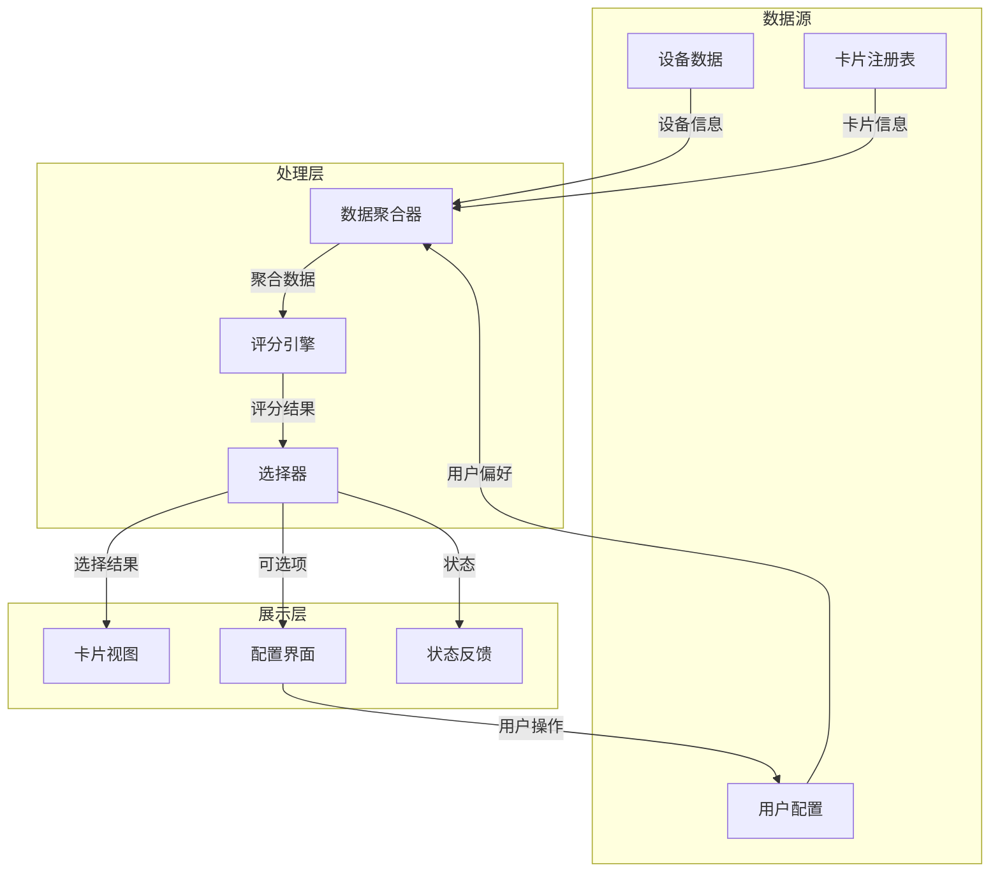

# 卡片选择规则设计

> 核心逻辑是基于评分权重默认选择最佳匹配的展示卡片，如果用户指定(基于Device ID)某个设备使用某个卡片，则优先选择用户指定的卡片。

## 卡片系统架构图

```mermaid
graph TB
  subgraph "卡片注册系统"
      CR[卡片注册表]
      CM[卡片清单]
      CR -->|注册| CM

      subgraph "卡片类型"
          OC[官方卡片]
          VC[厂商卡片]
          CC[社区卡片]
          OC --> CR
          VC --> CR
          CC --> CR
      end
  end

  subgraph "设备系统"
      DR[设备注册表]
      DI[设备信息]
      DR -->|管理| DI
  end

  subgraph "用户系统"
      UP[用户偏好]
      UH[使用历史]
      UP -->|影响| UH
  end

  subgraph "卡片选择器"
      CS[选择器核心]
      CM -->|提供卡片信息| CS
      DR -->|提供设备信息| CS
      UP -->|提供用户配置| CS
      CS -->|选择结果| UI[用户界面]
  end

  style CR fill:#f9f,stroke:#333
  style CS fill:#bbf,stroke:#333
  style UI fill:#bfb,stroke:#333
```

## 卡片选择流程

```mermaid
sequenceDiagram
  participant UI as 用户界面
  participant CS as 卡片选择器
  participant CR as 卡片注册表
  participant DR as 设备注册表
  participant UP as 用户偏好

  UI->>CS: 请求卡片选择
  activate CS

  CS->>DR: 获取设备信息
  DR-->>CS: 返回设备类型和功能需求

  CS->>CR: 获取兼容卡片列表
  CR-->>CS: 返回可用卡片

  CS->>UP: 获取用户配置
  UP-->>CS: 返回用户偏好

  Note over CS: 计算每个卡片得分

  CS->>CS: 应用选择策略
  CS-->>UI: 返回最佳卡片
  deactivate CS

  UI->>UI: 渲染选中卡片
```

## 卡片评分系统

```mermaid
graph LR
  subgraph "评分因素"
      V[厂商匹配 40%]
      C[功能支持 30%]
      P[优先级 20%]
      U[用户偏好 10%]
  end

  subgraph "厂商匹配评分"
      V --> VM1[完全匹配 100%]
      V --> VM2[声明支持 80%]
      V --> VM3[通用支持 30%]
  end

  subgraph "功能支持评分"
      C --> CS1[必需功能支持度]
      C --> CS2[高级功能支持度]
      C --> CS3[功能实现级别]
  end

  subgraph "优先级评分"
      P --> PS1[卡片声明优先级]
      P --> PS2[设备类型匹配度]
  end

  subgraph "用户偏好评分"
      U --> UP1[用户指定 100%]
      U --> UP2[使用频率]
      U --> UP3[历史评分]
  end
```

## 配置界面结构

```mermaid
graph TB
  subgraph "卡片配置面板"
      CP[配置面板容器]

      subgraph "自动选择开关"
          AS[自动/手动切换]
          AM[自动模式设置]
      end

      subgraph "卡片选择器"
          CL[卡片列表]
          CD[卡片详情]
          CP1[预览]
      end

      subgraph "高级设置"
          PS[性能设置]
          VS[可见性设置]
          SS[大小设置]
      end

      CP --> AS
      CP --> CL
      CL --> CD
      CD --> CP1
      CP --> PS
      CP --> VS
      CP --> SS
  end

  style CP fill:#f9f,stroke:#333
  style CL fill:#bbf,stroke:#333
  style CD fill:#bfb,stroke:#333
```

## 数据流向图

```mermaid
graph TD
  subgraph "数据源"
      D1[设备数据]
      D2[卡片注册表]
      D3[用户配置]
  end

  subgraph "处理层"
      P1[数据聚合器]
      P2[评分引擎]
      P3[选择器]
  end

  subgraph "展示层"
      V1[卡片视图]
      V2[配置界面]
      V3[状态反馈]
  end

  D1 -->|设备信息| P1
  D2 -->|卡片信息| P1
  D3 -->|用户偏好| P1

  P1 -->|聚合数据| P2
  P2 -->|评分结果| P3
  P3 -->|选择结果| V1
  P3 -->|可选项| V2
  P3 -->|状态| V3

  V2 -->|用户操作| D3
```
