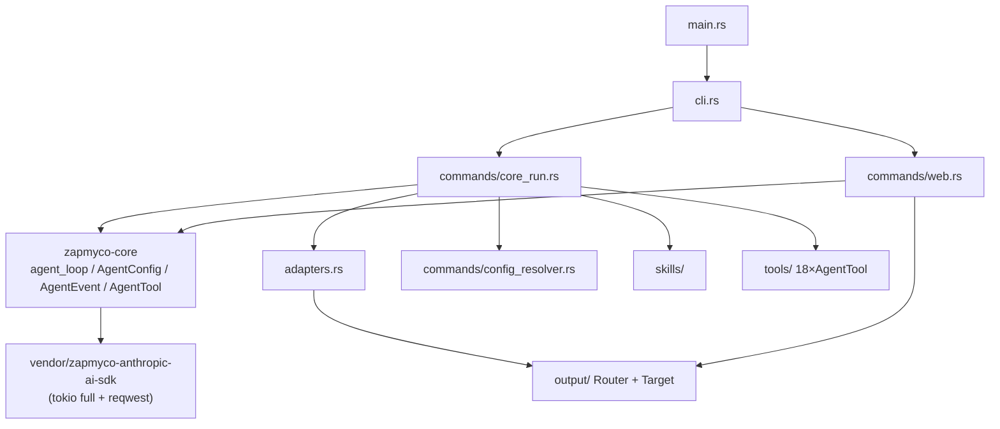
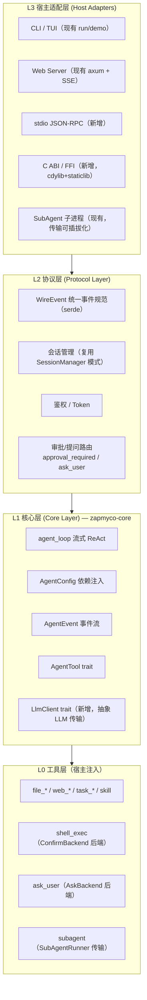
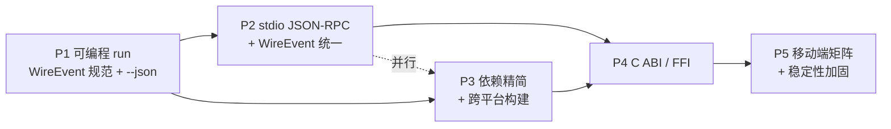

# 技术方案：将 zapmyco 演进为「任意环境 agent 节点」

> 编写日期: 2026-08-06
> 状态: 草稿（待评审）

---

## 1. 愿景与目标

### 1.1 产品愿景

zapmyco 的最终愿景是：**让 zapmyco 能运行在任意环境中，作为一个 agent 节点执行。**

展开为四个维度的"跨"：

- **跨环境**：Windows / Linux / macOS / Docker / 老旧系统，都能运行
- **跨语言**：可被 C/C++、Java、Node.js、Go、Python 等任意语言结合使用
- **跨端**：可嵌入不同软件内部环境，包括 Android、iOS
- **跨场景**：任何需要智能的场景，都能轻松引入并使用，是一个完整完善的 agent

这要求 zapmyco 具备四个关键特质：**轻巧、精简、跨语言、跨端、足够稳定**。它不应只是"终端里的聊天工具"，而是一个**随时可嵌入的完整 agent 节点**。

### 1.2 北极星与关键不变式

实现该愿景需要遵守三条架构不变式，所有分阶段工作均不得破坏它们：

| 不变式 | 含义 |
|---|---|
| **Core 零环境依赖** | `zapmyco-core` 不读取文件、不写终端、不访问环境变量；所有外部参数经依赖注入（`AgentConfig`）传入 |
| **协议层承载跨进程语义** | 机器可解析的输出、审批/提问注入、会话生命周期，全部收敛到协议层，宿主（CLI/Web/FFI/嵌入端）不各自发明协议 |
| **工具层通过后端注入解耦环境** | 工具（shell_exec/ask_user/subagent 等）的环境交互（终端审批、提问、子进程通信）抽象为可插拔后端，嵌入端可替换实现 |

---

## 2. 现状分析

### 2.1 能力盘点（已验证）

以下能力均经源码核验，是本次方案的**现状基线**：

| 能力 | 状态 | 代码依据 |
|---|---|---|
| 流式 ReAct 循环 | ✅ 完整 | `crates/zapmyco-core/src/agent_loop.rs`（~850 行，Anthropic Messages API SSE 流式，`max_tool_rounds` 默认 50） |
| Core 零环境依赖设计 | ✅ 完整 | `crates/zapmyco-core/src/{agent_config, agent_event, agent_tool}.rs`：依赖注入、事件流、工具即 Trait |
| 工具生态 | ✅ 完整 | `src/tools/` 18 个工具模块（file_*/shell_exec/web_*/ask_user/confirm/task_*/subagent/skill 等），均实现 `zapmyco_core::AgentTool` |
| 权限模型 | ✅ 完整 | 三层：CLI 级 `PermissionMode`（full/read-only/read-write）工具过滤 + `ConfirmBackend`（shell 审批）+ `AskBackend`（提问）；另有 `settings.toml` allow/deny 命令表 |
| Skills 系统 | ✅ 完整 | `src/skills/`：YAML frontmatter + 三层发现（Project/.agents/User）+ `allowed_tools` 白名单 |
| 输出总线 | ✅ 完整 | `src/output/mod.rs`：全局 `ROUTER` + `Target` trait；`Message` 已内置 `data: Option<serde_json::Value>` 字段（tool_call/tool_result/llm_usage 等已带结构化数据） |
| Core 跨上下文复用 | ✅ 已证明 | `src/web/chat.rs` 通过 `zapmyco_core::agent_loop` 在 axum HTTP server 中跑同一循环；`src/web/events.rs` 的 `agent_event_to_stream_event` 是纯函数映射（已带完整单测） |
| 会话持有模式 | ✅ 已有 | `src/web/session.rs` 的 `SessionManager` 持有 `config + tools`，避免 `AgentConfig::clone()` 清空工具列表的缺陷 |

### 2.2 与愿景的差距（已验证）

| 维度 | 现状 | 差距 | 严重度 |
|---|---|---|---|
| **run 输出机器可解析性** | `zapmyco run` 输出非结构化终端文本；无 `--json` 标志；无机器可解析的结果帧 | 外部程序无法稳定拿到结构化结果 | 🔴 高 |
| **管道/CI 下的可运行性** | `run` 结束后进入 `inquire::Text` 交互式 continue 循环（`src/commands/core_run.rs`），无 TTY 时**阻塞挂起** | 违背"任意环境"：CI/管道/子进程/嵌入端无法使用 | 🔴 高 |
| **跨语言调用协议** | 无可编程协议：无 stdin 管道、无 JSON-RPC、无 IPC/daemon 形态 | 跨语言"结合"缺少最低成本路径 | 🔴 高 |
| **进程内嵌入（FFI）** | 无 C ABI / FFI / JNI：无 `#[no_mangle]`、无 `extern "C"`、无 cdylib/staticlib | 其他语言无法进程内直链 agent 节点 | 🔴 高 |
| **移动端（Android/iOS）** | 无 `aarch64-linux-android` / `aarch64-apple-ios` 等构建目标 | 完全无法嵌入移动应用 | 🟠 中 |
| **老旧系统 / 容器** | 仅 glibc 动态链接（5 个发布目标）；无 musl、无 Dockerfile、无 `.cargo/config.toml` | 无法在 Alpine/scratch 容器与旧 glibc 系统运行 | 🟠 中 |
| **依赖体积** | Cargo.lock 共 470 依赖项；`tokio(full)/reqwest/axum/ratatui/crossterm/inquire/rust-embed` 均在默认依赖，未 feature-gate | 与"轻巧精简"冲突；slim 形态缺失 | 🟠 中 |
| **core 的运行时解耦** | core 依赖 `tokio::sync::mpsc` + vendored SDK（SDK 依赖 `tokio(full)` + `reqwest`） | 只能在 tokio 生态内复用；非 tokio 运行时/嵌入式不可用 | 🟡 中低 |

---

## 3. 当前架构分析

### 3.1 Workspace 结构

```
zapmyco/
├── Cargo.toml                      # 主包 zapmyco v0.45.1（lib + bin 单一 crate，src/ 全部 pub mod 暴露）
├── src/
│   ├── main.rs                     # 入口：初始化日志 → 注册 TerminalTarget → clap 解析 → cli::run()
│   ├── lib.rs                      # 库入口：pub mod 声明全部模块
│   ├── cli.rs                      # Clap CLI 定义 + 子命令路由
│   ├── commands/                   # core_run / init / web / upgrade / note / completion / demo(空实现) / config_resolver
│   ├── adapters.rs                 # AgentEvent → output::Message 的终端适配
│   ├── output/                     # 输出总线：Message / Router / Target / TerminalTarget / LogTarget
│   ├── tools/                      # 18 个 AgentTool 实现
│   ├── skills/                     # skill 发现 / 解析 / 白名单
│   ├── session/                    # 会话日志（conversation.jsonl / session.json）
│   ├── tui/                        # 自研 ratatui 组件（demo 命令为空实现，TUI 聊天未完成）
│   └── web/                        # axum server + SSE /api/chat
├── crates/
│   └── zapmyco-core/               # 已独立发布 v0.1.1（workspace 成员）
├── vendor/
│   ├── zapmyco-anthropic-ai-sdk/   # fork 的 Anthropic SDK（workspace 成员）
│   └── zapmyco-grep/               # fork 的 ripgrep 风格搜索（workspace 成员）
```

### 3.2 模块依赖关系



**关键边界**：

1. `zapmyco-core` **不依赖** 主 crate，可独立发布（已发布 v0.1.1）。
2. 主 crate 依赖 core，通过 `AgentTool` trait 与 `AgentEvent` 枚举跨越 crate 边界。
3. `output` 与 core 解耦：core 通过 `mpsc::Sender<AgentEvent>` 流式输出，`adapters.rs` 翻译为 `output::Message`。
4. 18 个工具在 `src/tools/` 实现 `AgentTool`，但依赖具体环境（crossterm、reqwest、`std::process`），**保留在主 crate 而非 core**——这正确，工具本就应由宿主注入。
5. `web` 模块同样从 core 导入 `agent_loop`，**证明了 core 可从完全不同的上下文（HTTP server）调用**。

### 3.3 关键缺陷识别（对方案有直接约束）

| 缺陷 | 位置 | 影响 |
|---|---|---|
| `AgentConfig::clone()` 会**清空工具列表** | `crates/zapmyco-core/src/agent_config.rs` | 长生命周期宿主（RPC server / FFI session）不能依赖 clone 复用工具，必须用 web 已有的 `SessionManager` 持有模式（`Arc<AgentConfig>` + 建会话时装配工具） |
| `build_tools` **隐式读取全局 `settings.toml`** 的 allow/deny 命令表 | `src/commands/core_run.rs`（build_tools 工具过滤） | 嵌入端不能依赖宿主机器上的全局文件，策略必须显式注入 |
| `run` 的 continue 循环无 TTY 检测 | `src/commands/core_run.rs`（交互式继续循环，用 `inquire::Text`） | 管道/CI/子进程下阻塞挂起 |
| SubAgent 依赖**文件系统通信** | `src/tools/subagent.rs`（`~/.zapmyco/subagents/<id>/` 轮询） | 嵌入端为累赘：轮询 + 残留目录 |
| `run` 无 `--json` / 非交互标志 | `src/cli.rs` + `src/commands/core_run.rs` | 无机器可解析输出 |
| MSRV 1.95（edition 2024） | 根/`core` `Cargo.toml` | 与"老旧系统"愿景潜在冲突（旧工具链可能不支持） |

---

## 4. 目标架构

从"单一 CLI 二进制"演进为**分层、可插拔宿主**的 agent 节点。



**分层职责与迁移要点**：

- **L1 Core**：保持现有零环境依赖设计。唯一结构性改动是把 `tokio::sync::mpsc` 抽象为 executor 无关的 channel，并新增 `LlmClient` trait 以解除对 vendored SDK 的硬编码（见 §5.4）。`AgentConfig::clone()` 丢工具问题通过 **Session 持有模式**规避（复用 `src/web/session.rs` 的 `Session { config: Arc<AgentConfig>, ... }`）。
- **L2 协议层**：新引入的 `WireEvent` 是 web 已定义 `StreamEvent`（`src/web/chat.rs`）的泛化，补 `result` 终结事件。SSE、stdio JSON-RPC、`--json` NDJSON、C ABI 回调四者**共享同一事件序列化**，避免四套协议四套语义。
- **L3 宿主适配层**：CLI/Web 已有；新增 RPC 与 FFI；SubAgent 从文件系统通信抽象为 `SubAgentRunner` trait（`Process` 默认实现保留现有行为，`InProcess` 复用 P2 的 stdio RPC，`Remote` 走 HTTP）。

---

## 5. 关键技术选型与决策

### 5.1 跨语言协议：JSON-RPC over stdio + 复用 HTTP/SSE，共享 WireEvent

| 协议形态 | 适用场景 | 优点 | 缺点 |
|---|---|---|---|
| **JSON-RPC 2.0 over stdio**（LSP 风格，**新增**） | 子进程嵌入、CI、脚本、语言绑定（宿主 spawn 一个长驻 agent 进程） | 跨语言"结合"的最低成本路径——任何语言 spawn 子进程即可，无需网络栈；**天然双向**（可反向注入审批/提问/取消）；无端口/防火墙问题 | 需约定进程生命周期；stdout/stderr 分账（**约定：stdout 仅协议帧，stderr 为日志**） |
| **HTTP + SSE**（保留） | 浏览器、远程、多租户服务 | 已有实现（`/api/chat`），防火墙友好 | 需维护 HTTP 栈，体积重 |
| **C ABI**（P4） | 进程内嵌入（C/C++/Java/Go/Python 直链、移动端） | 零进程开销、同步可阻塞 | 生命周期与线程安全复杂，见 §5.3 |

**决策**：

1. **以 JSON-RPC over stdio 作为"机器协议"新增**，方法集：`initialize` / `shutdown` / `exit`（生命周期）+ `session/start` / `session/run` / `session/cancel` / `session/approve` / `session/ask-respond` / `session/history`（自定义）。
2. **统一 WireEvent**：`--json` NDJSON、stdio RPC 的 `agent/event` notification、web SSE 的 event、C ABI 的 callback，全部映射同一 `WireEvent`。web 现有的 `agent_event_to_stream_event`（`src/web/events.rs`）是纯函数映射，直接提升为共享模块，保留其单测。
3. **HTTP+SSE 保留**作为网络化形态，与 RPC 并存；**不搞第三套协议语义**。

### 5.2 run 命令非交互化改造（P1 主体）

| 改动 | 设计 |
|---|---|
| `--json` | stdout 输出 NDJSON 的 `WireEvent` 流，终帧 `{"type":"result", text, token_usage, tool_calls}`；人类可读文本全部转 stderr 或静默 |
| `--non-interactive` / `--no-continue` | 跳过 continue 循环；**同时用 `std::io::IsTerminal` 自动检测**——stdin 非 TTY（管道/CI/子进程）时默认不进入 continue，杜绝挂起 |
| stdin 管道输入 | `echo "task" \| zapmyco run --stdin`，从 stdin 读取内容作为 prompt |
| 退出码 | 成功 0；LLM/工具错误非 0；`--json` 下错误以 `error` 帧上报 + 非零退出码 |
| Plan 模式审批降级 | 非交互下 `inquire::Confirm` 不可用：读 `--permission-mode`（read-only 自动拒写/拒执行），full 默认 `AutoDeny`，除非显式 `--auto-approve` 或协议侧存在审批通道 |

**实现要点**：新增 `JsonTarget` 实现 `output::Target`（`src/output/mod.rs`），把 `Message` 转 WireEvent 写 stdout，与现有 `ROUTER` 并行注册——**不破坏 Terminal/Log target，不改动任何消息生产点**。`Message` 已内置 `data: Option<serde_json::Value>`，tool_call/tool_result 等已带结构化数据，是低成本落地的基础。

### 5.3 C ABI / FFI：手写薄 C ABI 为底座，uniffi 作为移动端可选加速器

- **底座用手写 `extern "C"` 薄层**（新 crate `crates/zapmyco-ffi`，`crate-type = ["cdylib","staticlib"]`），用 **cbindgen** 生成 `zapmyco.h`。理由：C ABI 是**最通用**的互操作面——C/C++ 直链、Python `ctypes`、Go `cgo`、Node `napi`、Java `JNA/JNI`、Swift 都能零额外依赖调用；不引入 uniffi 的 codegen 约束与类型改写。
- **API 形态（两类）**：
  - 阻塞式 `zapmyco_run_blocking(config_json, prompt_json, event_cb, userdata) -> i32`：适合脚本/一次性调用。
  - 会话式 `zapmyco_session_new/free/run/cancel/approve/ask_respond`：适合移动端长生命周期（带取消与外部注入审批）。
- **运行时管理**：进程级单例 tokio runtime（`OnceLock`），`zapmyco_init()` 可显式初始化，否则惰性创建；所有 `extern "C"` 入口用 `catch_unwind` 包裹，**绝不跨 FFI unwind**，返回错误码而非 panic。
- **内存契约**：字符串统一 UTF-8 C 字符串；返回值需 `zapmyco_string_free` 释放；config/prompt JSON 仅调用期间借用；句柄式 API + 版本化 ABI（`zapmyco_ffi_version` + ABI_MAJOR/MINOR）。
- **uniffi 定位**：P5 评估是否在 C ABI 之上叠加 uniffi 生成 Kotlin/Swift 绑定以获得类型化 async 体验——但保持 FFI 薄层，使 uniffi 只是"另一层包装"，不反向侵入。
- **移动端接入路径**：
  - Android：`cargo-ndk` 出 `aarch64-linux-android` / `x86_64-linux-android` 的 `libzapmyco_ffi.so`，Kotlin 侧 `System.loadLibrary("zapmyco_ffi")` + JNI 包装类。
  - iOS：`aarch64-apple-ios` + `aarch64-apple-ios-sim` 的 staticlib，Xcode 链接 + Swift 包装类。

### 5.4 依赖精简：feature-gate 优先；core 解除 tokio 硬依赖（可行但收益中等）

**Feature-gate（立即做，收益最大）**：

```toml
# 根 Cargo.toml（方案示意，非本次落地）
[features]
default = ["tui", "web", "interactive"]
tui          = ["dep:ratatui", "dep:crossterm", "dep:tui-textarea", "dep:indicatif"]
web          = ["dep:axum", "dep:tower-http", "dep:rust-embed", "dep:uuid", "dep:tokio-stream", "dep:async-stream", "dep:webbrowser"]
interactive  = ["dep:inquire"]
```

同时 `build.rs` 的 pnpm 前端构建 gate 到 `web` feature（否则无 Node 环境编译失败风险延续）。仅此一项即可从 Cargo.lock 剪掉 axum/tower/ratatui/crossterm 整棵依赖树。

**core 解除 tokio 硬依赖**（分三步，P3 可选子任务）：
1. `mpsc` 换成 executor 无关的 `futures_channel`
2. 新增 `LlmClient` trait，默认 `SdkLlmClient` 挂 `core/sdk` feature（才引入 tokio + vendored SDK）
3. `agent_loop` 改为 `&dyn LlmClient` 驱动

**结论：值得做，但收益是"可被非 tokio 运行时驱动 + 为 WASM 留路"，而非 no_std**。原因是 vendored SDK 依赖 `reqwest`（streaming SSE 依赖 HTTP/2），no_std 在此依赖链下不可行；且 streaming 是产品核心，不能退回同步客户端。**明确不设 no_std 目标**（风险项，见 §7）。

### 5.5 跨平台构建：musl 静态 + cross/zigbuild + 发布矩阵分两步扩展

- 新增 `.cargo/config.toml`：统一 `target-dir`、Android/iOS 的 linker 与 rustflags（Android 需 NDK 链接器）。
- 老旧 Linux/容器：加 `x86_64-unknown-linux-musl`、`aarch64-unknown-linux-musl`，用 `cargo-zigbuild` 或 `cross` 出**纯静态**二进制；补多阶段 Dockerfile（musl 构建 → `scratch`/`distroless` 运行镜像）。
- 发布矩阵（`dist-workspace.toml`）分两步：
  - **第一步（P3）**：追加 musl 双目标 + 现有 5 目标，覆盖 Win/Linux/macOS/容器。
  - **第二步（P5）**：Android/iOS 目标**不进 cargo-dist 常规矩阵**（GitHub runner 无 NDK/Xcode，编译/签名复杂），改用独立 job（`cargo-ndk` / 专用 macOS runner 出 iOS staticlib）产出，与主二进制分开发布通道。
- **WASM 单列**（§8 开放问题）：`wasm32-wasip1`（WASI）比 `wasm32-unknown-unknown` 现实，但 tokio/reqwest 均不直接支持，需 §5.4 的 `LlmClient` 抽象 + WASI 运行时。**本期不投入**。

### 5.6 稳定性保障：权限模型复用 + 无人值守安全策略

现有三层权限模型**结构上已可跨端复用**，缺口是"全局 settings.toml 隐式读取"和"无人值守降级策略"：

- **把策略注入显式化**：`build_tools` 目前隐式 `load_settings()` 读 allow/deny 命令表。新增 `ToolPolicy` 结构体（`permission_mode` + allow/deny 命令 + 沙箱开关），由宿主显式传入，嵌入端不再依赖全局文件。
- **审批降级矩阵**（统一由 `RunPolicy` 控制）：

| 环境 | 行为 |
|---|---|
| TTY + Full | 终端 confirm（现状，`ConfirmBackend::Terminal`） |
| 非交互 + ReadOnly | 写/执行工具不注册或 `AutoDeny` |
| 非交互 + Full + 无审批通道 | 默认 `AutoDeny`，`--auto-approve` 显式开启 |
| 非交互 + 有审批通道 | `ConfirmBackend::Channel` 走 RPC notification / SSE / C ABI 回调 |
| 审批/提问超时（如 60s 无人响应） | 降级为 deny + 中止当前 run，避免挂死 |

- **全局限额**（无人值守安全）：`max_tool_calls`、`max_wall_time`（`tokio::time::timeout` 包住 `agent_loop`）、`max_output_bytes`（shell 已有单命令上限，升为全局）、token/费用预算（消费 `TokenUsage` 事件累计，超限中断）。`max_tool_rounds`（core 已有，默认 50）作为每轮硬上限。
- **SubAgent 传输可插拔**：抽象 `SubAgentRunner` trait，保留 `Process` 实现（CLI），新增 `InProcess`（复用 P2 的 stdio RPC）供嵌入端无子进程模式使用。

---

## 6. 分阶段实施路线

### 6.1 阶段依赖



- **P1 先行**：产出 `WireEvent` 规范，是 P2/P4 的共同基础。
- **P2 依赖 P1**：复用 WireEvent 与"非交互化审批降级"。
- **P3 与 P2 可并行**：feature-gate 不依赖协议。
- **P4 依赖 P2 + P3**：FFI 会话层复用 RPC 的会话/审批路由，slim 构建支撑小体积交付。
- **P5 依赖 P4**：移动端直接调用 C ABI。

### 6.2 阶段 1：可编程 run（机器可解析输出）

**目标**：消除 `run` 的管道阻塞，输出机器可解析结构。

**任务清单**
- 定义 `WireEvent` 规范（基于 `StreamEvent`，补 `result` 终结帧），落地为 `src/protocol/wire.rs`（serde）。
- `run` 增加 `--json`、`--non-interactive`、`--stdin`、`--auto-approve` 标志；`IsTerminal` 自动检测跳过 continue。
- 新增 `JsonTarget`（实现 `output::Target`，把 `Message` 转 WireEvent 写 stdout），与现有 ROUTER 并行注册。
- `--json` 下 Plan 模式审批降级为 auto-deny / auto-approve。
- 退出码规范化 + `result` 帧承载最终文本 / token 用量 / 工具调用数 / 错误。

**验收标准**
```bash
echo "列出当前目录" | zapmyco run --json --non-interactive
# 期望：CI（无 TTY）下正常退出、stdout 为合法 NDJSON、末帧 {"type":"result",...}
```
- 人为制造工具错误 → 非零退出码 + `error` 帧。
- 现有 TTY 交互行为不回退（`--json` 缺省时输出不变）。

### 6.3 阶段 2：stdio JSON-RPC 会话协议 + WireEvent 统一

**目标**：提供长驻、双向的机器协议，作为一切嵌入（脚本/语言绑定/SubAgent 复用/FFI 会话）的协议底座。

**任务清单**
- 新增 `zapmyco rpc` 子命令（或独立 bin `zapmyco-serve`）：stdio 上跑 JSON-RPC 2.0。
- 方法集：`initialize` / `shutdown` / `exit`；`session/start`（model/key/base_url/system_prompt/工具集/permission）→ session_id；`session/run` → 流式 `agent/event` notification + 结果；`session/cancel`；`session/approve`；`session/ask-respond`；`session/history`。
- 复用 web 的 Session 持有模式（config+tools 不跨 clone 丢失）；审批/提问走 notification 注入 `ConfirmBackend::Channel` / `AskBackend::Channel`。
- 将 `agent_event_to_stream_event` 提升为共享的 `WireEvent` 映射，web SSE 与 RPC 双消费。
- 约束：stdout 仅协议帧，stderr 为日志；纯 NDJSON（`\n` 分隔 JSON，简单优先）。

**验收标准**
- 用 Python 脚本 spawn `zapmyco rpc`：初始化 → 建会话 → 发送 run → 收到流式 `agent/event` 与结果 → 触发 `approval_required` 并注入 approve → 会话继续 → cancel → shutdown。全流程无死锁、3 秒级响应。
- web `/api/chat` 在切换到共享 WireEvent 映射后，现有前端测试不回退。

### 6.4 阶段 3：依赖精简 + 跨平台构建（与 P2 并行）

**目标**：默认构建功能不减，但提供 slim 构建与静态/容器化交付，覆盖"老旧系统/容器"。

**任务清单**
- 根 `Cargo.toml` feature-gate：`tui` / `web` / `interactive`，`default` 全开；`build.rs` 的 pnpm 构建 gate 到 `web`。
- 验证 slim 形态 `--no-default-features` 下 `run --subagent` 全链路可用。
- 新增 `.cargo/config.toml`、musl 目标、`cross`/zigbuild 构建脚本、多阶段 Dockerfile。
- `dist-workspace.toml` 追加 `x86_64-unknown-linux-musl`、`aarch64-unknown-linux-musl`。
- （可选子任务）core 的 `LlmClient` + `futures_channel` 解耦，`core/sdk` feature 隔离 tokio/SDK。

**验收标准**
```bash
cargo build --release --no-default-features --target x86_64-unknown-linux-musl
file target/x86_64-unknown-linux-musl/release/zapmyco   # 期望：not dynamically linked（纯静态）
# 体积目标：≤ 全量的 50%（估算 < 15MB）
docker build -t zapmyco .
docker run --rm zapmyco run --subagent --skill plan "检查容器环境"   # 期望：容器内可用
```
- 全量默认构建功能（demo/web/交互）不回退；Cargo.lock 在 slim 构建下显著收缩。

### 6.5 阶段 4：C ABI / FFI 层

**目标**：进程内嵌入能力，被任意语言直链。

**任务清单**
- 新 crate `crates/zapmyco-ffi`（cdylib + staticlib），`extern "C"` API：阻塞式 `zapmyco_run_blocking` + 会话式 `zapmyco_session_*`；`catch_unwind` 包裹；错误码与 `zapmyco_string_free`。
- cbindgen 生成 `zapmyco.h`；版本化 ABI（`zapmyco_ffi_version` + ABI_MAJOR/MINOR）。
- 单例 tokio runtime；回调在后台 runtime 线程触发（文档约定宿主不得在回调内阻塞）。
- 语言冒烟测试：C（直链 staticlib）、Python（ctypes）、Go（cgo）、Node（napi-rs 或 ffi）。
- README + 示例：`examples/ffi/`。

**验收标准**
- C 测试程序链接 staticlib 完成一次 run，回调收到完整事件序列并拿到 `result`；无崩溃/无泄漏（asan 跑一遍）。
- Python/Go/Node 各跑通同一场景；`zapmyco.h` 由 cbindgen 幂等生成。
- 双 free / 空指针 / 并发多 session 的负向测试不 panic。

### 6.6 阶段 5：移动端构建矩阵 + 稳定性加固

**目标**：Android/iOS 接入，无人值守安全完备。

**任务清单**
- Android：`cargo-ndk` 出 so + Kotlin JNI 包装类 + 示例 App；iOS：staticlib + Swift 包装类 + 示例工程。
- 发布通道：独立 job 出移动端产物，不进 cargo-dist 常规矩阵。
- 稳定性加固：`RunPolicy`（权限/命令/沙箱）、`max_tool_calls`/`max_wall_time`/费用预算、审批降级矩阵、`TokenUsage` 费用累计、secret 脱敏。
- WASM/WASI 可行性验证（若 §8 开放问题决定要）。

**验收标准**
- Android 模拟器 App 内调用 agent 节点完成一次带审批的 run；iOS 模拟器同样通过。
- 无人值守对抗用例：只读节点尝试写文件被拒；超时自动中断；费用超限中断；无审批通道时危险命令 auto-deny。
- 全部目标产物在 CI 可复现发布。

---

## 7. 风险与权衡

| 风险 | 影响 | 缓解 |
|---|---|---|
| **tokio/reqwest 依赖链使 no_std / wasm32-unknown-unknown 不可行** | 若产品要浏览器端 WASM，需重写 LLM 传输层 | **明确不设 no_std 目标**；用 `LlmClient` trait 隔离，留 WASI 评估余地；WASM 需求未确认前不投入（见 §8） |
| **体积与功能平衡**：全量默认仍重（vendored SDK 拉 tokio full + reqwest） | 与"轻巧精简"愿景冲突 | feature-gate + slim 构建先行；SDK 侧评估裁剪 feature（`reqwest` 仅保留需要的特性）；接受"全功能体积大、slim 体积小"的双轨 |
| **C ABI 生命周期/线程安全复杂度** | FFI 泄漏/双重释放/回调死锁/跨 FFI unwind | 句柄式 API + 显式 init/销毁 + `catch_unwind` 全入口包裹 + 文档约定回调不得阻塞 + asan 负向测试 |
| **`AgentConfig::clone()` 丢工具列表** | 长驻宿主复用会话时工具丢失 | 全面采用 `SessionManager` 式"Arc\<AgentConfig\> 持有 + 建会话时装配工具"模式，不在运行中 clone 带工具的 config |
| **审批通道缺失导致无人值守挂死** | 嵌入端 run 卡在 approval/ask | 全局审批/提问超时降级为 deny+中断；`--non-interactive` 默认 auto-deny |
| **Android/iOS 交叉编译复杂度**（NDK/Xcode、签名） | 发布周期变长 | 移动端产物独立 job + 独立发布通道，不阻塞主二进制发布 |
| **MSRV 1.95 过高** | 与"老旧系统"愿景冲突（旧 Linux/Windows 工具链可能不支持） | 评估是否值得拉低 MSRV 或为 slim/FFI crate 单独定 MSRV；属产品决策（§8） |
| **SubAgent 文件系统通信脆弱** | 嵌入端轮询/残留目录 | `SubAgentRunner` 抽象，嵌入端默认 `InProcess`（复用 stdio RPC） |

---

## 8. 开放问题（需产品方决策）

| # | 问题 | 影响决策 |
|---|---|---|
| 1 | **优先服务哪个语言生态？** | 决定协议绑定优先级与示例投入（Python 脚本嵌入 / Node 插件 / Go 服务 / C 桌面端 / Java 后端） |
| 2 | **是否需要 WASM？** | 浏览器/边缘侧 agent 是重大成本（tokio/reqwest 不兼容，需独立传输层），确认前不投入 |
| 3 | **是否接受降低 TUI 优先级**换取体积精简？（TUI `demo` 命令移出默认构建或独立二进制） | 影响 P3 feature-gate 的默认值 |
| 4 | **体积目标**：slim 静态二进制目标是多少？（<5MB / <10MB / 可接受 15MB） | 影响 P3 验收标准与依赖裁剪深度 |
| 5 | **MSRV**：是否接受为覆盖老旧系统而拉低 MSRV / 或为 slim+FFI crate 单独定 MSRV？ | 影响 P3/P5 兼容范围 |
| 6 | **无人值守审批降级默认策略**：只读时 auto-deny、full 时默认 auto-deny 还是允许 `--auto-approve` 默认开启？（安全 vs 便利） | 影响 P1/P5 审批降级矩阵默认值 |
| 7 | **是否保留内置 Web 前端（rust-embed）在默认构建**？它带来 build.rs 的 Node 依赖与体积 | 影响 P3 feature-gate 默认值 |
| 8 | **C ABI 的优先级**：阻塞式 vs 会话式，哪类宿主先落地？ | 影响 P4 首个示例语言与 API 打磨重点 |
| 9 | **多供应商扩展**：`LlmClient` trait 是否要优先支持非 Anthropic 供应商？ | 影响 §5.4 core 解耦的投入方向 |

---

## 附：评估过程说明

本方案基于对当前代码库的逐层核验（3 个并行探索 + 关键文件精读），核心事实均已标注代码路径，确保后续实施不因前期评估不充分而返工。几个关键结论的推导依据：

1. **"run 管道阻塞"是 P1 必须解决的问题**：`core_run.rs` 的 continue 循环用 `inquire::Text` 读取输入，无 TTY 检测。这是"任意环境"愿景的第一道闸门。
2. **WireEvent 统一的成本很低**：`Message` 已带 `data` 结构化字段，`agent_event_to_stream_event` 已是带单测的纯函数——把 web 的协议泛化为共享规范，是增量而非重构。
3. **FFI 选择手写 C ABI 而非直接上 uniffi**：C ABI 是所有语言的最广公约数，且不引入 codegen 约束；uniffi 只在移动端作为可选加速层。
4. **no_std 目标被明确排除**：vendored SDK 依赖 reqwest（HTTP/2 streaming），no_std 在该依赖链下不可行；强行 no_std 会重写传输层，与"streaming 是产品核心"冲突。
5. **阶段依赖的设计依据**：WireEvent（P1）→ 协议（P2）→ FFI（P4）是严格依赖链；P3 独立可并行；P5 依赖 C ABI 就绪。

---

*本方案为设计文档，不含任何实现代码。批准后各阶段按 §6 顺序实施，每阶段独立验收。*
