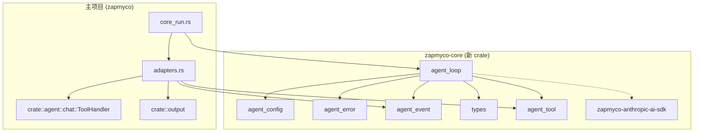

# 技术方案：将 `src/core` 独立发布为 `zapmyco-core`

> 编写日期: 2026-07-20
> 状态: 草稿

---

## 1. 现状分析

### 1.1 当前项目结构

`zapmyco` 是一个单一的 Rust crate（同时产出 lib 和 binary），当前 workspace 包含两个 vendored 成员：

```
zapmyco/
├── Cargo.toml              # 主 package: zapmyco v0.44.2
├── src/
│   ├── core/               ← 目标提取模块（7 个源文件 + 1 个 mod.rs）
│   ├── agent/              ← 旧 AiAgent 系统
│   ├── commands/           ← 命令入口（core_run.rs 是 core 的唯一消费者）
│   ├── ...
│   └── lib.rs
├── vendor/
│   ├── zapmyco-anthropic-ai-sdk/   # workspace 成员
│   └── zapmyco-grep/               # workspace 成员
```

### 1.2 `src/core` 现状

| 文件 | 行数 | 外部依赖 | 是否可独立 |
|------|------|---------|-----------|
| `types.rs` | ~180 | `serde_json` | ✅ |
| `agent_tool.rs` | ~120 | `async_trait`, `serde_json` | ✅ |
| `agent_event.rs` | ~180 | `serde_json` | ✅ |
| `agent_config.rs` | ~200 | `AgentTool`（core 内部） | ✅ |
| `agent_error.rs` | ~100 | std  only | ✅ |
| `agent_loop.rs` | ~850 | `tokio`, `futures_util`, `serde_json`, `zapmyco_anthropic_ai_sdk` | ✅ |
| `mod.rs` | ~40 | 模块声明 + re-export | ✅ |
| **`adapters.rs`** | ~340 | `crate::agent::chat::ToolHandler`, `crate::output` | ❌ **不能** |

**核心发现**：除 `adapters.rs` 外，其余 7 个文件完全不依赖主 crate 中的任何模块，可以直接提取。

### 1.3 `adapters.rs` 的依赖链



---

## 2. 目标架构

### 2.1 提取后结构

```
zapmyco/
├── Cargo.toml                      # 主 package，新增依赖 zapmyco-core
├── libs/
│   └── zapmyco-core/
│       ├── Cargo.toml
│       └── src/
│           ├── lib.rs
│           ├── types.rs
│           ├── agent_tool.rs
│           ├── agent_event.rs
│           ├── agent_config.rs
│           ├── agent_error.rs
│           └── agent_loop.rs
├── src/
│   ├── core/                       ← 删除
│   ├── adapters.rs                 ← 从 core 移出（原 adapters.rs）
│   ├── agent/
│   ├── commands/
│   │   ├── core_run.rs             ← 改从 zapmyco_core 导入
│   │   └── run.rs
│   ├── ...
│   └── lib.rs                      ← 移除 pub mod core
├── vendor/
│   ├── zapmyco-anthropic-ai-sdk/
│   └── zapmyco-grep/
```

### 2.2 新 Crate 的公共 API

提取后 `zapmyco-core` 对外暴露的接口：

```rust
// 数据类型
pub use types::{ConversationMessage, MessageBlock, Role};

// 工具 Trait
pub use agent_tool::AgentTool;

// 事件枚举
pub use agent_event::AgentEvent;

// 配置
pub use agent_config::AgentConfig;

// 错误
pub use agent_error::AgentError;

// 核心循环
pub use agent_loop::agent_loop;
```

共 **8 个公共类型/函数**，不含 `adapters.rs` 中的 `LegacyToolAdapter`、`from_tool_handlers`、`core_event_handler`。

---

## 3. 依赖分析

### 3.1 `zapmyco-core` 的 dependencies

```toml
[dependencies]
serde_json = "1"
async-trait = "0.1"
tokio = { version = "1", features = ["sync"] }
futures-util = "0.3"
zapmyco-anthropic-ai-sdk = { version = "0.3", path = "../vendor/zapmyco-anthropic-ai-sdk" }

[dev-dependencies]
wiremock = "0.6"
tokio = { version = "1", features = ["rt", "macros"] }
```

### 3.2 主项目减少的依赖

提取后，主项目的 `Cargo.toml` 中以下依赖**仍然需要**（其他模块也在用）：
- `tokio`（web, tui, tools 等）
- `futures-util`（tools 等）
- `serde_json`（几乎所有模块）
- `async-trait`（tools 等）

所以主项目的 Cargo.toml 依赖项**基本不变**，只需新增 `zapmyco-core` 的 path 依赖。

---

## 4. 实施步骤

### 阶段 1：准备 — 将 `adapters.rs` 移出 core 层

**目标**：解除 `adapters.rs` 对 core 层的"污染"，使其成为主项目的一个独立模块。

具体操作：

#### 1.1 创建 `src/adapters.rs`

将 `src/core/adapters.rs` **复制**到 `src/adapters.rs`（注意不是移动，因为 core 目录还要整体打包到新 crate）。

#### 1.2 更新 `src/adapters.rs` 的导入路径

```rust
// 修改前（原文件）：
use crate::agent::chat::ToolHandler;
use crate::core::{AgentEvent, AgentTool};
use crate::output::{self, Message};

// 修改后：
use crate::agent::chat::ToolHandler;
use crate::output::{self, Message};
use zapmyco_core::{AgentEvent, AgentTool};
```

#### 1.3 更新 `src/lib.rs`

```rust
// 添加
pub mod adapters;
```

#### 1.4 更新 `src/core/mod.rs`

移除 `adapters` 模块声明和公共 re-export：

```rust
// 删除这两行：
mod adapters;
pub use adapters::{LegacyToolAdapter, core_event_handler, from_tool_handlers};
```

#### 1.5 更新 `src/commands/core_run.rs`

```rust
// 修改前：
use crate::core::{AgentConfig, agent_loop, core_event_handler, from_tool_handlers};

// 修改后：
use crate::adapters::{core_event_handler, from_tool_handlers};
use zapmyco_core::{AgentConfig, agent_loop};
```

#### 1.6 更新测试引用

`adapters.rs` 中的测试 `impl crate::core::AgentTool` 需要改为 `impl zapmyco_core::AgentTool`。

---

### 阶段 2：创建 `zapmyco-core` crate

#### 2.1 目录结构

创建以下文件和目录：

```
libs/zapmyco-core/
├── Cargo.toml
└── src/
    ├── lib.rs
    ├── types.rs
    ├── agent_tool.rs
    ├── agent_event.rs
    ├── agent_config.rs
    ├── agent_error.rs
    └── agent_loop.rs
```

#### 2.2 `Cargo.toml`

```toml
[package]
name = "zapmyco-core"
version = "0.1.0"
edition = "2024"
rust-version = "1.95"
description = "Environment-agnostic AI Agent runtime core — ReAct loop, tool abstraction, event system"
license = "MIT"
repository = "https://github.com/shenjingnan/zapmyco"

[dependencies]
serde_json = "1"
async-trait = "0.1"
tokio = { version = "1", features = ["sync"] }
futures-util = "0.3"
zapmyco-anthropic-ai-sdk = { version = "0.3", path = "../../vendor/zapmyco-anthropic-ai-sdk" }

[dev-dependencies]
wiremock = "0.6"
tokio = { version = "1", features = ["rt", "macros"] }

[features]
# 保留扩展点，后续可添加 feature gate
default = []
```

#### 2.3 `src/lib.rs`

```rust
//! # zapmyco-core
//!
//! AI Agent 运行时的核心抽象层。
//!
//! ## 设计原则
//!
//! - **零环境依赖**：不读文件、不写终端、不碰环境变量
//! - **依赖注入**：所有外部依赖通过 `AgentConfig` 传入
//! - **事件驱动**：所有输出通过 `AgentEvent` 流发送
//! - **工具即 Trait**：通过 `AgentTool` trait 注册，不通过枚举硬编码

mod agent_config;
mod agent_error;
mod agent_event;
mod agent_loop;
mod agent_tool;
mod types;

// ── 重新导出所有公共类型 ──

pub use agent_config::AgentConfig;
pub use agent_error::AgentError;
pub use agent_event::AgentEvent;
pub use agent_loop::agent_loop;
pub use agent_tool::AgentTool;
pub use types::{ConversationMessage, MessageBlock, Role};
```

#### 2.4 拷贝源文件

从 `src/core/`（不包含 `adapters.rs`）拷贝到 `libs/zapmyco-core/src/`，并更新内部导入路径：

**`agent_loop.rs` 的修改：**

```rust
// 修改前：
use crate::core::{AgentConfig, AgentError, AgentEvent, ConversationMessage, MessageBlock, Role};

// 修改后：
use crate::{AgentConfig, AgentError, AgentEvent, ConversationMessage, MessageBlock, Role};
```

**`agent_config.rs` 的修改：**

```rust
// 修改前：
use crate::core::AgentTool;

// 修改后：
use crate::AgentTool;
```

**测试中的修改（agent_loop.rs tests）：**

```rust
// 修改前：
impl crate::core::AgentTool for EchoTool { ... }

// 修改后：
// 在测试模块顶部添加 use crate::AgentTool;
use crate::AgentTool;
impl AgentTool for EchoTool { ... }
```

---

### 阶段 3：更新主项目引用

#### 3.1 更新 workspace 配置

在根 `Cargo.toml` 中添加新成员：

```toml
[workspace]
resolver = "2"
members = [
    "vendor/zapmyco-anthropic-ai-sdk",
    "vendor/zapmyco-grep",
    "libs/zapmyco-core",
]
```

#### 3.2 更新主项目的 dependencies

```toml
[dependencies]
# 新增
zapmyco-core = { path = "libs/zapmyco-core" }
# 或者如果先发布到 crates.io：
# zapmyco-core = "0.1"
```

#### 3.3 更新 `src/lib.rs`

```rust
// 移除
pub mod core;

// 如果暂时需要保留 core 目录的备份，可以注释而非删除
```

#### 3.4 更新 `src/commands/core_run.rs` 的导入

```rust
// 最终效果：
use zapmyco_core::{AgentConfig, agent_loop, AgentTool, ConversationMessage};
use crate::adapters::{core_event_handler, from_tool_handlers};
// ... 其他 use 不变
```

#### 3.5 删除旧文件

确认一切正常后，删除 `src/core/` 目录（移除前备份 `adapters.rs`）。

---

### 阶段 4：测试与验证

#### 4.1 编译检查

```bash
# 编译全部 workspace 成员
cargo build

# 编译新 crate 单独
cargo build -p zapmyco-core
```

#### 4.2 运行测试

```bash
# 运行新 crate 的测试
cargo test -p zapmyco-core -- --test-threads=1

# 运行主项目的测试
cargo test -- --test-threads=1
```

#### 4.3 代码质量检查

```bash
cargo fmt --check
cargo clippy -- -D warnings
cargo test -- --test-threads=1
```

---

### 阶段 5：发布到 crates.io

#### 5.1 发布前提

| 条件 | 状态 | 操作 |
|------|------|------|
| `zapmyco-anthropic-ai-sdk` 已发布到 crates.io | ❌ 未发布 | 先发布 SDK crate，或将 path 依赖保留为 workspace 成员 |
| 主项目测试通过 | 待验证 | 阶段 4 |
| 文档注释完整 | 待完善 | 检查所有 `pub` 项的文档注释 |

#### 5.2 发布命令

```bash
cd libs/zapmyco-core
cargo publish --dry-run
cargo publish
```

#### 5.3 版本策略

建议采用 **独立版本号**（从 `0.1.0` 开始），理由：

- core 层的变更节奏与主项目不同
- 可以独立演进，不依赖主项目的发版周期
- 当 core 稳定后，其他项目也可以独立使用

主项目 `zapmyco` 中声明依赖时使用：

```toml
zapmyco-core = { version = "0.1", path = "libs/zapmyco-core" }
# 发布后：
# zapmyco-core = "0.1"
```

---

## 5. 变更影响分析

### 5.1 文件变更清单

| 文件 | 操作 | 影响 |
|------|------|------|
| `libs/zapmyco-core/Cargo.toml` | **新建** | 无 |
| `libs/zapmyco-core/src/lib.rs` | **新建** | 无 |
| `libs/zapmyco-core/src/*.rs` (6 个) | **拷贝** | 内部 use 路径需调整 |
| `src/core/mod.rs` | **修改** | 移除 adapters 声明和 re-export |
| `src/core/adapters.rs` | **移动** | 移至 `src/adapters.rs` |
| `src/core/*.rs` (6 个) | **删除** | 被新 crate 替代 |
| `src/adapters.rs` | **新建** | 原 `core/adapters.rs` + 更新导入 |
| `src/lib.rs` | **修改** | 添加 `pub mod adapters`，移除 `pub mod core` |
| `src/commands/core_run.rs` | **修改** | 导入路径更新 |
| `Cargo.toml` (根) | **修改** | 添加 workspace 成员 + dependency |

### 5.2 对现有功能的影响

| 功能 | 是否受影响 | 说明 |
|------|-----------|------|
| `zapmyco run` (默认) | ✅ 无影响 | 通过 `cmd_core_run` 继续走 core 层 |
| `zapmyco run --legacy` | ✅ 无影响 | 仍走 `cmd_run`（AiAgent 旧系统） |
| `zapmyco core-run` | ✅ 无影响 | 进口改为 `zapmyco_core` |
| Web 系统 | ✅ 无影响 | 仍依赖旧系统 |
| TUI Demo | ✅ 无影响 | 功能空实现 |
| 其他命令 | ✅ 无影响 | 不涉及 core 层 |

### 5.3 风险与缓解

| 风险 | 概率 | 缓解措施 |
|------|------|---------|
| `zapmyco-anthropic-ai-sdk` 无法发布到 crates.io | 中 | 保持 path 依赖，core crate 作为 workspace 成员发布 |
| 跨 crate 的 `Box<dyn AgentTool>` 兼容问题 | 低 | trait 已有 `Send + Sync` 约束，跨 crate 边界正常 |
| 测试中的 wiremock 版本冲突 | 低 | 两个 crate 独立声明 dev-dependencies |
| fmt/clippy 规则差异 | 低 | 新 crate 继承 workspace 配置 |

---

## 6. 验收标准

| 验收项 | 检查方式 |
|--------|---------|
| `cargo build` 编译通过 | 运行无错误 |
| `cargo test -- --test-threads=1` 全部通过 | 所有测试绿 |
| `cargo fmt --check` 格式通过 | 无格式问题 |
| `cargo clippy -- -D warnings` 通过 | 无 warning |
| `zapmyco run "hello"` 正常运行 | CLI 功能正常 |
| `zapmyco core-run "hello"` 正常运行 | CLI 功能正常 |
| `zapmyco run --legacy "hello"` 正常运行 | 旧系统回退正常 |

---

## 7. 后续工作（不在本次范围内）

- 将 Web 系统（`web/chat.rs`）从 AiAgent 迁移到 core 层
- 为 core 层实现 session 日志适配器
- 补全交互式继续循环、Ctrl+C 处理等功能
- 完成旧系统（`agent/chat.rs`）的整体下线
