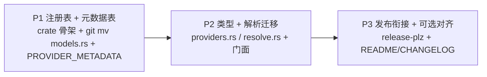

# 技术方案：将模型/供应商相关代码提取为独立 crate `zapmyco-providers`

> 编写日期: 2026-08-07
> 状态: 草稿（待评审）

---

## 1. 背景与目标

### 1.1 背景

zapmyco 是"Anthropic API 兼容"的多供应商 AI CLI：所有供应商（DeepSeek / GLM / Anthropic / MiniMax / Kimi / Doubao / Qwen / MIMO）都提供 `/anthropic` 兼容端点，走同一条 vendored SDK 通道。**当前"供应商"只是一个字符串 key + 数据，不是代码抽象**——供应商差异仅有 `base_url` + `api_key` 两项。

相关代码分散在多处，且存在若干隐式硬编码：

- `resolve_api_key`（`src/config/mod.rs` L20-49）对所有供应商都硬编码回退 `DEEPSEEK_API_KEY` 环境变量；
- `get_search_model`（`src/commands/config_resolver.rs` L105-111）把 provider→搜索模型映射写死在命令层；
- api_version `"2023-06-01"` 硬编码在 `zapmyco-core`（`agent_config.rs` L58）与 `zapmyco-tools`（`web_search.rs` L88）两处；
- `init.rs`（L88-117）硬编码 9 个供应商选项，与模型注册表的供应商顺序不一致。

这些"供应商知识"散落在主 crate 的 config / commands / cli 三个目录，且 config 解析逻辑（`config_resolver.rs`）与文件 I/O（`load_settings`）耦合，无法被外部项目复用。

### 1.2 目标

将模型注册表、供应商元数据、纯函数配置解析提取为独立 crate **`zapmyco-providers`**：

1. 可独立发布到 crates.io，供任何 Rust 项目直接依赖；
2. 配合 `zapmyco-core` / `zapmyco-tools`，外部项目"引包即得模型目录 + 配置解析"，服务"任意环境 agent 节点"愿景中的**多供应商中立**目标；
3. 主 crate `zapmyco` 功能**完全不回退**，通过门面重导出保持 `zapmyco::config::*`、`zapmyco::commands::config_resolver::*` 旧路径兼容；
4. 供应商差异显式化（元数据表），新供应商 = 新增一行，不散落硬编码。

### 1.3 目标架构

```mermaid
graph TD
    subgraph P["crates/zapmyco-providers（新 crate，独立发布，仅 serde 依赖）"]
        P1["models.rs — 模型注册表（22 模型 / 8 供应商）"]
        P2["providers.rs — ProviderConfig / LlmSettings + ProviderMeta 元数据表"]
        P3["resolve.rs — 纯函数配置解析（resolve_llm_config / resolve_api_key / ...）"]
        P1 --> P3
        P2 --> P3
    end

    subgraph M["主 crate zapmyco"]
        M1["src/config/models.rs → 1 行门面"]
        M2["src/config/settings.rs → re-export 类型"]
        M3["src/config/mod.rs → re-export resolve_api_key"]
        M4["src/commands/config_resolver.rs → wrapper + 门面"]
        M5["core_run.rs / web/chat.rs / cli.rs / init.rs / completion.rs（零改动）"]
        M1 --> M
        M2 --> M
        M3 --> M
        M4 --> M5
    end

    subgraph X["外部消费方"]
        X1["独立 Rust 项目"]
        X2["zapmyco-core / zapmyco-tools 组装 agent"]
    end

    M --> P
    X --> P
    X1 --> X2
```

**依赖方向（无环）**：`zapmyco-providers`（叶，仅 serde+std）← 主 crate；`zapmyco-core` / `zapmyco-tools` / `zapmyco-anthropic-ai-sdk` 均**不依赖** providers。与 `zapmyco-tools` 提取时的三层依赖（core ← tools ← 主应用）互补，本 crate 是更底层的"供应商/模型目录"叶。

---

## 2. 现状分析

### 2.1 供应商现状：数据而非代码抽象

| 层 | 位置 | 现状 |
|---|---|---|
| 模型注册表 | `src/config/models.rs` | 静态 `BUILT_IN_MODELS`：22 模型 / 8 供应商（deepseek/glm/anthropic/minimax/kimi/doubao/qwen/mimo），纯数据 + 纯函数 |
| 配置解析 | `src/commands/config_resolver.rs` | `resolve_llm_config()`：model → provider → api_key → base_url → max_tokens |
| 传输层 | `crates/zapmyco-core/src/agent_loop.rs` L44 | 直接 `AnthropicClient::builder(api_key, api_version).with_api_base_url(base_url)`，全供应商同一通道 |
| 工具层 | `crates/zapmyco-tools/src/web_search.rs` L83 | 自建 SDK client，需外部传入 api_key/base_url/model/max_tokens |
| 宿主装配 | `core_run.rs` L123 + `web/chat.rs` L157 | 两处重复 `resolve_llm_config()` → `AgentConfig::new()` |

**核心事实**：供应商差异只有 `base_url` + `api_key` 两项。所有厂商提供 Anthropic Messages API 兼容端点。

### 2.2 模型注册表规模（`src/config/models.rs`）

- `pub enum ModelCapability { Text, Vision }`（L9-13）
- `pub struct BuiltInModel { provider, base_url, capabilities, context_window, max_output_tokens }`（L16-28）
- 内部 const：`BUILT_IN_MODELS`（L31-258）、`BASE_URL_REGION`（L329-343）、`OVERSEAS_BASE_URLS`（L346-352）、`MODEL_PREFIX_PROVIDER`（L394-404）
- pub fn 共 7 个：`get_model_info`（L260）、`get_built_in_model_names`（L268）、`format_model_help`（L273）、`get_built_in_base_urls`（L305）、`get_built_in_base_hosts`（L316）、`get_built_in_base_host_info`（L355）、`guess_provider_from_model_name`（L407）
- **全部零 I/O、零外部依赖**，文件顶部有 `#![allow(dead_code)]`（部分能力字段暂未消费）。

### 2.3 配置解析链路（`src/commands/config_resolver.rs`）

- `pub struct ResolvedLlmConfig { model, api_key, base_url, max_tokens, provider_name }`（L11-17，字段全 pub）
- `pub fn resolve_llm_config(profile, model, api_key, base_url) -> Result<ResolvedLlmConfig, String>`（L36-102）：**唯一 I/O 是 `load_settings()`**（读文件，L42-49），其余是纯路由
- `pub fn get_search_model(provider_name) -> &str`（L105-111）：deepseek→"deepseek-v4-flash"、anthropic→"claude-sonnet-4-6"、其余回退 `DEFAULT_MODEL`
- `pub fn get_internal_max_tokens(search_model) -> u32`（L114-118）：查注册表 `max_output_tokens`
- 常量：`DEFAULT_MODEL`（L19）、`DEFAULT_BASE_URL`（L20）、`DEFAULT_MAX_TOKENS`（L21）

### 2.4 隐式硬编码盘点

| 硬编码 | 位置 | 现状语义 |
|---|---|---|
| `DEEPSEEK_API_KEY` 环境变量回退 | `src/config/mod.rs` L39-43 | **对所有**供应商回退到 DEEPSEEK 的 env |
| provider→搜索模型映射 | `config_resolver.rs` L105-111 | deepseek / anthropic 有特例，其余回退默认 |
| api_version `"2023-06-01"` | `zapmyco-core/agent_config.rs` L58、`zapmyco-tools/web_search.rs` L88 | 两处硬编码，无供应商差异 |
| init.rs 供应商选项 | `src/commands/init.rs` L107-115 | 9 个硬编码选项，顺序与注册表不一致 |

### 2.5 消费方清单（已核验）

**models 模块的 5 个消费方**（均 `use crate::config::models::...`）：

| 文件 | 行号 | 引用函数 | 用途 |
|---|---|---|---|
| `src/config/mod.rs` | L11-15 | 全部 | 旧路径 re-export |
| `src/cli.rs` | L6-8, L67, L70, L124 | `get_built_in_model_names`/`format_model_help`/`get_built_in_base_host_info` | `--model`/`--base-url` Tab 补全 |
| `src/commands/init.rs` | L4, L183, L189, L240 | `get_built_in_model_names`/`get_model_info` | 按供应商筛选模型、格式化标签 |
| `src/commands/config_resolver.rs` | L7, L65, L115 | `get_model_info` | 解析 provider/base_url/max_tokens |
| `src/commands/completion.rs` | L5-7 | 同上三函数 | shell 补全脚本生成 |

**config_resolver 模块的消费方**：

| 文件 | 行号 | 引用 | 用途 |
|---|---|---|---|
| `src/commands/core_run.rs` | L24, L123 | `resolve_llm_config` / `ResolvedLlmConfig` | `cmd_core_run()` 解析配置 |
| `src/commands/core_run.rs` | L634-641 | `get_search_model`/`get_internal_max_tokens`/`WebSearch::new` | 装配 WebSearch 工具 |
| `src/web/chat.rs` | L18, L157 | `resolve_llm_config` | Web UI 聊天初始化（`resolve_llm_config(None,None,None,None)`） |

**resolve_api_key / resolve_env_ref 消费方**：`resolve_api_key` 唯一调用方是 `config_resolver::resolve_llm_config`（L74）；`resolve_env_ref` 唯一调用方是 `resolve_api_key`。

### 2.6 关键约束（已验证）

| 约束 | 位置 | 影响 |
|---|---|---|
| `resolve_api_key` 是 `src/config/mod.rs` 的 **inline pub fn**（L20-49），非从 settings 导出 | `src/config/mod.rs` | 迁移后必须删函数体、改 `pub use`，否则 `zapmyco::config::resolve_api_key` 路径断裂 |
| `Settings::masked()` 用 struct literal 构造 `LlmSettings`/`ProviderConfig` | `src/config/settings.rs` L176-200 | 类型迁入 crate 后需在 settings.rs 顶部 re-export，且字段保持 `pub` |
| `ResolvedLlmConfig` 被测试用 struct literal 构造 | `src/commands/core_run.rs` L905（`make_resolved()`） | 字段保持 `pub`；门面重导出类型后构造性不变 |
| `resolve_env_ref` 错误信息含 `.zapmyco/settings.toml` 路径常量 | `src/config/settings.rs` L5, L127-130 | 迁入 crate 需保留路径常量（或改通用文案） |
| `zapmyco-core` **零耦合**：不引用 config::models / config_resolver | `crates/zapmyco-core/src/lib.rs` | 新 crate 不需要被 core 依赖 |
| 主 crate 的 serde/toml **不能瘦身** | `settings.rs` 各 I/O 函数 | `Settings`/`Permissions`/`load_settings` 仍留主 crate 且继续用 toml |

---

## 3. 目标架构与 crate 设计

### 3.1 目录结构

```
crates/zapmyco-providers/
├── Cargo.toml            # name=zapmyco-providers v0.1.0, edition=2024, rust-version=1.95
│                         #   deps: serde{derive}（唯一运行时依赖）
├── README.md             # 新建（docs.rs 需要）
├── CHANGELOG.md          # 新建 [Unreleased]
└── src/
    ├── lib.rs            # 模块声明 + 便捷重导出
    ├── models.rs         # ← git mv 自 src/config/models.rs（零改动，含全部测试）
    ├── providers.rs      # ← ProviderConfig/LlmSettings 迁自 src/config/settings.rs L16-37
    │                     #   + 新增 ProviderMeta / PROVIDER_METADATA / provider_meta() / all_provider_names()
    └── resolve.rs        # ← resolve_api_key 迁自 src/config/mod.rs L20-49
                          #   + resolve_env_ref 迁自 src/config/settings.rs L119-135
                          #   + ResolvedLlmConfig + 纯 resolve_llm_config + get_search_model
                          #   + get_internal_max_tokens + DEFAULT_MODEL/BASE_URL/MAX_TOKENS 常量
```

### 3.2 Cargo.toml

```toml
[package]
name = "zapmyco-providers"
version = "0.1.0"
edition = "2024"
rust-version = "1.95"
description = "Model registry, provider metadata and pure LLM config resolution for zapmyco"
license = "MIT"
repository = "https://github.com/shenjingnan/zapmyco"
readme = "README.md"
documentation = "https://docs.rs/zapmyco-providers"

[dependencies]
serde = { version = "1", features = ["derive"] }
```

**设计要点**：仅 serde。不引入 tokio/reqwest/toml —— 配置库允许 std::env（读 API key 环境变量），但**零重依赖**，与 `zapmyco-core` 的"零环境依赖"原则互补（core 禁环境 I/O，providers 是配置库可读 env）。

### 3.3 公开 API（lib.rs 重导出）

```rust
pub mod models;
pub mod providers;
pub mod resolve;

// 便捷重导出
pub use models::{
    BuiltInModel, ModelCapability,
    format_model_help, get_built_in_base_host_info, get_built_in_base_hosts,
    get_built_in_base_urls, get_built_in_model_names, get_model_info,
    guess_provider_from_model_name,
};
pub use providers::{
    LlmSettings, ProviderConfig, ProviderMeta, PROVIDER_METADATA,
    all_provider_names, provider_meta,
};
pub use resolve::{
    ResolvedLlmConfig, get_internal_max_tokens, get_search_model,
    resolve_api_key, resolve_env_ref, resolve_llm_config,
};
```

**符号细分**：

- **models**（全零 I/O）：`ModelCapability::{Text, Vision}`、`BuiltInModel`、7 个查询函数。
- **providers**：
  - `ProviderConfig { api_key: Option<String>, base_url: Option<String> }`（serde camelCase + `skip_serializing_if`，原样迁入）
  - `LlmSettings { providers: Option<HashMap<String, ProviderConfig>>, models: Option<HashMap<String, String>> }`（同上）
  - `ProviderMeta { name, display_name, default_search_model, default_env_var, api_version }`（字段全 pub，避免 clippy dead_code）
  - `pub const PROVIDER_METADATA: &[ProviderMeta]`、`pub fn provider_meta(name) -> Option<&'static ProviderMeta>`、`pub fn all_provider_names() -> Vec<&'static str>`
- **resolve**：
  - `ResolvedLlmConfig { model, api_key, base_url, max_tokens, provider_name }`（字段全 pub）
  - `pub fn resolve_llm_config(llm: Option<&LlmSettings>, profile, model, api_key, base_url) -> Result<ResolvedLlmConfig, String>` —— **纯函数**，增 `llm` 首参，I/O 由调用方注入
  - `resolve_api_key`、`resolve_env_ref`、`get_search_model`、`get_internal_max_tokens`

### 3.4 类型归属（避免依赖环的核心决策）

`ProviderConfig` / `LlmSettings` **必须归 crate 所有**，否则纯函数 `resolve_llm_config(llm: &LlmSettings, ...)` 会造成 providers→main 反向依赖环。

主 crate `src/config/settings.rs` 顶部：

```rust
pub use zapmyco_providers::{LlmSettings, ProviderConfig};
pub use zapmyco_providers::resolve::resolve_env_ref;
```

`Settings` 结构体（settings.rs L84-94，含 `pub llm: Option<LlmSettings>`）继续留在主 crate，serde derive 随类型迁入 crate 后仍可 TOML 序列化。`Settings::masked()` 的 struct literal 构造因字段保持 `pub` 而无需改动。

### 3.5 ProviderMeta 元数据表（只存不接）

```rust
pub struct ProviderMeta {
    /// 供应商 ID（settings.toml providers 的 key，与模型注册表 provider 字段一致）
    pub name: &'static str,
    /// init 向导显示名（对齐 src/commands/init.rs L107-115）
    pub display_name: &'static str,
    /// 默认搜索模型名；None 表示回退 DEFAULT_MODEL
    pub default_search_model: Option<&'static str>,
    /// 该供应商的默认环境变量约定（**仅信息，不接线**，见 §4.3）
    pub default_env_var: Option<&'static str>,
    /// 默认 API 版本（**仅信息，不接线**，现状各供应商均为 "2023-06-01"）
    pub api_version: &'static str,
}
```

按 init.rs 顺序定义（anthropic / deepseek / qwen / minimax / glm / kimi / doubao / mimo / custom），其中 `custom` 为特殊项（display_name="自定义"，各字段 None）：

| name | display_name | default_search_model | default_env_var |
|---|---|---|---|
| anthropic | Anthropic | claude-sonnet-4-6 | None |
| deepseek | DeepSeek | deepseek-v4-flash | DEEPSEEK_API_KEY |
| qwen | Qwen（通义千问） | None | None |
| minimax | MiniMax | None | None |
| glm | GLM（智谱） | None | None |
| kimi | Kimi（月之暗面） | None | None |
| doubao | Doubao（火山引擎/字节） | None | None |
| mimo | MIMO（小米） | None | None |
| custom | 自定义 | None | None |

---

## 4. 关键技术决策

### 4.1 兼容门面（跟随 tools 提取先例，cargo-semver-checks 友好）

| 文件 | 改造 | 生效路径 |
|---|---|---|
| `src/config/models.rs` | 重写为 1 行：`pub use zapmyco_providers::models::*;` | `zapmyco::config::models::*` 不变，5 个消费方零改动 |
| `src/config/settings.rs` | 删 `ProviderConfig`/`LlmSettings`/`resolve_env_ref` 定义；顶部 re-export | `zapmyco::config::settings::{LlmSettings, ProviderConfig, resolve_env_ref}` 不变 |
| `src/config/mod.rs` | 删 inline `resolve_api_key` fn 体，改 `pub use zapmyco_providers::resolve::resolve_api_key;` | `zapmyco::config::resolve_api_key` 不变 |
| `src/commands/config_resolver.rs` | 保留旧签名 `resolve_llm_config`（内部 `load_settings` + 调 crate 纯函数）；`pub use zapmyco_providers::resolve::{ResolvedLlmConfig, get_search_model, get_internal_max_tokens};` | `zapmyco::commands::config_resolver::{...}` 不变 |

**零改动文件**：`core_run.rs`、`web/chat.rs`、`cli.rs`、`init.rs`、`completion.rs` —— 全部经门面解析到 crate。

### 4.2 `resolve_llm_config` 纯函数化

- **crate 内**：`resolve_llm_config(llm: Option<&LlmSettings>, profile, model, api_key, base_url)` —— 纯路由，从 `config_resolver.rs` L52-101 迁移，`crate::config::resolve_api_key` 改为调用 crate 自身 `resolve_api_key`，`get_model_info` 改为 `crate::models::get_model_info`。
- **主 crate wrapper**（config_resolver.rs 保留）：`resolve_llm_config(profile, model, api_key, base_url)` —— 保留 `load_settings()` + 错误文案（"读取配置文件失败" / "未找到配置文件...请先运行 zapmyco init" 含 `get_settings_path().display()`），取 `settings.llm.as_ref()` 后调 crate 纯函数。

两个调用方（core_run.rs L123、web/chat.rs L157）签名不变，零改动。

### 4.3 "只存不接"边界（行为保持的前提）

`ProviderMeta.default_env_var` 与 `api_version` **仅作信息字段，不接线**：

| 字段 | 若接线的行为变化 | 不接线理由 |
|---|---|---|
| `default_env_var` | `resolve_api_key` 会对 anthropic 等改回退各自 env，而非现状的"任意供应商都回退 DEEPSEEK_API_KEY" | 行为变更 |
| `api_version` | 需给 `WebSearch::new`（tools 已发布 v0.1.0）加新 builder 才可驱动，并改动 core_run.rs L223/L636 与 web/chat.rs L157 | 触碰已发布 core/tools，且打破"调用方零改动"承诺 |

`get_search_model` 与 `init.rs` 的对齐列为 P3 **可选**增强（见 §5.4），P1/P2 只存不接，行为完全保持。

---

## 5. 分阶段实施路线

### 5.1 阶段依赖



### 5.2 阶段 1：crate 骨架 + 模型注册表提取 + 元数据表（行为保持）

**改动文件**：
1. 新建 `crates/zapmyco-providers/Cargo.toml`、`README.md`、`CHANGELOG.md`、`src/lib.rs`。
2. `git mv src/config/models.rs crates/zapmyco-providers/src/models.rs`（含全部纯函数测试）。
3. 重写 `src/config/models.rs` 为 `pub use zapmyco_providers::models::*;`。
4. 新建 `src/providers.rs`：定义 `ProviderMeta` + `PROVIDER_METADATA` + `provider_meta()` + `all_provider_names()`（§3.5 表；**暂不迁入** LlmSettings/ProviderConfig）。
5. 根 `Cargo.toml`：`members` 加 `"crates/zapmyco-providers"`；`dependencies` 加 `zapmyco-providers = { version = "0.1", path = "crates/zapmyco-providers" }`。
6. lib.rs `pub mod models; pub mod providers;` 及 models/providers 重导出。

**验收标准**：
```bash
cargo build
cargo test --jobs 1 -- --test-threads=1
cargo test -p zapmyco-providers        # models.rs 测试全绿
cargo clippy -- -D warnings && cargo fmt --check
```
`--model` Tab 补全（cli.rs）、`completion` 脚本生成、`init` 供应商/模型筛选、`get_model_info` 全部按旧路径编译通过；行为与迁移前一致（元数据表尚未被消费）。

### 5.3 阶段 2：类型迁入 + resolve.rs 迁移（行为保持）

**改动文件**：
1. `src/config/settings.rs`：删除 `ProviderConfig`/`LlmSettings` 定义（L16-37）与 `resolve_env_ref` 定义（L119-135）；顶部 `pub use`（§3.4）。serde 测试留守。
2. `src/providers.rs`：迁入两个 serde 类型（derive、`rename_all="camelCase"`、`skip_serializing_if` 原样）。
3. 新建 `src/resolve.rs`：迁入 `resolve_api_key`（保持 DEEPSEEK_API_KEY 回退与错误文案）、`resolve_env_ref`（保留 `.zapmyco/settings.toml` 路径常量）、`ResolvedLlmConfig`、纯 `resolve_llm_config`、`get_search_model`、`get_internal_max_tokens`、`DEFAULT_*` 常量。
4. `src/config/mod.rs`：删 inline `resolve_api_key`，改 `pub use zapmyco_providers::resolve::resolve_api_key;`。
5. `src/commands/config_resolver.rs`：重写为 wrapper + 门面（§4.1）。原 5 个 I/O 测试留守。
6. lib.rs 补 `resolve` 模块与重导出。
7. crate `resolve.rs` 内新增纯函数单测（构造 `LlmSettings`；env 测试用 `unsafe { std::env::set_var }` 并还原，变量名用唯一前缀避免竞态）。

**验收标准**：`cargo build` / `cargo test --jobs 1 -- --test-threads=1` / `clippy` / `fmt` 全绿；`core_run.rs` L123/L634-635、`web/chat.rs` L157、`init.rs`、`cli.rs`、`completion.rs` **零改动**通过；settings.rs 全部 serde 测试通过。

### 5.4 阶段 3：清理 + 发布配置 + 可选对齐

**改动文件**：
1. `release-plz.toml` 新增：
   ```toml
   [[package]]
   name = "zapmyco-providers"
   changelog_update = true
   changelog_path = "crates/zapmyco-providers/CHANGELOG.md"
   publish_allow_dirty = true
   ```
2. 补 README（docs.rs 元数据）、CHANGELOG（`[Unreleased]`）。
3. 主 crate 依赖核对：`cargo machete` 确认 serde/toml 仍被 Settings 侧使用，**不删除**（与 tools 提取不同，本次不瘦身）。
4. **可选增强**（与主 PR 分离更安全）：
   - `get_search_model` 改由 `PROVIDER_METADATA.default_search_model` 驱动，保持"未知名回退 DEFAULT_MODEL"语义（含 custom）；
   - `init.rs` 供应商选项对齐 `PROVIDER_METADATA`（保留 exact label / init 顺序 / custom 特殊项）。
5. 根 CHANGELOG 补条目。

**验收标准**：
```bash
cargo publish -p zapmyco-providers --dry-run
cargo publish -p zapmyco --dry-run
cargo semver-checks            # zapmyco lib 无 breaking change 报告
cargo test --jobs 1 -- --test-threads=1
cargo clippy -- -D warnings && cargo fmt --check && typos .
```
`dist-workspace.toml` 无需改动（`members = ["cargo:."]` 只打包根 bin crate）。发布顺序由 release-plz 按依赖序自动处理（providers → main）。

---

## 6. 测试策略

| 测试 | 归属 | 说明 |
|---|---|---|
| models.rs 纯函数测试 | **随 git mv 迁入 crate** | 零 I/O、无 `crate::` 引用，搬迁即用 |
| config_resolver.rs 的 5 个测试 | **留守主 crate** | 依赖 `run_with_temp_home` + 写文件，测 wrapper + `load_settings` |
| settings.rs serde 测试 | **留守主 crate** | 经 re-export 解析类型，`use super::*` 无需改 |
| crate resolve.rs 新增纯函数单测 | 新 crate | 构造 `LlmSettings`；env 测试 `unsafe { std::env::set_var }` + 还原 |
| 主 crate 集成测试（cli 补全 / init / run / web） | 留守 | 门面保路径，断言不变 |

**env 竞态防护**：crate 测试用唯一前缀 env 变量名；CI 已用 `cargo test --jobs 1 -- --test-threads=1` 串行化跨二进制与进程内测试。

---

## 7. 风险与权衡

| 风险 | 等级 | 缓解 |
|---|---|---|
| **发布顺序**：providers 未发布时主 crate 无法以版本依赖发布 | 高 | release-plz 按依赖序；P3 加 `[[package]]` 条目；发布前两处 `--dry-run` |
| **`config/mod.rs` inline `resolve_api_key` 迁移遗漏** → `zapmyco::config::resolve_api_key` 断裂 | 中 | §4.1 显式列为 P2 改动点；编译期即暴露 |
| **`settings.rs` 双重 re-export 遗漏** → init.rs/config/mod.rs 无法编译 | 中 | §3.4 显式列为 P2 改动点；`Settings::masked()` struct literal 依赖字段 pub |
| **`ResolvedLlmConfig` 字段可见性/构造性**（core_run.rs L905 测试 struct literal） | 低 | 字段保持 pub；cargo-semver-checks 兜底 |
| **`resolve_env_ref` 错误信息耦合 `.zapmyco/settings.toml`** | 低 | crate 内保留路径常量；现有测试只断言变量名子串 |
| **serde 版本/derive 语义**（camelCase / skip_serializing_if / PartialEq） | 低 | 主 crate 与 providers 均 serde 1，Cargo 合并单版本；derive 属性原样迁移；settings.rs serde 测试留守 |
| **测试迁移边界**：I/O 测试误随文件迁入导致 `crate::config` 缺失 | 中 | §6 划分明确；config_resolver/settings 测试留守 |
| **`default_env_var`/`api_version` 接线导致行为变化** | 中 | P1/P2 只存不接；接线另立方案，避免触碰已发布 core/tools |
| **新增 metadata 字段触发 dead_code**（clippy -D warnings） | 低 | `ProviderMeta` 字段与查询函数全 pub，lib crate 不报 dead_code |
| **主 crate 依赖瘦身误删 serde/toml** | 低 | P3 用 `cargo machete` 核对；Settings 侧仍需二者，实际不删 |
| **crate 测试 env 变量与主 crate 竞态** | 低 | 唯一前缀变量名；CI `--jobs 1 -- --test-threads=1` 已串行化 |

---

## 8. 验收标准

### 8.1 独立消费方最小示例（终态目标）

```rust
use zapmyco_providers::{
    LlmSettings, ResolvedLlmConfig, get_model_info, get_search_model,
    resolve_llm_config, resolve_env_ref,
};

// 模型目录：查任意内置模型元数据
let info = get_model_info("deepseek-v4-flash").unwrap();
assert_eq!(info.provider, "deepseek");

// 供应商元数据
let meta = zapmyco_providers::provider_meta("anthropic").unwrap();
assert_eq!(meta.default_search_model, Some("claude-sonnet-4-6"));

// 纯函数配置解析（settings 由调用方注入，零文件 I/O）
let llm = LlmSettings {
    providers: None,
    models: None,
};
let resolved: ResolvedLlmConfig =
    resolve_llm_config(Some(&llm), None, Some("deepseek-v4-flash"), Some("sk-xxx"), None)?;
assert_eq!(resolved.provider_name, "deepseek");
```

### 8.2 终态检查清单

| 验收项 | 检查方式 |
|---|---|
| 新 crate 独立可用 | `cargo build -p zapmyco-providers`；上方示例可编译 |
| 主 crate 功能不回退 | `cargo test --jobs 1 -- --test-threads=1` 全绿；run（Base/Plan）、--model 补全、init、web 均正常 |
| 代码质量 | `cargo fmt --check`、`cargo clippy -- -D warnings`、`typos .` |
| 无循环依赖 | `cargo tree -p zapmyco-providers` 不含 `zapmyco`（主 crate） |
| 发布就绪 | `cargo publish -p zapmyco-providers --dry-run` 与主 crate dry-run 通过；release-plz 含 zapmyco-providers |
| semver | `cargo semver-checks` 对 `zapmyco`（lib）无 breaking change 报告 |

---

## 附：评估过程说明

本方案基于对代码库的逐层核验（2 个并行探索 agent + 关键文件精读），核心事实均已标注代码路径，确保后续实施不因前期评估不充分而返工。几个关键结论的推导依据：

1. **"供应商是数据问题而非代码问题"是抽象边界的依据**：全部供应商走同一 Anthropic Messages API 通道，差异仅 base_url + api_key；因此方案 A（数据 + 纯函数）而非 Provider trait 传输抽象（YAGNI，且与 any-env 方案 §5.4 的 `LlmClient` trait 正交）。
2. **类型归属 crate 是避免依赖环的前提**：纯函数 `resolve_llm_config` 接受 `&LlmSettings`，若类型留在主 crate 则 providers→main 反向环；把 `ProviderConfig`/`LlmSettings` 迁入 crate（仅 serde）是最小代价解法。
3. **门面兼容是"调用方零改动"的关键**：5 个 models 消费方、2 个 config_resolver 调用方全部经门面解析，P1/P2 期间 `core_run.rs`/`web/chat.rs`/`cli.rs`/`init.rs`/`completion.rs` 零改动，最大限度降低回归风险。
4. **"只存不接"是行为保持的红线**：`default_env_var`/`api_version` 接线会改变现有行为或触碰已发布 core/tools，故仅作为信息字段纳入元数据表，接线另立方案。
5. **测试迁移以"测纯逻辑 vs 测装配"为界**：models 纯函数随迁，config_resolver/settings 的 I/O 测试留守主 crate，避免 `crate::config` 缺失导致编译失败。

---

*本方案为设计文档，不含任何实现代码。批准后按 §5 阶段顺序实施，每阶段独立验收。*
