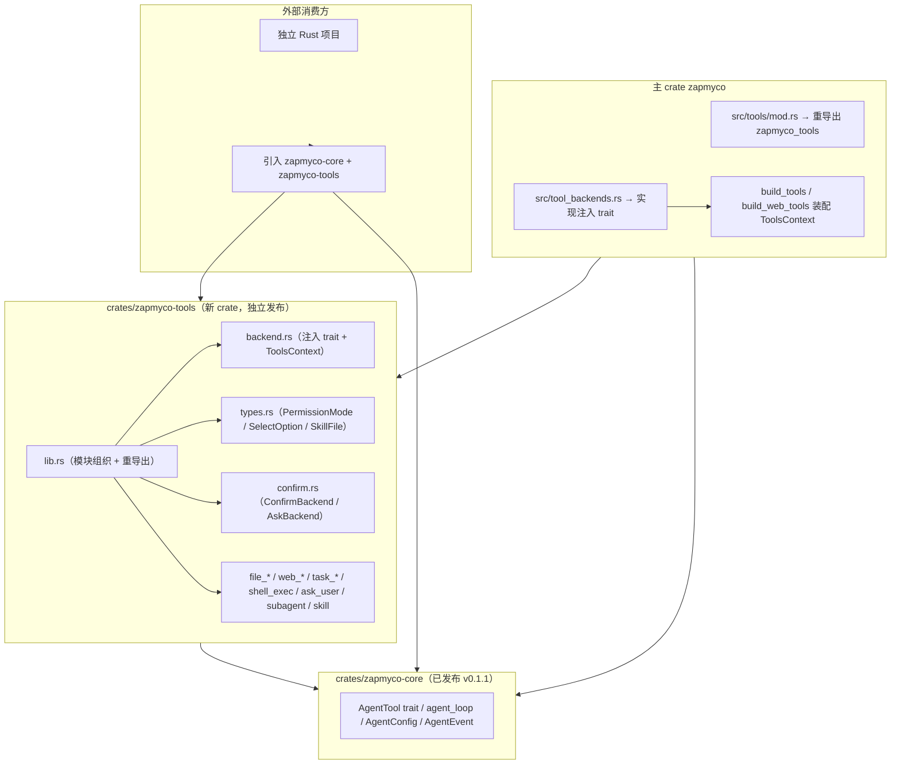
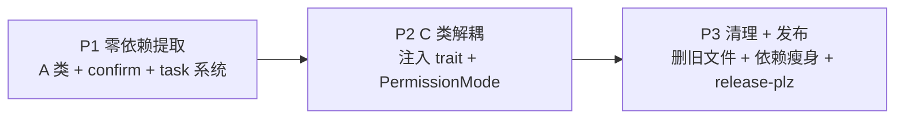

# 技术方案：将 `src/tools` 提取为独立 crate `zapmyco-tools`

> 编写日期: 2026-08-06
> 状态: 草稿（待评审）

---

## 1. 背景与目标

### 1.1 背景

zapmyco 的愿景是成为"任意环境、任意语言都能轻松接入的 agent 节点"。当前架构已拆分出独立的 `zapmyco-core`（已发布 v0.1.1），它提供 agent **引擎**：

- `AgentTool` trait（工具抽象）
- `agent_loop()`（流式 ReAct 循环）
- `AgentConfig` / `AgentEvent` / `ConversationMessage`（依赖注入 / 事件流 / 对话类型）

但 `zapmyco-core` **不含任何内置工具**——18 个 `AgentTool` 实现（约 15,018 行）位于主 crate 的 `src/tools/`。外部 Rust 项目引入 core 只能获得"裸引擎"，需要**自己实现全部工具**才能组装出可用 agent。

这造成了与愿景的缺口：**"引包即得完整 agent"无法实现**。

### 1.2 目标

将 `src/tools/` 提取为独立 crate **`zapmyco-tools`**，使其：

1. 可独立发布到 crates.io，被任何 Rust 项目直接依赖；
2. 配合 `zapmyco-core`，外部项目引入两个 crate 即可获得**引擎 + 全套工具**（文件 / 搜索 / Web / 任务 / shell / 子代理 / skill）；
3. 主 crate `zapmyco` 功能**完全不回退**，通过重导出门面保持现有 `zapmyco::tools::*` 路径兼容。

### 1.3 目标架构



**依赖方向（无环）**：`zapmyco-tools → zapmyco-core`；主 crate `zapmyco → zapmyco-tools`；`zapmyco-core` 不依赖 tools。这是标准三层依赖：core（trait）← tools（实现）← 主应用（注入 + 集成）。

---

## 2. 现状分析

### 2.1 工具清单与规模

`src/tools/` 共 **19 个文件、约 15,018 行**（含大量测试）：

| 文件 | 行数 | 分类 | 主 crate 内部依赖 |
|---|---|---|---|
| `confirm.rs` | 195 | 基础设施 | **无**（仅 std + tokio::sync::oneshot + uuid） |
| `file_read.rs` | 576 | A | 无 |
| `file_write.rs` | 419 | A | 无 |
| `file_edit.rs` | 1,886 | A | 无 |
| `file_find.rs` | 602 | A | 无 |
| `file_search.rs` | 836 | A | 无 |
| `web_fetch.rs` | 912 | A | 无 |
| `web_search.rs` | 334 | C | `crate::output::send` |
| `shell_exec.rs` | 3,836 | C | `crate::output`、`crate::config::settings`、`confirm`、`prompt` |
| `subagent.rs` | 2,190 | C | `crate::cli::PermissionMode`、硬编码 `~/.zapmyco/subagents/` |
| `ask_user.rs` | 491 | C | `crate::session::logger`、`confirm`、`prompt` |
| `skill.rs` | 378 | B | `crate::skills::{discovery, loader}` |
| `task_manager.rs` | 1,061 | B | `crate::config::settings::get_settings_dir()` |
| `task_create.rs` | 102 | B | 同包 `task_manager` |
| `task_get.rs` | 85 | B | 同包 `task_manager` |
| `task_list.rs` | 78 | B | 同包 `task_manager` |
| `task_update.rs` | 216 | B | 同包 `task_manager` |
| `task_display.rs` | 748 | B | 同包 `task_manager` |
| `prompt.rs` | 6 | 重导出 | `crate::tui`（真实实现在 `src/tui/select.rs`） |
| `mod.rs` | 67 | 重导出 | `zapmyco_grep::GrepError` 等 |

### 2.2 依赖边界分类

- **A 类（零主 crate 依赖，直接迁移）**：file_read / file_write / file_edit / file_find / file_search / web_fetch，以及实际零依赖的 confirm。只依赖 `zapmyco_core`、`zapmyco_anthropic_ai_sdk`、`zapmyco_grep` 与纯外部 crate（reqwest / mdka / ignore / globset / tokio / serde_json 等）。约 **5,500 行**。
- **B 类（轻量重构：构造注入）**：task_manager（注入 base_dir）+ task_create/get/list/update/display（只依赖同包 task_manager）+ skill（注入 SkillResolver）。约 **2,700 行**。
- **C 类（依赖注入解耦）**：shell_exec / subagent / ask_user / web_search，以及 prompt 重导出。约 **6,850 行**。

### 2.3 共享基础设施

- **ConfirmBackend / AskBackend**：定义在 `src/tools/confirm.rs`（L177-195），`Terminal` / `AlwaysAllow` / `Channel(PendingApprovals)` 等变体，**零主 crate 依赖**，可整体迁移。
- **PermissionMode**：定义在 `src/cli.rs` L32（`#[derive(clap::ValueEnum)]`），被 subagent / shell_exec 消费。
- **test_util**：`crate::test_util::run_with_temp_home` + HOME/SESSION 双锁，被多个工具测试引用（cfg(test)）。

### 2.4 关键约束（已验证）

| 约束 | 位置 | 影响 |
|---|---|---|
| `builtin_safe_commands()` 为 `pub(crate)`，但被 `core_run.rs` L615 跨模块调用 | `src/tools/shell_exec.rs` | 迁入 tools crate 后必须改为 `pub`，否则主 crate 无法编译 |
| `web_search.rs` 顶部把 SDK 的 `Message` 与主 crate `output::Message` 同名 | `src/tools/web_search.rs` | 用 `OutputEmitter` 替代 `output::send` 后同名引用消失，天然消除冲突 |
| shell_exec 尾部有 settings 集成测试依赖 `crate::config::settings` | `src/tools/shell_exec.rs` 尾部 | 该部分测试应**留守主 crate**（见 §6.2） |
| `prompt.rs` 仅重导出 `crate::tui` | `src/tools/prompt.rs` | 阶段 3 删除；交互能力经 `UserPrompt` trait 注入 |

---

## 3. 目标架构与 crate 设计

### 3.1 目录结构

```
crates/zapmyco-tools/
├── Cargo.toml
├── README.md
└── src/
    ├── lib.rs           # 模块声明 + 重导出
    ├── backend.rs       # 注入 trait + ToolsContext + no-op 默认实现
    ├── types.rs         # PermissionMode、SelectOption、SkillDescriptor/SkillFile 等
    ├── confirm.rs       # ConfirmBackend/AskBackend/PendingApprovals/PendingAsks
    ├── file_read.rs / file_write.rs / file_edit.rs / file_find.rs / file_search.rs
    ├── web_fetch.rs / web_search.rs
    ├── task_manager.rs / task_create.rs / task_get.rs / task_list.rs / task_update.rs / task_display.rs
    ├── shell_exec.rs / ask_user.rs / subagent.rs / skill.rs
    └── test_util.rs     # #[cfg(test)] 模块，复刻主 crate 的 run_with_temp_home + 双锁
```

根 `Cargo.toml` workspace 增加成员 `"crates/zapmyco-tools"`。

### 3.2 Cargo.toml 依赖清单

```toml
[package]
name = "zapmyco-tools"
version = "0.1.0"
edition = "2024"
rust-version = "1.95"
description = "Reusable AgentTool implementations — file/search/web/task/shell tools for zapmyco-core agents"
license = "MIT"
repository = "https://github.com/shenjingnan/zapmyco"
documentation = "https://docs.rs/zapmyco-tools"

[dependencies]
zapmyco-core = { version = "0.1", path = "../zapmyco-core" }
zapmyco-anthropic-ai-sdk = { version = "0.3", path = "../../vendor/zapmyco-anthropic-ai-sdk" }
zapmyco-grep = { version = "0.1", path = "../../vendor/zapmyco-grep" }
async-trait = "0.1"
serde = { version = "1", features = ["derive"] }
serde_json = "1"
thiserror = "2"
tokio = { version = "1", features = ["sync", "process", "time", "fs", "io-util", "rt", "macros"] }
futures-util = "0.3"
chrono = "0.4"
reqwest = "0.13"
mdka = "2"
ignore = "0.4"
globset = "0.4"
fs4 = { version = "1.1", features = ["tokio"] }
uuid = { version = "1", features = ["v4"] }

[dev-dependencies]
tempfile = "3"
tokio = { version = "1", features = ["full"] }
```

**依赖到模块映射**（A 类零重构迁移的关键）：
- `reqwest`/`mdka` → web_fetch；`reqwest`/`futures-util` → web_search
- `ignore`/`globset` → file_find；`zapmyco-grep` → file_search
- `fs4` → task_manager；`chrono` → task_manager/subagent；`uuid` → confirm/shell_exec
- `zapmyco-anthropic-ai-sdk` → `web_search` 的 `AnthropicClient`（见 §4.3 说明）

### 3.3 Feature 设计

```toml
[features]
default = ["full"]
full = ["file", "task", "web", "shell", "subagent", "skill"]
file = []
task = []
web = []
shell = []
subagent = []
skill = []
clap = ["dep:clap"]   # 仅服务于 PermissionMode 的 clap::ValueEnum derive
```

**推荐**：v0.1 不设模块级 `#[cfg(feature = ...)]` 门控，`default = ["full"]` 全量编译。理由：定位是"引包即用完整工具集"；在 19 个文件上铺 `#[cfg]` 会增加迁移风险与编译矩阵。Cargo feature 是**加性**的，后续可随时从 `full` 拆出分组，不影响已发布 API 兼容。`[features]` 仅预留分组骨架。

`clap` feature 由主 crate 启用（见 §4.2），普通库消费方默认不引入 clap。

### 3.4 lib.rs 模块组织与重导出

```rust
//! # zapmyco-tools
//! 可复用的 AgentTool 实现集。配合 `zapmyco-core` 组装完整 agent。

pub mod backend;
pub mod types;
pub mod confirm;
pub mod file_read;  pub mod file_write;  pub mod file_edit;
pub mod file_find;  pub mod file_search;
pub mod web_fetch;  pub mod web_search;
pub mod task_manager; pub mod task_create; pub mod task_get;
pub mod task_list;    pub mod task_update; pub mod task_display;
pub mod shell_exec; pub mod ask_user; pub mod subagent; pub mod skill;

pub use zapmyco_grep::GrepError;   // 旧路径兼容：主 crate 经门面透传
pub use backend::{OutputEmitter, UserPrompt, SessionLogger, AllowlistPersister,
                  SkillResolver, ToolsContext};
pub use types::PermissionMode;
pub use confirm::{ConfirmBackend, AskBackend, PendingApprovals, PendingAsks,
                  ShellConfirmDecision, AskUserResponse};

#[cfg(test)]
pub(crate) mod test_util { /* 复刻 run_with_temp_home + HOME/SESSION 双锁 */ }
```

---

## 4. 关键技术决策

### 4.1 注入 trait 设计（C 类解耦核心）

全部定义在 `crates/zapmyco-tools/src/backend.rs`，由主 crate 实现并通过 `ToolsContext` 注入：

```rust
/// 输出级别（映射到主 crate output::Message::info/warning/error）
pub enum OutputLevel { Info, Warning, Error }

/// 输出后端 — 替换 crate::output::send(&Message::info/warning/...)
pub trait OutputEmitter: Send + Sync {
    fn emit(&self, level: OutputLevel, text: &str);
}

/// 用户交互后端 — 替换 crate::tui::prompt_single_select / prompt_multi_select
pub trait UserPrompt: Send + Sync {
    fn prompt_single_select(&self, question: &str, options: &[SelectOption]) -> Option<SingleSelectResult>;
    fn prompt_multi_select(&self, question: &str, options: &[SelectOption]) -> Option<MultiSelectResult>;
}

/// 会话日志后端 — 替换 crate::session::logger::log_user_event
pub trait SessionLogger: Send + Sync {
    fn log_user_event(&self, event: &str);
}

/// 白名单持久化后端 — 替换 crate::config::settings::add_to_command_allowlist
pub trait AllowlistPersister: Send + Sync {
    fn add_to_command_allowlist(&self, command: &str) -> Result<(), String>;
}

/// Skill 解析后端 — 替换 crate::skills::discovery::* / loader::*
pub trait SkillResolver: Send + Sync {
    fn list_available_skills(&self, cwd: &Path) -> Vec<SkillDescriptor>;
    fn resolve_skill(&self, name: &str, cwd: &Path) -> Option<SkillFile>;
    fn build_skill_list_text(&self, skills: &[SkillDescriptor]) -> String;
}

/// 聚合装配
#[derive(Clone)]
pub struct ToolsContext {
    pub output: Arc<dyn OutputEmitter>,
    pub prompt: Arc<dyn UserPrompt>,
    pub session_logger: Arc<dyn SessionLogger>,
    pub allowlist_persister: Arc<dyn AllowlistPersister>,
    pub skill_resolver: Arc<dyn SkillResolver>,
}
```

`ToolsContext` 的 `Default` 提供全部 no-op 实现：输出静默、`prompt_*` 返回 `None`（确认/提问被拒）、白名单写入 `Ok(())`、skill 为空列表。**无头默认**保证工具在未注入时安全运行（拒绝而非挂起）。

`types.rs` 承载公共数据类型（字段与现有 `tui/types.rs`、`skills/types.rs` 对齐）：`SelectOption`、`SingleSelectResult`、`MultiSelectResult`、`SkillDescriptor`、`SkillFile`。

**各工具的装配方式**：

| 工具 | 注入方式 |
|---|---|
| `ShellExec` | `ShellExecOptions` 增加 `pub context: ToolsContext`（`Default` 填充）；`output::send` → `ctx.output.emit`；`add_to_allowlist_inner` → `ctx.allowlist_persister`；`prompt_confirm` 系列 → `ctx.prompt` |
| `AskUser` | 结构体增加 `pub context`（Clone/Default 兼容）；`session_logger::log_user_event` → `ctx.session_logger`；`prompt::*` → `ctx.prompt`。`sanitize_user_input` 为纯函数，作为 `pub fn` 迁入 |
| `WebSearch` | 结构体增加 `context`，提供 `with_context(ctx)` builder；`new(...)` 签名保持不变（默认 no-op 输出） |
| `SubAgentTool` | 无 output/log 调用，不需要 ToolsContext；`permission_mode` 改用 `types::PermissionMode`；新增 `with_data_dir(PathBuf)`，保留 `new()`（读 HOME）作便捷默认 |
| `SkillTool` | `new()` 保持；新增 `with_context(ctx)`；`list_available_skills`/`resolve_skill`/`build_skill_list_text` 全部改走 `ctx.skill_resolver` |
| `TaskManager` | 构造注入 `with_base_dir(base_dir, list_id)`；`new()` 用 tools 内 `default_tasks_root()`（`$HOME/.zapmyco/tasks`）保持默认行为 |

### 4.2 PermissionMode 归属

**放入 `zapmyco-tools`（`types.rs`），不放 `zapmyco-core`**。理由：

1. `PermissionMode` 是**工具执行策略**，被 `shell_exec`（readonly 选项）和 `subagent`（子进程权限）直接消费，二者都在 tools crate 内；
2. `zapmyco-core` 的设计原则是"零环境依赖、不含 CLI 概念"，追加策略枚举会污染 core 的纯净定位并迫使所有 core 消费方携带它；
3. tools 是最自然归属，主 crate 通过重导出维持 `crate::cli::PermissionMode` 路径不变。

clap 派生用 feature-gated derive 隔离（库消费方默认不引入 clap）：

```rust
#[derive(Debug, Clone, Copy, PartialEq, Eq, Default)]
#[cfg_attr(feature = "clap", derive(clap::ValueEnum))]
pub enum PermissionMode {
    #[default]
    Full,
    #[cfg_attr(feature = "clap", clap(alias = "readwrite"))]
    ReadWrite,
    #[cfg_attr(feature = "clap", clap(alias = "readonly"))]
    ReadOnly,
}
```

主 crate `src/cli.rs` 改为 `pub use zapmyco_tools::PermissionMode;` 并启用 `zapmyco-tools/clap` feature。

### 4.3 tool_definition() 的 SDK 依赖

**决策：移除各工具的 `tool_definition()` 方法，由主 crate 注册层统一生成**（用户决策）。

**对比**（客观陈述，供实施时复核）：

| 方案 | 优点 | 缺点 |
|---|---|---|
| A. tools 直接依赖 SDK，保留各工具 `tool_definition()` | 实现内聚；外部消费方可直接拿 SDK `Tool` | 全部工具与 SDK 版本强耦合；tools 依赖树重 |
| **B. 移除 `tool_definition()`，注册层统一生成（选定）** | tools 对外只暴露 `AgentTool` trait（更通用）；依赖边界更干净；SDK 耦合收敛到主 crate | 外部消费方需自己生成 SDK `Tool`（若走 Anthropic SDK 直连）；web_search 因功能仍依赖 SDK |

**实施方式**：主 crate 注册层提供统一函数，从 `AgentTool` 的 `name`/`description`/`input_schema` 构造 SDK `Tool`：

```rust
// 主 crate 注册层（如 src/tools/registry.rs）
fn sdk_tool_definition(tool: &dyn AgentTool) -> zapmyco_anthropic_ai_sdk::types::message::Tool {
    // name / description / input_schema → Tool
}
```

**重要说明**：`web_search` 在功能上直接使用 SDK 的 `AnthropicClient`、`Message`、`ContentBlock`、`StreamEvent` 等类型（约 30 处引用），因此 **tools 对 `zapmyco-anthropic-ai-sdk` 的依赖不会因该决策完全消失**。该决策消除的是"其余 17 个工具仅为 `tool_definition()` 而依赖 SDK"的耦合，而非全部 SDK 依赖。此依赖已存在于 core crate，tools 引入不产生新环。

### 4.4 TaskManager base_dir 注入

`task_manager` 是 B 类中唯一依赖主 crate 的（`get_settings_dir()` 硬编码 `~/.zapmyco/tasks/{list_id}/`）。解耦：

- tools 内新增 `with_base_dir(base_dir: PathBuf, list_id: impl Into<String>)`；
- `new()`/`with_list_id()` 用 tools 内 `default_tasks_root()`（`$HOME/.zapmyco/tasks`）保持默认行为；
- 主 crate 在 `build_tools` 中显式注入 `crate::config::settings::get_settings_dir().join("tasks")` 以**精确对齐现状**。

### 4.5 主 crate 后端实现（新文件 `src/tool_backends.rs`）

```rust
pub struct RouterEmitter;                    // impl OutputEmitter → output::send
pub struct TuiPrompt;                        // impl UserPrompt → crate::tui::prompt_*
pub struct SessionLoggerBackend;             // impl SessionLogger → session::logger
pub struct SettingsAllowlistPersister;       // impl AllowlistPersister → settings
pub struct SkillsResolverBackend;            // impl SkillResolver → skills::discovery/loader
```

`build_tools`（`src/commands/core_run.rs`）与 `build_web_tools`（`src/web/tools.rs`）各构造一次 `ToolsContext`，readonly 与 full 两套工具集复用同一 context 克隆注入。

### 4.6 主 crate `src/tools/mod.rs` 改造为重导出门面

迁移完成后（阶段 3 终态），`src/tools/mod.rs` 替换为：

```rust
//! 工具模块已迁移至独立 crate zapmyco-tools。
//! 此处保留为向后兼容的重导出门面（doc(hidden)）。
#[doc(hidden)]
pub use zapmyco_tools::{
    ask_user, confirm, file_edit, file_find, file_read, file_search, file_write,
    shell_exec, skill, subagent, task_create, task_display, task_get, task_list,
    task_manager, task_update, web_fetch, web_search,
};
// 旧路径兼容：逐一重导出 FileEdit/ShellExec/WebFetch 等 + GrepError
```

**兼容策略：保留旧路径别名重导出（不删除）**。`zapmyco::tools::*` 是 `pub` 库 API（虽 doc(hidden)），保留门面可将提取的对外破坏性降到最低，并满足 cargo-semver-checks。`src/lib.rs` 继续保留 `pub mod tools;`。

---

## 5. 分阶段实施路线

### 5.1 阶段依赖



### 5.2 阶段 1：零依赖提取（约 7,716 行）

**迁移文件**：`confirm.rs`(195)、`file_read.rs`(576)、`file_write.rs`(419)、`file_edit.rs`(1,886)、`file_find.rs`(602)、`file_search.rs`(836)、`web_fetch.rs`(912)、`task_manager.rs`(1,061)、`task_create.rs`(102)、`task_get.rs`(85)、`task_list.rs`(78)、`task_update.rs`(216)、`task_display.rs`(748)。

**主 crate 同步改动**：
- 创建 `crates/zapmyco-tools` 骨架（Cargo.toml + lib.rs + test_util.rs）；
- workspace 注册新成员；主 `Cargo.toml` 加 `zapmyco-tools = { version = "0.1", path = "crates/zapmyco-tools" }`；
- `TaskManager` 加 `with_base_dir` 构造注入（B 类轻重构，提前做）；
- `src/tools/mod.rs`：被迁移模块的 `pub mod` 声明改为 `pub use zapmyco_tools::{...}`（分模块逐个替换，保持 `crate::tools::file_read` 等路径可用）。

> 注：`prompt.rs` 依赖 `crate::tui`，留在主 crate（阶段 3 删除）。阶段 1 后 shell_exec 仍留主 crate，通过 `crate::tools::prompt` 继续工作，故先不碰。

**验收标准**：
```bash
cargo build                    # 全 workspace 编译通过
cargo test --jobs 1 -- --test-threads=1   # 全绿
cargo clippy -- -D warnings && cargo fmt --check
```
`zapmyco run` / `--skill` / Plan 模式 / Web 模式行为与迁移前一致。

### 5.3 阶段 2：C 类解耦 + PermissionMode + skill（约 7,300 行）

**迁移文件**：`shell_exec.rs`(3,836)、`ask_user.rs`(491)、`web_search.rs`(334)、`subagent.rs`(2,190)、`skill.rs`(378)。

**主 crate 同步改动**：
- 新 crate 增加 `backend.rs`、`types.rs`，实现六个注入 trait + `ToolsContext`；
- `PermissionMode` 迁入 tools（clap feature-gated），`src/cli.rs` 改为重导出；
- 新文件 `src/tool_backends.rs`：六个 trait 的主 crate 实现；
- `core_run.rs` `build_tools` / `web/tools.rs` `build_web_tools` 装配 `ToolsContext`；
- **`shell_exec::builtin_safe_commands()` 从 `pub(crate)` 改为 `pub`**；
- `src/tools/mod.rs` 门面补全剩余模块重导出；
- subagent/skill 测试内 `use crate::cli::PermissionMode` 改为 tools 路径。

**验收标准**：编译 + 测试全绿；交互确认（Terminal）、Plan 自动审批（AlwaysAllow）、Web Channel 审批、ask_user 提问、web_search 进度日志、skill list/load、subagent spawn/poll/list/kill 全部回归正常；`test_build_tools_full_mode` / `readonly_mode` / `subagent_skips_subagent_tool` 等集成测试通过。

### 5.4 阶段 3：清理 + 发布配置衔接

- 从 `src/tools/` 删除全部已迁移 `.rs`（仅留 `mod.rs` 门面）；删除 `prompt.rs`（主 crate 内已无 `crate::tools::prompt` 引用，tui 仍保有真实实现）；
- 主 `Cargo.toml` 依赖瘦身：`reqwest`/`mdka`/`ignore`/`globset`/`fs4` 迁移后仅被 tools 使用，从主 crate 移除（`uuid` 需确认 `web/chat.rs` 是否仍直接用；`async-trait` 主 crate 其它模块仍用则保留）。用 `cargo machete` 或逐文件 grep 验证；
- `release-plz.toml` 增加条目：

```toml
[[package]]
name = "zapmyco-tools"
changelog_update = true
changelog_path = "crates/zapmyco-tools/CHANGELOG.md"
publish_allow_dirty = true
```

- 为 `crates/zapmyco-tools` 补 README、CHANGELOG、docs.rs 元数据；
- `dist-workspace.toml` 无需改动（`members = ["cargo:."]` 仅打包根 bin crate，新 lib crate 不进 dist 产物）。

**发布顺序衔接**：release-plz 会按依赖序自动发布（`zapmyco-core` → `zapmyco-tools` → `zapmyco`）。关键前置：`zapmyco-tools` 必须先发布到 crates.io，主 crate 才能以版本依赖发布；release-plz 的 release-pr 会自动把主 crate 的 `path` 依赖改写为 crates.io 版本号。

**验收标准**：全量编译/测试/fmt/clippy 通过；`cargo publish -p zapmyco-tools --dry-run` 与主 crate dry-run 成功。

---

## 6. 测试策略

### 6.1 工具自带测试迁移

- **HOME 变异测试**：主 crate `test_util` 的 `run_with_temp_home` / `acquire_home_lock` 模式复制进 `crates/zapmyco-tools/src/test_util.rs`（`#[cfg(test)]`），含 HOME 与 SESSION_LOG_DIR 两把全局锁。由于迁移文件内引用 `crate::test_util::...`，在新 crate 内定义同名 `test_util` 模块后**引用路径无需改动**。
- **划分原则**：测工具纯逻辑（安全命令判定、命令拆分、prompt、tool_definition）→ 随文件走；测主 crate 配置装配 → 留守。

### 6.2 主 crate 专用测试留守

`shell_exec.rs` 尾部几个 settings 集成测试（`test_full_chain_from_toml_to_executor`、`test_cli_settings_*`）依赖 `crate::config::settings::{Settings, CommandPermissions, load_settings}`。这些是"settings.toml → ShellExecOptions"的主 crate 装配逻辑，**应留守主 crate**——迁移时剔除，在 `src/commands/core_run.rs` 测试模块内以 `use zapmyco_tools::shell_exec::{ShellExec, ShellExecOptions}` 复刻。

### 6.3 主 crate 集成测试保持通过

- `core_run.rs` 的 `build_tools` 测试：迁移后 `build_tools` 内部构造 `ToolsContext`（RouterEmitter 等），在 `run_with_temp_home` 下 settings 指向临时目录，断言（工具名存在/过滤）不变。
- `web/tools.rs` 的 `test_build_web_tools_has_eight`：8 个工具 + Channel 后端，路径经门面解析，断言不变。

### 6.4 CI 衔接

现有 CI 已用 `cargo test --jobs 1 -- --test-threads=1`：`--jobs 1` 保证各测试二进制**串行**执行，`--test-threads=1` 保证**进程内**串行。新增 tools crate 后跨进程的 HOME 变异仍被串行保护，**无需改 CI**。subagent 测试用系统 `echo`/`sleep` 作 test_binary（非 `CARGO_BIN_EXE`），库化后不受影响。

---

## 7. 风险与权衡

| 风险 | 等级 | 缓解 |
|---|---|---|
| **发布顺序**：zapmyco-tools 未发布时主 crate 无法以版本依赖发布 | 高 | release-plz 按依赖序发布；阶段 3 加 `[[package]]` 条目；发布前 `cargo publish --dry-run` |
| **reqwest 依赖树合并**：主 crate 与 tools 各持一个 reqwest 版本可能 feature 合并不一致 | 中 | 两者统一 `reqwest = "0.13"`，Cargo 会合并；迁移后核对 `cargo tree -i reqwest` |
| **fs4 平台相关**：file locking 在 Windows/macOS/Linux 行为差异 | 中 | 保持 `features=["tokio"]` 与现状一致；task_manager 锁测试已在 3 OS CI 矩阵覆盖 |
| **`builtin_safe_commands` 可见性**：`pub(crate)` → `pub` 若遗漏则编译失败 | 低 | 阶段 2 明确列为改动点；编译期即暴露 |
| **shell_exec/ask_user 的 settings 集成测试误随文件迁移导致编译失败** | 中 | 按 §6.2 明确留守主 crate；迁移清单逐文件核对 `crate::config`/`crate::session`/`crate::output` 引用 |
| **semver 影响** | 中 | `zapmyco` 工具模块 doc(hidden)，门面重导出同名类型 → 非破坏；`zapmyco-tools` 为全新 v0.1.0；`zapmyco-core` 不动 |
| **clap 版本进入 tools 公共 API** | 低 | 用 `clap` feature + `cfg_attr` 隔离，默认消费方不引入 |
| **`zapmyco::tools::prompt` 外部引用消失** | 低 | 阶段 3 删除 prompt.rs；如担心可保留 `#[deprecated] pub use zapmyco_tools::...`（tools 内提供 `prompt` 兼容模块） |
| **web_search 的 SDK `Message` 与主 crate `output::Message` 同名** | 低 | 用 `OutputEmitter` 后 `output::Message` 引用消失，无冲突 |
| **主 crate 依赖瘦身破坏其他模块** | 中 | 瘦身仅在阶段 3 以全量测试通过为前提执行；用 `cargo machete` 验证 |

---

## 8. 验收标准

### 8.1 独立消费方最小示例（终态目标）

```rust
use std::sync::Arc;
use tokio::sync::mpsc;
use zapmyco_core::{agent_loop, AgentConfig, AgentTool};
use zapmyco_tools::{
    ask_user::AskUser, confirm::ConfirmBackend, file_edit::FileEdit, file_find::FileFind,
    file_read::FileRead, file_search::FileSearch, file_write::FileWrite,
    shell_exec::{ShellExec, ShellExecOptions}, task_create::TaskCreate, task_get::TaskGet,
    task_list::TaskList, task_manager::TaskManager, task_update::TaskUpdateTool,
    web_fetch::WebFetch, ToolsContext,
};

#[tokio::main]
async fn main() -> Result<(), Box<dyn std::error::Error>> {
    let ctx = ToolsContext::default(); // 无头默认；可注入自定义后端

    let mut tools: Vec<Box<dyn AgentTool>> = vec![
        Box::new(FileRead::new(Default::default())),
        Box::new(FileWrite::new(Default::default())),
        Box::new(FileEdit::new(Default::default())),
        Box::new(FileFind::new(Default::default())),
        Box::new(FileSearch::new(Default::default())),
        Box::new(WebFetch::new(Default::default())?),
    ];

    let tm = Arc::new(TaskManager::new());
    tools.push(Box::new(TaskCreate { manager: tm.clone() }));
    tools.push(Box::new(TaskGet    { manager: tm.clone() }));
    tools.push(Box::new(TaskList   { manager: tm.clone() }));
    tools.push(Box::new(TaskUpdateTool { manager: tm.clone() }));

    tools.push(Box::new(ShellExec::new(ShellExecOptions {
        context: ctx.clone(),
        confirm_backend: ConfirmBackend::AlwaysAllow,
        ..Default::default()
    })));
    tools.push(Box::new(AskUser::default()));

    let config = Arc::new(
        AgentConfig::new("deepseek-v4-flash", api_key, base_url)
            .with_system_prompt("你是一个能操作文件的助手")
            .with_tools(tools),
    );
    let (event_tx, mut event_rx) = mpsc::channel(256);
    tokio::spawn(async move { while let Some(ev) = event_rx.recv().await { /* 渲染事件 */ } });
    let mut messages = vec![];
    agent_loop(config, &mut messages, "读取并总结 README.md", event_tx).await?;
    Ok(())
}
```

### 8.2 终态检查清单

| 验收项 | 检查方式 |
|---|---|
| 新 crate 独立可用 | `cargo build -p zapmyco-tools`；上方示例可编译 |
| 主 crate 功能不回退 | `cargo test --jobs 1 -- --test-threads=1` 全绿；run（Base/Plan）、--skill、Web 8 工具、权限模式过滤、ask_user/确认交互、subagent 均正常 |
| 代码质量 | `cargo fmt --check`、`cargo clippy -- -D warnings`、`typos .` |
| 无循环依赖 | `cargo machete` 无报告；`cargo tree -p zapmyco-tools` 不含 `zapmyco` |
| 发布就绪 | `cargo publish -p zapmyco-tools --dry-run` 与主 crate dry-run 通过；release-plz 含 zapmyco-tools |
| semver | `cargo semver-checks` 对 `zapmyco`（lib）无 breaking change 报告 |

---

## 附：评估过程说明

本方案基于对 `src/tools/` 的逐文件依赖核验（探索分析 + 关键文件精读），核心结论的推导依据：

1. **"无循环依赖"是提取的前提**：工具只实现 core 的 `AgentTool` trait，主 crate 消费两者，`zapmyco-core` 不反向依赖任何工具实现——标准三层依赖。
2. **A 类零重构迁移的关键**：A 类工具 + confirm 内部只依赖 `zapmyco_core`/`zapmyco_anthropic_ai_sdk`/`zapmyco_grep` 与纯外部 crate，无 `crate::` 引用，搬迁即用。
3. **C 类的 5 个耦合点全部可注入**：output/settings/tui/session/skills 均能以 trait 注入替代，与 web 已用的 `ConfirmBackend::Channel` 注入是同一成熟模式。
4. **tool_definition() 决策的权衡**：选定"注册层统一生成"（用户决策），收敛 SDK 耦合；但如实标注 `web_search` 的功能性 SDK 依赖无法消除，避免实施阶段误判"tools 可完全脱离 SDK"。
5. **`builtin_safe_commands` 可见性**是实施时最易遗漏的编译阻塞点，已列为显式改动项。
6. **测试迁移的划分**以"测工具纯逻辑 vs 测主 crate 装配"为界，避免 settings 集成测试迁入后因 `crate::config` 缺失而编译失败。

---

*本方案为设计文档，不含任何实现代码。批准后按 §5 阶段顺序实施，每阶段独立验收。*
